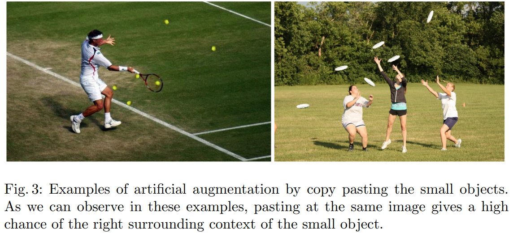
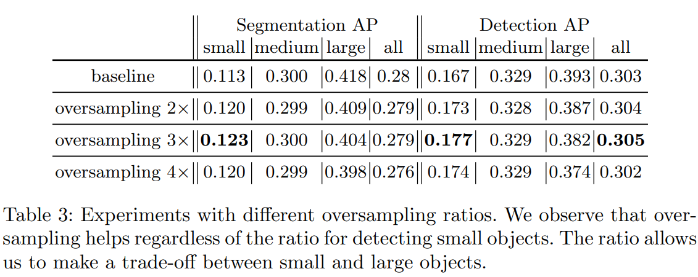
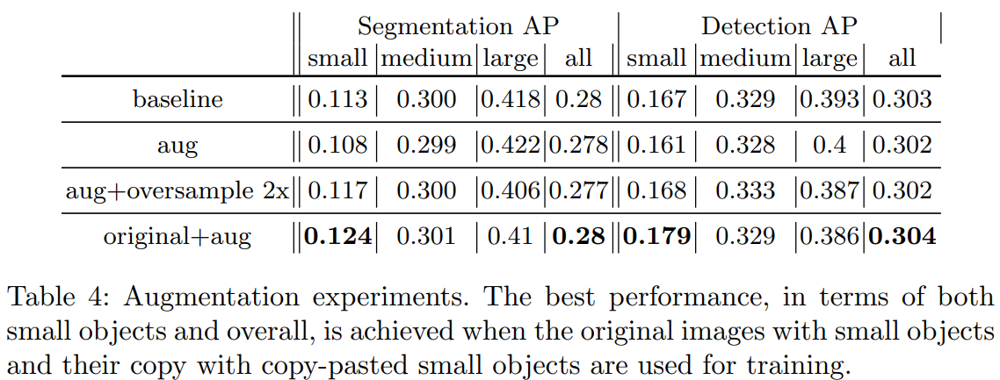
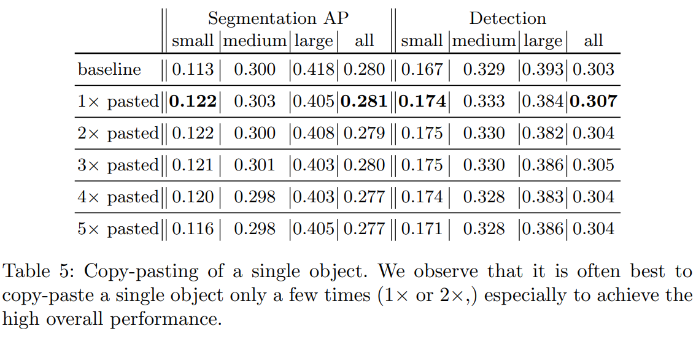
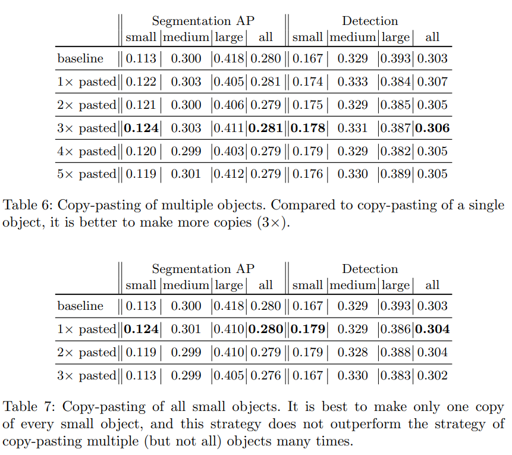

-----

| Title     | ML PreP DataAug CP                                    |
| --------- | ----------------------------------------------------- |
| Created @ | `2019-12-09T10:17:07Z`                                |
| Updated @ | `2023-02-02T09:14:56Z`                                |
| Labels    | `index`                                               |
| Edit @    | [here](https://github.com/junxnone/aiwiki/issues/269) |

-----

# Copy-Pasting

## Reference

  - [paper - Augmentation for small object
    detection](https://arxiv.org/pdf/1902.07296.pdf)
  - [增强小目标检测（Augmentation for small object
    detection）](https://blog.csdn.net/u011344545/article/details/91355839)

## Brief

  - 小物体平均精度差
      - 训练数据中缺少小物体的表示

## 方法

  - Oversampling（过采样）- 直接复制图片？
  - Augmentation（增强）
      - Copy-pasting - 从其原始位置复制对象, 然后将副本粘贴到不同的位置

-----

## Test Results

### Oversampling

### Copy-pasting of Single Object

### Copy-pasting of Multiple Objects

