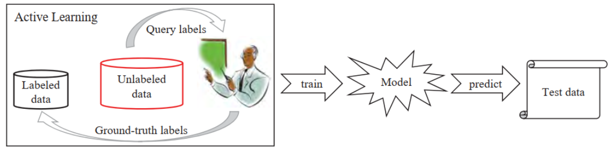
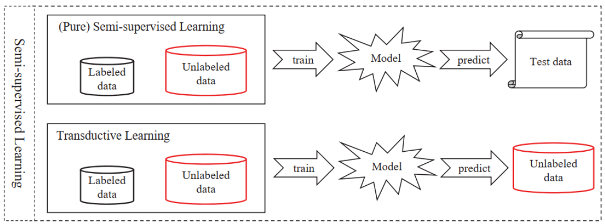

-----

| Title         | ML SSL                                                |
| ------------- | ----------------------------------------------------- |
| Created @     | `2019-01-28T02:29:12Z`                                |
| Last Modify @ | `2022-12-24T13:17:13Z`                                |
| Labels        | \`\`                                                  |
| Edit @        | [here](https://github.com/junxnone/aiwiki/issues/271) |

-----

# Semi-Supervised Learning 半监督学习

## Reference

  - [Semi-supervised Learning
    ;半监督学习](https://blog.csdn.net/MosBest/article/details/79787288)
  - [周志华《Machine
    Learning》学习笔记（15）--半监督学习](https://blog.csdn.net/u011826404/article/details/74358913)
  - [常见机器学习分类、常见主动学习、监督学习、非监督学习、半监督学习](https://blog.csdn.net/dingyahui123/article/details/78135705)
  - [机器学习？有无监督、弱监督、半监督、强化、多示例学习是什么](https://blog.csdn.net/limiyudianzi/article/details/78921450)

## Brief

> 收集样本数据容易，但是给每个样本打标签 成本就很高。 因此出现了Semi-supervised Learning. 不同与 active
> learning，让学习过程不依赖外界的咨询交互，自动利用未标记样本所包含的分布信息的方法便是半监督学习（semi-supervised
> learning），即训练集同时包含有标记样本数据和未标记样本数据。

## 分类

  - 生成式方法（generative methods）
  - S3VM/TSVM
  - 图半监督学习

## Active Learning vs Semi-Supervised Learning

| Name     | Active Learning                                              | Semi-Supervised Learning                                     |
| -------- | ------------------------------------------------------------ | ------------------------------------------------------------ |
| 人工标注     | ✅                                                            | :x:                                                          |
| 挑选高价值样例  | ✅                                                            | ✅                                                            |
| 优点       |                                                              | 利用了未标注样本                                                     |
| 缺点       |                                                              | 引入了噪声样本                                                      |
| Pipeline |  |  |
