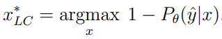
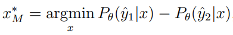
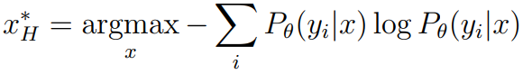
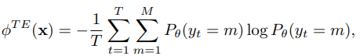
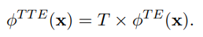
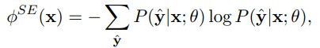
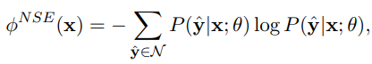
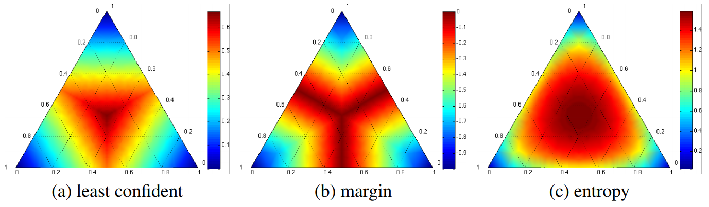

-----

| Title         | ML AL QS UncertaintySampling                          |
| ------------- | ----------------------------------------------------- |
| Created @     | `2020-07-06T07:16:16Z`                                |
| Last Modify @ | `2022-12-24T13:12:20Z`                                |
| Labels        | \`\`                                                  |
| Edit @        | [here](https://github.com/junxnone/aiwiki/issues/275) |

-----

# Uncertainty Sampling

## Reference

  - [主动学习（Active Learning）系列介绍（二）不确定度采样（Uncertainty
    Sampling）](https://blog.csdn.net/qq_39856931/article/details/106433187)
  - [modAL - Uncertainty
    sampling](https://modal-python.readthedocs.io/en/latest/content/query_strategies/uncertainty_sampling.html)

## Brief

  - 每次选择最不确定 `batch data`
  - **Input**
      - Model predict Vector
  - **Output**
      - Batch data index

## 不确定的评估标准

| Name                    | Description                           | 公式                                                           | Implement                                                                                                                                                                                           |
| ----------------------- | ------------------------------------- | ------------------------------------------------------------ | --------------------------------------------------------------------------------------------------------------------------------------------------------------------------------------------------- |
| Least Confident - 最小置信度 | `predict confidence`越小越有价值            |  | \- [alipy](https://github.com/NUAA-AL/ALiPy/blob/dev/alipy/query_strategy/query_labels.py#L226)  - [modAL](https://github.com/modAL-python/modAL/blob/master/modAL/uncertainty.py#L82)           |
| Margin - 间隔             | `predict confidence` 第一和第二的概率间隔越小越有价值 |  | \- [alipy](https://github.com/NUAA-AL/ALiPy/blob/dev/alipy/query_strategy/query_labels.py#L222-L223) - [modAL](https://github.com/modAL-python/modAL/blob/master/modAL/uncertainty.py#L107-L108) |
| Entropy                 | 和所有 `predict confidence` 有关           |  | \- [alipy](https://github.com/NUAA-AL/ALiPy/blob/dev/alipy/query_strategy/query_labels.py#L215-L216) - [modAL](https://github.com/modAL-python/modAL/blob/master/modAL/uncertainty.py#L130)      |

  - **NLP**

| Name                                    | Description | 公式                                                           | Implement |
| --------------------------------------- | ----------- | ------------------------------------------------------------ | --------- |
| Token Entropy                           |             |  |           |
| Total Token Entropy                     |             |  |           |
| Sequence Entropy                        |             |  |           |
| N-best sequence entropy                 |             |  |           |
| MNLP - Maximum Normalized Log-Probality |             |                                                              |           |
| MCLU - Multi-Class Level Uncertainty    |             |                                                              |           |
| BvSB - Best vs Second Best              |             |                                                              |           |

## Least Confident vs Margin vs Entropy

  - 如图为三分类问题中三类不确定度计算方法的不确定度分布
  - 颜色越深则越不确定 - `uncertain`，一般选取位于中间位置的示例作为query instance

## 不同的任务

  - 分类
  - 回归 - 最大方差

## 缺点

  - 依赖于 model 的 predict value

## History

  - 1994 [**Least Confident** - A sequential algorithm for training text
    classifiers](https://dl.acm.org/doi/pdf/10.5555/188490.188495)
  - 1994 [**Least Confident** - Heterogeneous uncertainty sampling for
    supervised
    learning](https://www.researchgate.net/profile/David_Lewis24/publication/2760933_Heterogeneous_Uncertainty_Sampling_for_Supervised_Learning/links/561284f108aeed6ac88415a4.pdf)
  - 2005 [**Least Confident** - Reducing labeling effort for stuctured
    prediction
    tasks](http://cs.iit.edu/~culotta/pubs/culotta05reducing.pdf)
  - 2008 [An analysis of active learning strategies for sequence
    labeling tasks](https://dl.acm.org/doi/pdf/10.5555/1613715.1613855)
  - 2001 [ **Margin Sampling** - Active hidden Markov models for
    information
    extraction](https://link.springer.com/content/pdf/10.1007%2F3-540-44816-0.pdf)
    - **P309 \~ P318**
