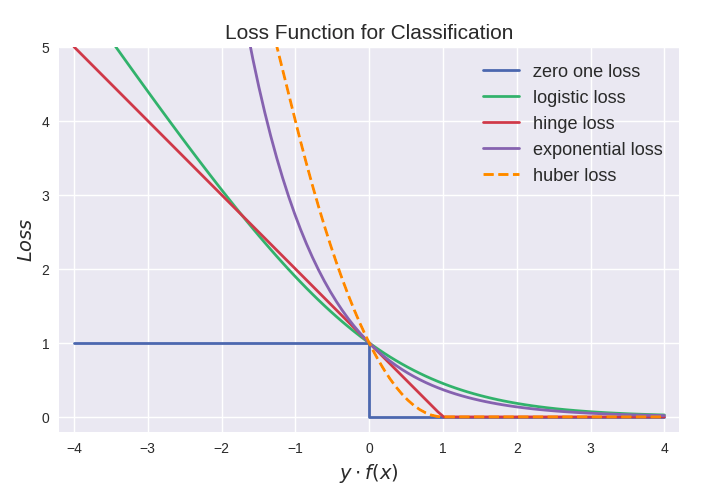
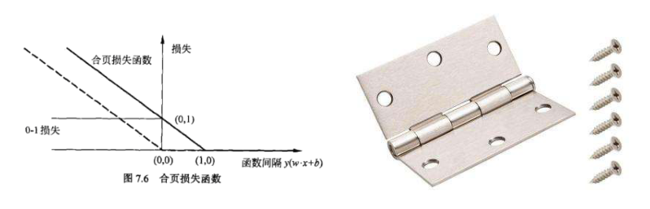
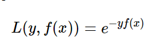
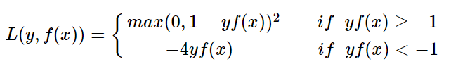
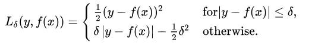
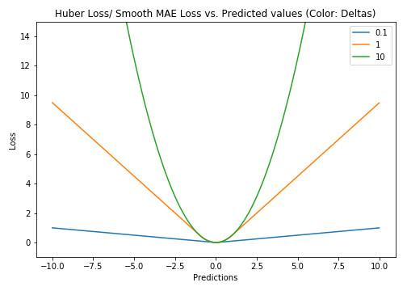
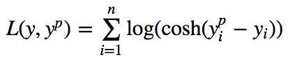
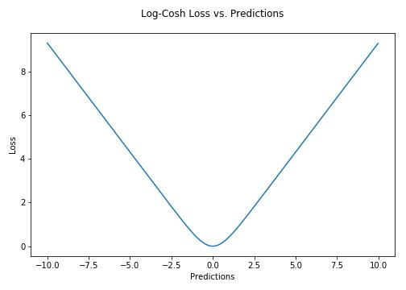

-----

| Title     | ML Arch Func LossFunction                             |
| --------- | ----------------------------------------------------- |
| Created @ | `2019-04-08T06:11:14Z`                                |
| Updated @ | `2023-02-06T01:58:29Z`                                |
| Labels    | \`\`                                                  |
| Edit @    | [here](https://github.com/junxnone/aiwiki/issues/281) |

-----

# Loss Function 损失函数

## Reference

  - [常见回归和分类损失函数比较](https://www.cnblogs.com/massquantity/p/8964029.html)
  - [L1 vs. L2 Loss
    function](http://rishy.github.io/ml/2015/07/28/l1-vs-l2-loss/)
  - [Hinge loss](https://www.wikiwand.com/en/Hinge_loss)
  - [Zero one loss -
    scikit-learn](https://scikit-learn.org/stable/modules/model_evaluation.html#zero-one-loss)

## Brief

  - Loss Function/损失函数 - 用于计算 `Predict Result` 与 `Ground Truth` 误差
  - 分类问题
  - 回归问题
  - [Focal Loss](/Focal_Loss)
  - [Dice Loss](/Dice_Loss)

## 分类损失函数

### 0-1 Loss

  - Zero one loss/0-1损失
  - 对每个错分类点都施以相同的惩罚，
  - 0-1损失不连续、非凸，优化困难

| Name     | Formula                                                    |
| -------- | ---------------------------------------------------------- |
| 0-1 Loss | $L\_{0-1}(y\_i, \\hat{y}\_i) = 1(\\hat{y}\_i \\not= y\_i)$ |

### Hamming Loss

| Name         | Formula                                                                                                                    |
| ------------ | -------------------------------------------------------------------------------------------------------------------------- |
| Hamming Loss | $L\_{Hamming}(y, \\hat{y}) = \\frac{1}{n\_\\text{labels}} \\sum\_{j=0}^{n\_\\text{labels} - 1} 1(\\hat{y}\_j \\not= y\_j)$ |

### Log Loss

  - `Logistic Regression Loss`/`Cross-Entropy Loss`

| Name                      | Formula                                                                                                                            |
| ------------------------- | ---------------------------------------------------------------------------------------------------------------------------------- |
| Binary Classification     | $L\_{\\log}(y, p) = -\\log \\operatorname{Pr}(y|p) = -(y \\log (p) + (1 - y) \\log (1 - p))$                                       |
| Multiclass Classification | $L\_{\\log}(Y, P) = -\\log \\operatorname{Pr}(Y|P) = - \\frac{1}{N} \\sum\_{i=0}^{N-1} \\sum\_{k=0}^{K-1} y\_{i,k} \\log p\_{i,k}$ |

### Hinge Loss/合页损失

  - 用于 `maximum-margin` 的分类器
  - 用于 SVM

| Name            | Formula                                                                             |
| --------------- | ----------------------------------------------------------------------------------- |
| Label\[-1, +1\] | $L\_\\text{Hinge}(y, w) = \\max\\left{1 - wy, 0\\right} = \\left|1 - wy\\right|\_+$ |
| Multi-Label     | $L\_\\text{Hinge}(y\_w, y\_t) = \\max\\left{1 + y\_t - y\_w, 0\\right}$             |

### 指数损失(Exponential loss)

### modified Huber loss

> 结合了hinge loss和logistic loss的优点，既能在yf(x)\>1时产生稀疏解提高训练效率，又能进行概率估计

## 回归损失函数

### MSE

  - Mean Squared Error/均方误差
  - L2 Loss - `Least Square errors`

| Name | Formula                                                                                                                 |
| ---- | ----------------------------------------------------------------------------------------------------------------------- |
| MSE  | $\\text{MSE}(y, \\hat{y}) = \\frac{1}{n\_\\text{samples}} \\sum\_{i=0}^{n\_\\text{samples} - 1} (y\_i - \\hat{y}\_i)^2$ |

### MAE

  - Mean Absolute Error/平均绝对值误差
  - L1 Loss - `Least absolute deviations`
  - MAE对异常点有更好的鲁棒性

| Name | Formula                                                                                                                                |
| ---- | -------------------------------------------------------------------------------------------------------------------------------------- |
| MAE  | $\\text{MAE}(y, \\hat{y}) = \\frac{1}{n\_{\\text{samples}}} \\sum\_{i=0}^{n\_{\\text{samples}}-1} \\left| y\_i - \\hat{y}\_i \\right|$ |

### MAPE

  - Mean Absolute Percentage Error
  - MAPD - `Mean Absolute Percentage Deviation`
  - 相对误差敏感

| Name | Formula                                                                                                                                                                                  |
| ---- | ---------------------------------------------------------------------------------------------------------------------------------------------------------------------------------------- |
| MAPE | $\\text{MAPE}(y, \\hat{y}) = \\frac{1}{n\_{\\text{samples}}} \\sum\_{i=0}^{n\_{\\text{samples}}-1} \\frac{{}\\left| y\_i - \\hat{y}\_i \\right|}{max(\\epsilon, \\left| y\_i \\right|)}$ |

### MSLE

  - Mean Squared Logarithmic Error

| Name | Formula                                                                                                                                                  |
| ---- | -------------------------------------------------------------------------------------------------------------------------------------------------------- |
| MSLE | $\\text{MSLE}(y, \\hat{y}) = \\frac{1}{n\_\\text{samples}} \\sum\_{i=0}^{n\_\\text{samples} - 1} (\\log\_e (1 + y\_i) - \\log\_e (1 + \\hat{y}\_i) )^2.$ |

### Huber损失

> 当Huber损失在\[0-δ,0+δ\]之间时，等价为MSE，而在\[-∞,δ\]和\[δ,+∞\]时为MAE。

### Log-Cosh损失

> 二阶处处可微

### 分位数损失
