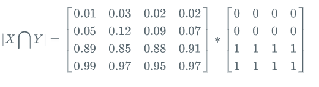
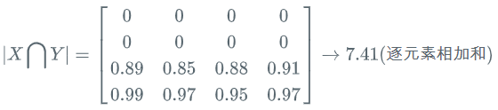
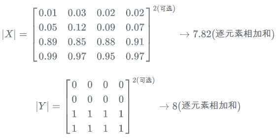
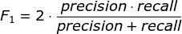
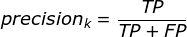
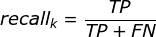

-----

| Title     | ML Arch Func LossFunction DiceLoss                    |
| --------- | ----------------------------------------------------- |
| Created @ | `2019-12-09T03:27:35Z`                                |
| Updated @ | `2023-02-06T01:59:11Z`                                |
| Labels    | \`\`                                                  |
| Edit @    | [here](https://github.com/junxnone/aiwiki/issues/283) |

-----

# Dice Loss

## Reference

  - [paper - V-Net: Fully Convolutional Neural Networks for Volumetric
    Medical Image
    Segmentation](http://campar.in.tum.de/pub/milletari2016Vnet/milletari2016Vnet.pdf)
  - [Dice系数](https://zh.wikipedia.org/wiki/Dice%E7%B3%BB%E6%95%B0)
  - [医学图像分割常用的损失函数](https://blog.csdn.net/Biyoner/article/details/84728417)
  - [医学图像分割之 Dice Loss](https://www.aiuai.cn/aifarm1159.html)
  - [Pytorch Dice
    Loss](https://github.com/pytorch/pytorch/issues/1249#issuecomment-337999895)
  - [Dice-coefficient loss for image
    segmentation](https://blog.masterliu.net/dice-loss/)

## Brief

## Dice 系数

  - 根据 Lee Raymond Dice 命名, 一种集合相似度度量函数，通常用于计算两个样本的相似度
  - 范围为0到1

-----

  - **|X∩Y| :** X 和 Y 的交集
  - **|X| :** X 的元素个数
  - **|Y| :** Y 的元素个数
  - 分子中的系数 2 ， 是因为 X , Y 中存在重复元素

-----

### Dice coefficient vs Jaccard Index

  - J - Jaccard Index
  - S - Dice coefficient

-----

**差异函数，即 `Dice Loss`**

## `Dice Loss` - 图像分割应用

  - **X:** Ground-Truth
  - **Y:** Predict Result

-----

  - **|X∩Y| :** X 和 Y 的点乘后的元素求和

-----

  - **|X| :** X 的元素取和
  - **|Y| :** Y 的元素取和

### Dice 系数和 F1-Score 的关系

| Metric   | 公式                                                           |
| -------- | ------------------------------------------------------------ |
| F1-Score |  |
| Prcision |  |
| Recall   |  |
| F1-Score |  |

> TP = Ground-Truth ∩ Predict Result FN = Ground-Truth - TP FP = Predict
> Result - TP F1-Score = 2TP/ True + Pred 即 Dice 系数

即 `Dice Loss = 1 - F1-Score`

## smooth

  - Laplace smoothing
      - 减少 Overfitting 加快收敛
      - 避免分母为 0
