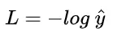
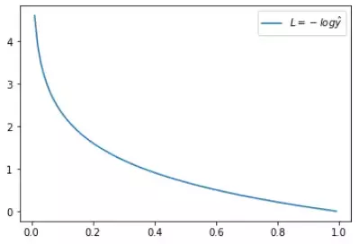
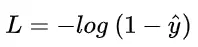
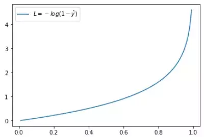
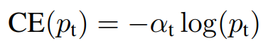
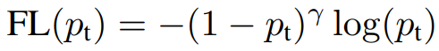
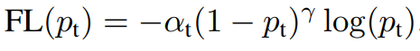
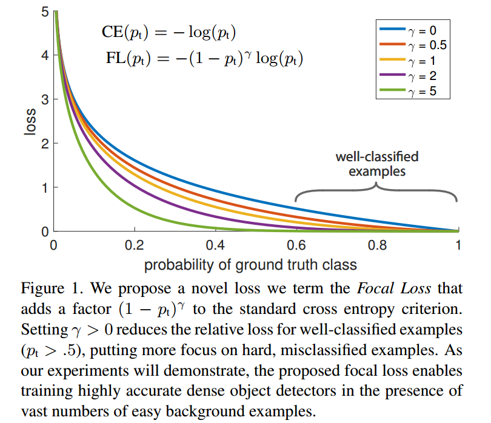
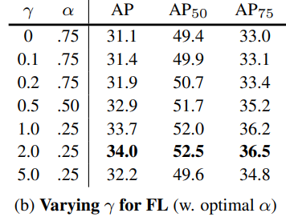

-----

| Title     | ML Arch Func LossFunction FocalLoss                   |
| --------- | ----------------------------------------------------- |
| Created @ | `2019-03-14T06:35:24Z`                                |
| Updated @ | `2023-02-06T01:59:17Z`                                |
| Labels    | \`\`                                                  |
| Edit @    | [here](https://github.com/junxnone/aiwiki/issues/284) |

-----

# Focal Loss

## Reference

  - [Focal Loss理解](https://www.cnblogs.com/king-lps/p/9497836.html)
  - [Focal Loss for Dense Object
    Detection解读](https://www.jianshu.com/p/204d9ad9507f)
  - [paper - Focal Loss for Dense Object
    Detection](https://arxiv.org/pdf/1708.02002.pdf)
  - [Focal Loss 论文理解及公式推导](https://www.aiuai.cn/aifarm636.html)

## Brief

  - 在交叉熵损失函数基础上进行的修改
  - Focal loss 主要是为了解决 one-stage 目标检测中正负样本比例严重失衡的问题
  - 该损失函数降低了大量简单负样本在训练中所占的权重，也可理解为一种困难样本挖掘。
  - 关注于在 hard samples 的稀疏子集进行训练，并避免在训练过程中大量的简单负样本淹没检测器

## 交叉熵 - cross entropy - CE

| 二分类交叉熵 |  |
| ------ | ------------------------------------------------------------ |

  - y' 是经过激活函数的输出，所以在0-1之间
  - 对于正样本, 输出概率越大损失越小
  - 对于负样本, 输出概率越小则损失越小

|  |  |
| ------------------------------------------------------------ | ------------------------------------------------------------ |
|  |  |

## 均衡交叉熵 Blanced CE

| Blanced CE |  |
| ---------- | ------------------------------------------------------------ |

  - 引入权重因子 αt
      - class 1 , `αt = α ∈ [0, 1]`
      - class −1, `αt = 1−α`
  - αt 能够平衡 positive/negative 样本的重要性，但不能区分 easy/hard 样本

## Focal Loss

| Focal Loss    |  |
| ------------- | ------------------------------------------------------------ |
| α-balanced FL |  |

  - 引入调制因子- modulating factor `(1 − pt)^γ`, γ ≥ 0
  - pt 为不同类别的分类概率
      - pt 越大, 样本越容易, 调制因子越小, 损失函数值越小, 得以区分 easy/hard 样本
  - γ ≥ 0
  - αt ∈ \[0, 1\] - 用于调节 positive 和 negative 的比例，前景类别使用 α 时，对应的背景类别使用
    1-α
      - 例如 α=0.25 则前景权重占比较小，背景占比较大
  - γ 和 αt 是固定值, 不参与训练
  - γ 和 αt 的最优值是相互影响的，所以在评估准确度时需要把两者组合起来调节
      - RetinaNet 作者在论文中给出 γ=2 & αt =0.25 时，ResNet-101+FPN 作为 backbone
        的结构有最优的性能。

-----

-----

不同 γ 和 αt 测试结果

