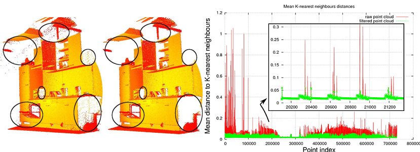
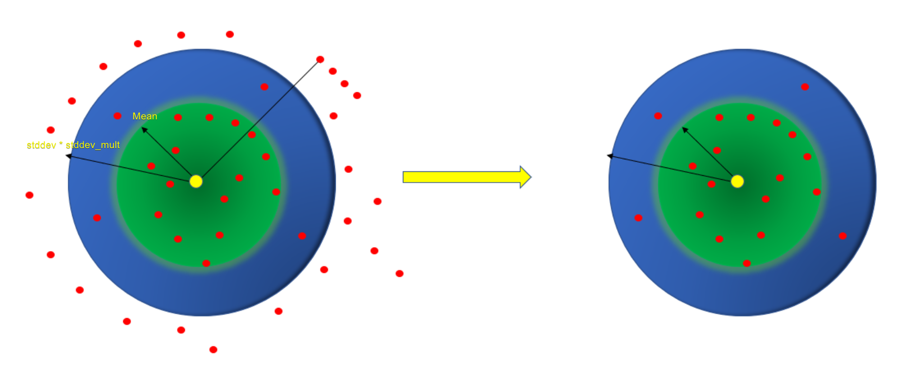
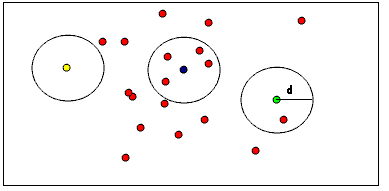

-----

| Title         | 3D Cloud SOR                                          |
| ------------- | ----------------------------------------------------- |
| Created @     | `2022-02-08T02:03:37Z`                                |
| Last Modify @ | `2022-12-25T03:46:54Z`                                |
| Labels        | \`\`                                                  |
| Edit @        | [here](https://github.com/junxnone/aiwiki/issues/287) |

-----

# 离群点移除

## Brief

  - StatisticalOutlierRemoval: 统计分布
  - ConditionalRemoval
  - RadiusOutlierRemoval

## StatisticalOutlierRemoval

  - 统计每个点的邻域内 K 个近邻点到该点的距离/平均距离
  - 所有点到临近点的平均距离计算分布/均值/标准差
  - 若平均距离在标准范围之外，作为离群点被移除
  - **Input**
      - **MeanK** 求取平均距离的 K个近邻点
      - **StddevMulThresh** 标准差系数 - `stddev_mult`, 距离阈值为 `mean +
        stddev_mult * stddev` (大于此值的点被移除)

## RadiusOutlierRemoval

  - 若点半径 R 内的邻域内近邻点小于 K , 则会被移除
  - **Input**
      - **R** 搜索近邻点半径
      - **K** 移除阈值, 近邻点个数小于K 则移除该点

## ConditionalRemoval

  - 移除不符合指定条件的点
