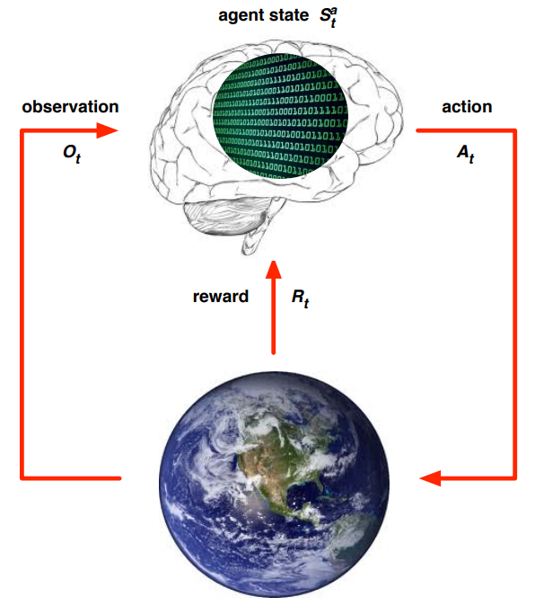
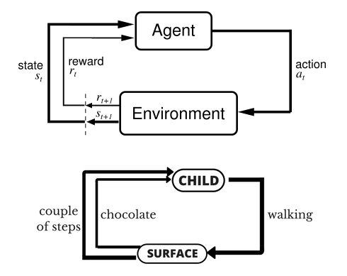

-----

| Title     | ML RL                                                 |
| --------- | ----------------------------------------------------- |
| Created @ | `2018-10-29T02:55:26Z`                                |
| Updated @ | `2023-11-08T07:12:29Z`                                |
| Labels    | `summary`                                             |
| Edit @    | [here](https://github.com/junxnone/aiwiki/issues/290) |

-----

# RL 强化学习

  - RL - `Reinforcement Learning` - 强化学习

## 定义

  - **Agent** - **智能体** 作出智能决策的主体，RL的学习者
  - **Environment** - **环境** 能够被感知的外部系统
  - **State** - **状态** 马尔科夫状态 - 历史信息总结 - 对世界的完整描述，不会隐藏世界的信息
  - **Observation** - **观察** 对状态的部分描述，可能会遗漏一些信息
  - **Action** - **动作**
      - **Action Space** - 在给定的环境中，有效动作的集合经常被称为动作空间
          - 离散动作空间(discrete action spaces)
          - 连续动作空间(continuous action spaces)
  - **Reward** - **奖励** 环境根据状态和智能体采取的动作，产生一个标量信号作为奖励反馈
  - **Policy** - **策略** 智能体用于决定下一步执行什么行动的规则
  - **Return** - **Cumulated Future Reward**
      - **Discounted Return** - 折扣汇报 - `cumulative discounted future
        reward`

|  |  |
| ------------------------------------------------------------ | ------------------------------------------------------------ |

>   - 当环境可被完全观察到时，强化学习问题被称为马尔可夫决策过程（markov decision process）
>   - 当状态不依赖于之前的操作时，我们称该问题为上下文赌博机（contextual bandit problem）
>   - 当没有状态，只有一组最初未知回报的可用动作时，这个问题就是经典的多臂赌博机（multi-armed bandit problem）。

## Algos

  - 按照环境是否已知划分
      - **Model-based** 去学习和理解环境，学会用一个模型来模拟环境，通过模拟的环境来得到反馈,基于之前学习的知识
      - **Model-free** 不去学习和理解环境，环境给出什么信息就是什么信息, 重新探索，不使用之前经验
  - 按照学习方式划分
      - **On-Policy** agent必须本人在场， 并且一定是本人边玩边学习
      - **Off-Policy** agent可以选择自己玩， 也可以选择看着别人玩， 通过看别人玩来学习别人的行为准则
  - 按照学习目标划分
      - **Policy-based** 直接输出下一步动作的概率，根据概率来选取动作 适用于非连续和连续的动作
      - **Value-based** 输出的是动作的价值，选择价值最高的动作。适用于非连续的动作
  - **Actor Critic** 结合了Value-Based和Policy-Based

| Algos      | Description                        |
| ---------- | ---------------------------------- |
| MDP        |                                    |
| PG         | Policy Gradient                    |
| Q-Learning |                                    |
| DQN        |                                    |
| SARSA      | State-Action-Reward-State-Action   |
| DDPG       | Deep Deterministic Policy Gradient |
| TRPO       | Trust Region Policy Optimization   |
| PPO        | Proximal Policy Optimization       |

## Platform

| Name                  | Description |
| --------------------- | ----------- |
| OpenAI Gym & Universe |             |
| DeepMind lab          |             |

## 应用

  - 机器人控制
  - 自动驾驶
  - 游戏
  - 交易系统
  - 对话系统

## Reference

  - [MAMEToolkit - against arcade
    games](https://github.com/M-J-Murray/MAMEToolkit)
  - [Chess - AlphaGo Zero
    methods](https://github.com/Zeta36/chess-alpha-zero)
  - [AlphaGoZero/AlphaZero
    reimplementation](https://github.com/pytorch/ELF)
  - [Reaver - 星际争霸 II](https://github.com/inoryy/reaver)
  - [Reinforcement Learning on google
    colab](https://medium.com/@kaleajit27/reinforcement-learning-on-google-colab-9cb2e1ef51e)
  - [Reinforcement Learning -
    ML-NLP](https://github.com/NLP-LOVE/ML-NLP/tree/master/Deep%20Learning/14.%20Reinforcement%20Learning)
  - [强化学习入门总结](https://blog.csdn.net/j754379117/article/details/83037799)
  - [awesome-deep-rl -
    tigerneil](https://github.com/tigerneil/awesome-deep-rl)
  - [reinforcement-learning -
    dennybritz](https://github.com/dennybritz/reinforcement-learning)
  - [UCL Course on RL -
    davidsilver](https://www.davidsilver.uk/teaching/)
  - [强化学习（Reinforcement
    Learning）知识整理](https://zhuanlan.zhihu.com/p/25319023)
  - [AutoDL论文解读（一）：基于强化学习的开创性工作](https://blog.csdn.net/u014157632/article/details/101721343)
  - [UCB CS294-112 深度强化学习中文笔记 -
    apachecn](http://cs294-112.apachecn.org/#/docs/1)
  - [强化学习入门：基本思想和经典算法
    \_](https://imzhanghao.com/2022/02/10/reinforcement-learning/)

## Books

  - [深度强化学习/Deep Reinforcement
    Learning](https://deepreinforcementlearningbook.org/)
  - [动手学强化学习](https://hrl.boyuai.com/)
  - [蘑菇书 EasyRL](https://datawhalechina.github.io/easy-rl/#/)
