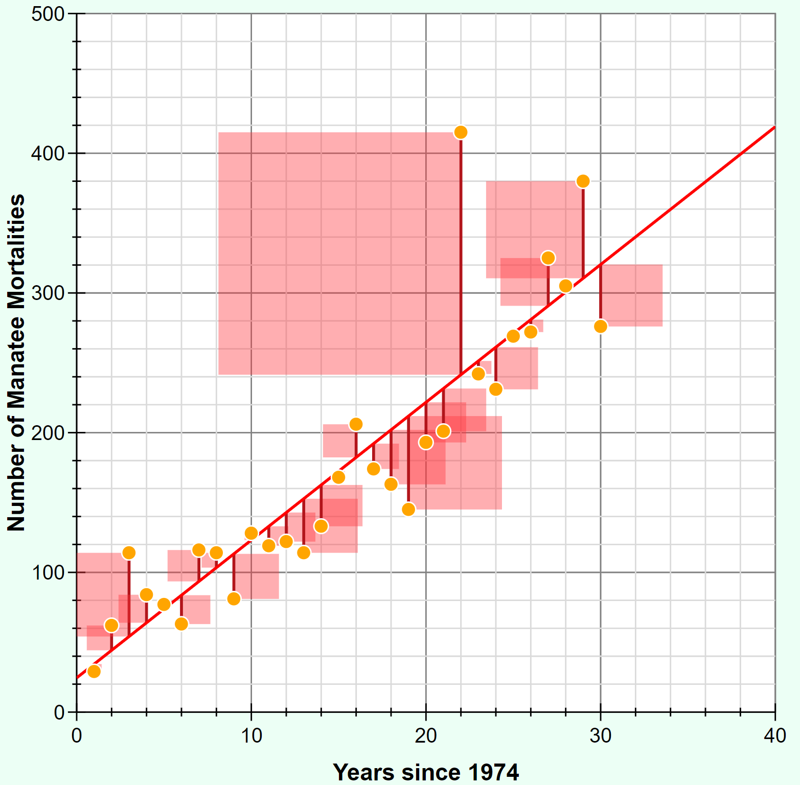
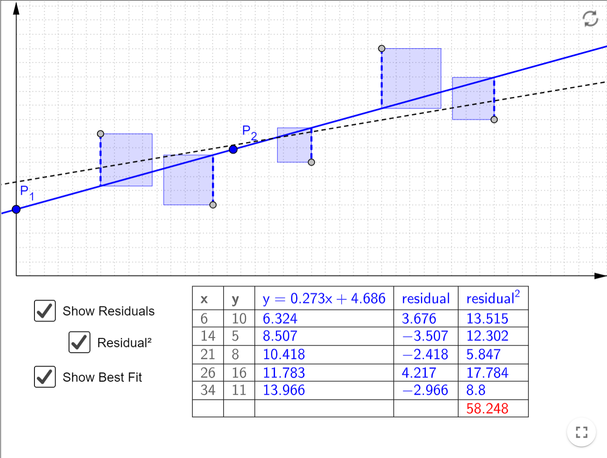

-----

| Title         | Math LeastSquares                                     |
| ------------- | ----------------------------------------------------- |
| Created @     | `2022-03-07T04:06:49Z`                                |
| Last Modify @ | `2022-12-25T03:37:51Z`                                |
| Labels        | \`\`                                                  |
| Edit @        | [here](https://github.com/junxnone/aiwiki/issues/294) |

-----

# Least Squares 最小二乘法

## Reference

  - [最小二乘法回归
    demo](https://phet.colorado.edu/sims/html/least-squares-regression/latest/least-squares-regression_en.html)
  - [最小二乘法 - 一元](https://otexts.com/fppcn/least-squares.html)
  - [最小二乘法 - 多元](https://otexts.com/fppcn/regression-matrices.html)

## Brief

  - Least Squares - 最小二乘法 - 最小平方法
  - 最小误差平方和优化获取最佳拟合
  - 拟合直线

|  |  |
| ------------------------------------------------------------ | ------------------------------------------------------------ |

## 推理

### 一元线性回归

| Name | Description                                                                                                                                                       |
| ---- | ----------------------------------------------------------------------------------------------------------------------------------------------------------------- |
| 数据   | $X = \\left{(x\_{1}, y\_{1}), (x\_{2}, y\_{2})..., (x\_{m}, y\_{m})\\right}$                                                                                      |
| 模型   | $y = \\beta\_{0} + \\beta\_{1}x$                                                                                                                                  |
| 目标函数 | $J(\\beta) = \\sum\_{i=0}^{m}(y\_{i}-\\beta\_{1}x\_{i}-\\beta\_{0})^2$                                                                                            |
| 解    | $\\beta\_{1} = \\frac{\\sum\_{i=1}^{m}(x\_{i}-\\bar{x})(y\_{i}-\\bar{y})}{\\sum\_{i=1}^{m}(x\_{i}-\\bar{x})^2}$   $\\beta\_{0} = \\bar{y}-\\beta\_{1}\\bar{x}$ |

### 多元线性回归

| Name | Description                                                                                                                                                                                                                            |
| ---- | -------------------------------------------------------------------------------------------------------------------------------------------------------------------------------------------------------------------------------------- |
| 模型   | $y\_{t} = \\beta\_{0} + \\beta\_{1} x\_{1,t} + \\beta\_{2} x\_{2,t} + \\cdots + \\beta\_{k} x\_{k,t} + \\varepsilon\_{t}$                                                                                                              |
| ...  | $\\bm{y} = \\bm{X}\\bm{\\beta} + \\bm{\\varepsilon}.$                                                                                                                                                                                  |
| 参数   | $\\bm{\\beta} = (\\beta\_{0},\\dots,\\beta\_{k})'$                                                                                                                                                                                     |
| 数据   | $\\bm{X} = \\left\[ \\begin{matrix} 1 & x\_{1,1} & x\_{2,1} & \\dots & x\_{k,1}\\ 1 & x\_{1,2} & x\_{2,2} & \\dots & x\_{k,2}\\ \\vdots& \\vdots& \\vdots&& \\vdots\\ 1 & x\_{1,T}& x\_{2,T}& \\dots& x\_{k,T} \\end{matrix}\\right\]$ |
| 目标函数 | $\\bm{\\varepsilon}'\\bm{\\varepsilon} = (\\bm{y} - \\bm{X}\\bm{\\beta})'(\\bm{y} - \\bm{X}\\bm{\\beta})$                                                                                                                              |
| 解    | $\\hat{\\bm{\\beta}} = (\\bm{X}'\\bm{X})^{-1}\\bm{X}'\\bm{y}$                                                                                                                                                                          |
