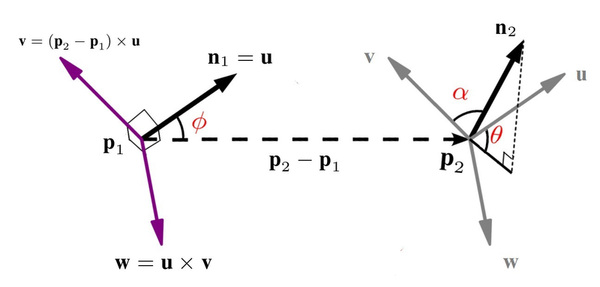

-----

| Title         | 3D Cloud Features PFH                                 |
| ------------- | ----------------------------------------------------- |
| Created @     | `2021-05-08T03:11:56Z`                                |
| Last Modify @ | `2022-12-25T03:50:44Z`                                |
| Labels        | \`\`                                                  |
| Edit @        | [here](https://github.com/junxnone/aiwiki/issues/298) |

-----

## Reference

  - [几何特征系列：Point Feature
    Histogram（点特征直方图）](http://lemonc.me/point-feature-histogram.html)
  - [PCL计算PFH源码computePairFeatures](https://blog.csdn.net/m0_49291417/article/details/110198763)
  - [【点云局部特征描述子】PFH & FPFH](https://zhuanlan.zhihu.com/p/192343758)
  - [Aligning point cloud views using persistent feature
    histograms](https://ias.in.tum.de/_media/spezial/bib/rusu08iros-1.pdf)

## Brief

  - PFH - `Point Feature Histogram` - 点特征直方图
  - 通过数理统计的方法获得一个用于描述中心点邻域几何信息的直方图
  - 使用空间k点差异信息, 描述几何属性

## Algos

### Point Pair(点对)

  - 红色点 $P\_{q}$ 为 **Query Point**
  - 以 $r$ 为半径搜索 $P\_{q}$ 近邻点, 所有点两两相连组成网络
  - **Point Pair** - 网络内的点两两配对得到 $k(k+1)/2$ 个点对
  - 计算每个点的 PFH 复杂度: $O(k^2)$

### 计算 PFH

  - 点 $p\_1$ $p\_2$ 各自法向量 $n\_1$ $n\_2$
  - 在 $p\_2$ 上定义局部坐标系:
      - $u=n\_1$
      - $v = u \\times \\frac{{p\_2} - {p\_1}}{{\\parallel}{p\_2} -
        {p\_1}{\\parallel}}\_2$
      - $w = u \\times v$
  - $n\_1$ $n\_2$ 差异表示: $(\\alpha, \\phi, \\theta)$
      - $\\alpha = v \\cdot {n\_2}$
      - $\\phi = u \\cdot \\frac{{p\_2} - {p\_1}}{{\\parallel}{{p\_2} -
        {p\_1}}{\\parallel}\_2}$
      - ${\\theta} = {\\arctan (w \\cdot {n\_2},u \\cdot {n\_2})}$
  - 邻域内 k 个点 计算 $C\_{k}^2$ 个所有四元组 $(\\alpha, \\phi, \\theta, d)$
      - $d={{\\parallel}{p\_2} - {p\_1}{\\parallel}}\_2$
  - $(\\alpha, \\phi, \\theta)$ 每个值分为 b 个区间, 三个维度组合为 $b^3$ 个区间,
    统计特征值出现在每一个区间的频率
  - b=5 ==\> `float[125]` ==\> **125 维特征向量** ==\> `pcl::PFHSignature125`

> 压缩信息 $(x\_1, y\_1, z\_1, n\_1^x, n\_1^y, n\_1^z, x\_2, y\_2, z\_2,
> n\_2^x, n\_2^y, n\_2^z)$ 为 $(\\alpha, \\phi, \\theta, d)$

## UseCase
