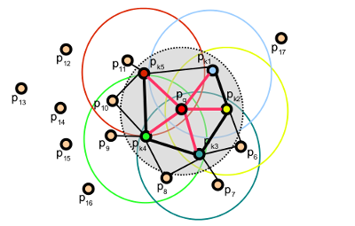
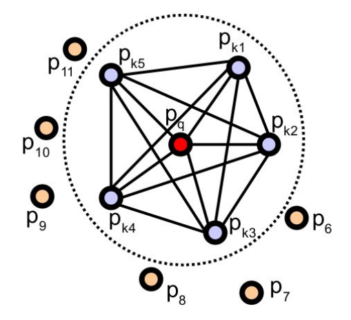
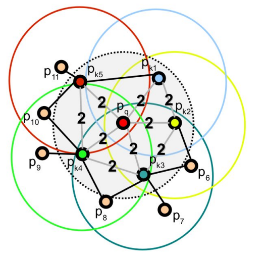

-----

| Title         | 3D Cloud Features FPFH                                |
| ------------- | ----------------------------------------------------- |
| Created @     | `2022-03-14T06:33:33Z`                                |
| Last Modify @ | `2022-12-25T03:50:31Z`                                |
| Labels        | \`\`                                                  |
| Edit @        | [here](https://github.com/junxnone/aiwiki/issues/299) |

-----

## Reference

  - [三维点云课程---FPFH特征点描述](https://blog.csdn.net/qq_45369294/article/details/121125386)
  - [Fast Point Feature Histograms (FPFH) for 3D
    registration](https://www.cvl.iis.u-tokyo.ac.jp/class2016/2016w/papers/6.3DdataProcessing/Rusu_FPFH_ICRA2009.pdf)

## Brief

  - FPFH - `Fast Point Feature Histogram` - 快速 PFH
  - 基于 \[\[PFH\]\]
  - SPFH - `Simplified Point Feature Histogram` - 简化 PFH
      - 只计算查询点与邻域点特征 (不计算邻域间点间特征)
  - 算法复杂度 $O(nk)$
  - 角度区间分割默认分割 11 份, 不进行穷举\[$33 = 11 + 11 + 11$\] ==\>
    `pcl::FPFHSignature33` ==\> `(float[33])`

## FPFH

  - 加权重计算 ==\> $FPFH(p) =
    SPFH(p)+\\frac{1}{k}\\sum\_{i=1}^{k}\\frac{1}{w\_k}SPFH(p\_k)$
  - $SPFH(p)$ : 查询点 $p$ 的 SPFH
  - $SPFH(p\_k)$ : 近邻点 $p\_k$ 的 SPFH
  - $k$: 查询点 $p$ 有 k 个近邻点
  - $\\frac{1}{w\_k}$: 查询点 $p$ 与近邻点 $p\_k$ 的距离

### PFH vs FPFH

| PFH 点对特征值计算                                                  | FPFH 加权计算                                                    |
| ------------------------------------------------------------ | ------------------------------------------------------------ |
|  |  |
