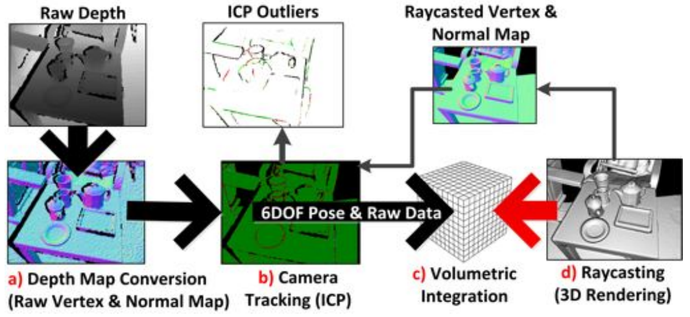
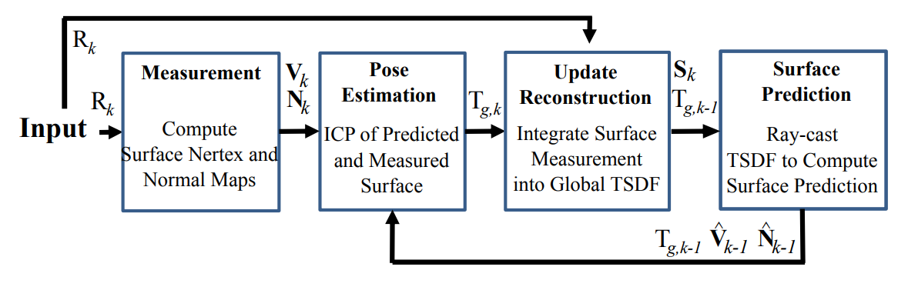

-----

| Title     | 3D Algos Reconstruction KinectFusion                  |
| --------- | ----------------------------------------------------- |
| Created @ | `2022-04-05T03:11:35Z`                                |
| Updated @ | `2023-06-17T15:35:16Z`                                |
| Labels    | \`\`                                                  |
| Edit @    | [here](https://github.com/junxnone/aiwiki/issues/306) |

-----

# KinectFusion

  - 通过低成本深度摄像机获取的深度图进行三维重建

## Pipeline

| Pipeline                                           | Description |
| -------------------------------------------------- | ----------- |
| Depth Map Conversion (**Measurement**)             | 深度图转点云      |
| Camera Tracking (**Pose Estimation**)              | ICP 配准求相对位姿 |
| Volumetric Integration (**Update Reconstruction**) | 重建物体表面      |
| Raycasting (**Surface Prediction**)                | 渲染          |

| x | 两篇 paper 中的 pipeline                                         |
| - | ------------------------------------------------------------ |
| 1 |  |
| 2 |  |

## Reference

  - 2011 **KinectFusion** KinectFusion: Real-time 3D Reconstruction and
    Interaction Using a Moving Depth Camera
    \[[paper](http://citeseerx.ist.psu.edu/viewdoc/summary?doi=10.1.1.229.2346)\]
    \[[code](https://github.com/Nerei/kinfu_remake)\]
  - 2011 [KinectFusion: Real-Time Dense Surface Mapping and
    Tracking](https://www.microsoft.com/en-us/research/wp-content/uploads/2016/02/ismar2011.pdf)
  - [啥是KinectFusion](https://zhuanlan.zhihu.com/p/39021659)
