-----

| Title         | 3D Camera 双目                                          |
| ------------- | ----------------------------------------------------- |
| Created @     | `2022-04-06T03:04:59Z`                                |
| Last Modify @ | `2022-12-24T16:22:56Z`                                |
| Labels        | \`\`                                                  |
| Edit @        | [here](https://github.com/junxnone/aiwiki/issues/307) |

-----

## Reference

  - [视差图Disparity与深度图Depth
    Map的一点知识](https://www.codenong.com/cs105964662/)
  - [双目视觉（一）双目视觉系统](https://blog.csdn.net/He3he3he/article/details/101053457)
  - [双目视觉（六）U-V视差](https://blog.csdn.net/He3he3he/article/details/105293258)
  - [计算机视觉：相机成像原理：世界坐标系、相机坐标系、图像坐标系、像素坐标系之间的转换](https://blog.csdn.net/chentravelling/article/details/53558096)

## Brief

  - 双目立体视觉: 基于视差原理, 获取被测物体的不同角度的两幅图像，计算图像对应点的位置偏差获取物体三维信息
  - 视差/Disparity
  - UV-Disparity Mapping
  - 结构光基于双目视觉(提供了主动标记)
  - **局限性**
      - 对环境光敏感
      - 不适合单调缺乏纹理场景
      - 计算复杂度高
      - 相机基线限制测量范围

## 坐标系

  - 世界坐标系
  - 相机坐标系
  - 图像坐标系
  - 像素坐标系

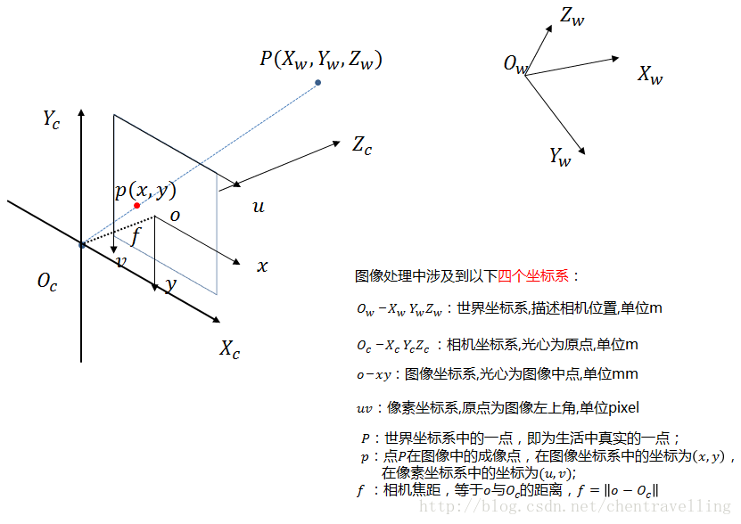

## UV-DIsparity Mapping

  - 统计视差行列中视差值 \[0,1,2,3,4...\] 个数

| 原理                                                           | 实际图像                                                         |
| ------------------------------------------------------------ | ------------------------------------------------------------ |
| 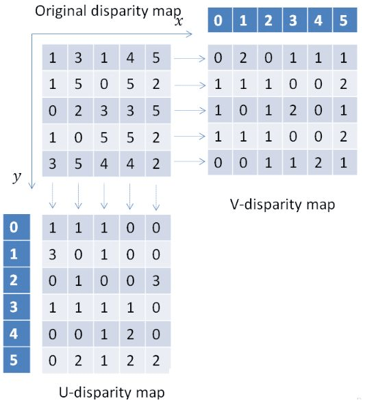 | 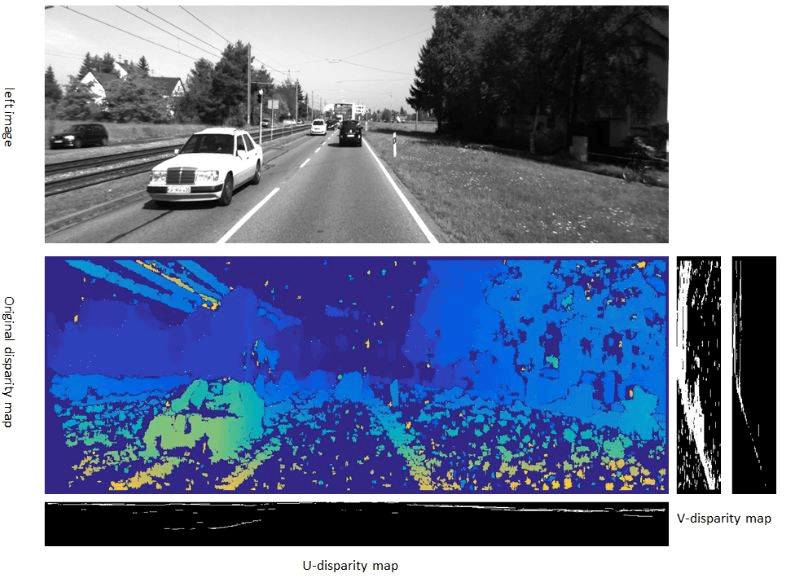 |

## 原理

### 对极几何/`Epipolar Geometry`

  - 基线 - `Baseline`: 直线 $O\_c - O^{'}\_c$
  - 对极平面束 - `Epipolar Pencil`: 以基线为轴的平面束
  - 对极平面 - `Epipolar Plane`: 任何包含基线的平面都称为对极平面
  - 对极点 - `Epipole`: 摄像机的基线与每幅图像的交点 $e$ 和 $e^{'}$
  - 对极线 - `Epipolar Line`: 对极平面与图像的交线 $x-e$ 和 $x^{'} - e^{'}$
  - 5点共面: 图像上点 $x x'$ + 摄像机中心$O\_c O^{'}\_c$ + 空间点 $X$ =\> 5点共面
  - 极线约束: 两极线上点的对应关系。

| 单目                                                           | 双目                                                           |
| ------------------------------------------------------------ | ------------------------------------------------------------ |
| 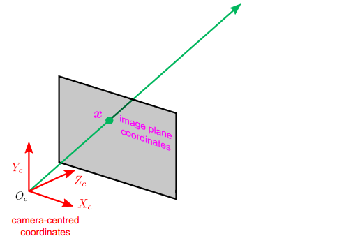 | 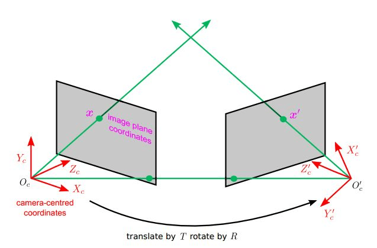 |

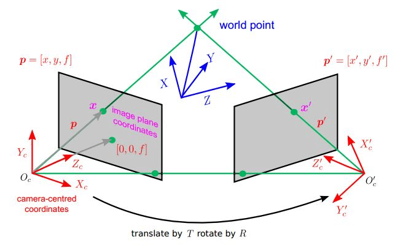
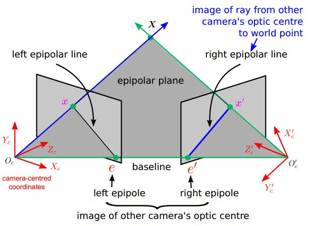
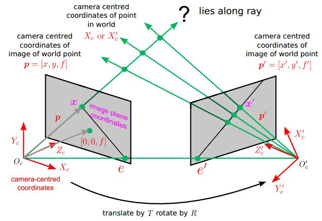

### 计算

  - $Depth(Z) = \\frac{FocalLength(f) \* Baseline(b)}{Disparity \*
    PixelSize}$

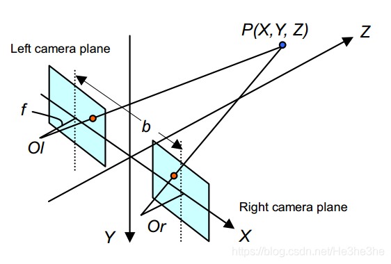

| Name         | 图解                                                           |
| ------------ | ------------------------------------------------------------ |
| Focal Length | 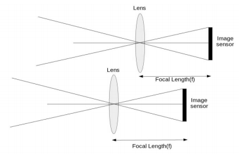 |
| Baseline     | 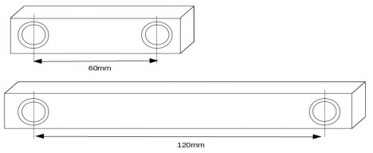 |
| Pixel Size   | 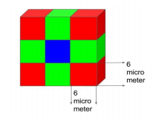 |
| Disparity    | 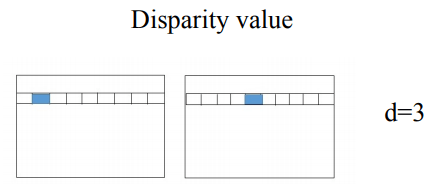 |
