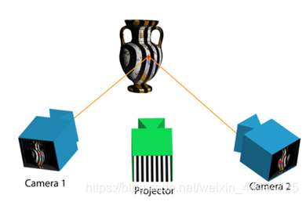

-----

| Title         | 3D Camera 结构光                                         |
| ------------- | ----------------------------------------------------- |
| Created @     | `2022-04-06T03:21:51Z`                                |
| Last Modify @ | `2022-12-24T16:23:34Z`                                |
| Labels        | \`\`                                                  |
| Edit @        | [here](https://github.com/junxnone/aiwiki/issues/308) |

-----

# 结构光3D Camera

## Reference

  - [格雷码简介](https://www.cnblogs.com/zhuruibi/p/8988044.html)
  - [系列篇|结构光——格雷码解码方法](https://zhuanlan.zhihu.com/p/113664502)
  - [结构光之格雷码编码加相移算法详解与实现](https://blog.csdn.net/qq_15295565/article/details/99989922)

## Brief

  - 基于\[\[双目3D相机原理\]\]
  - 结构光作为标记(主动三维测量)
  - \[\[相移法结构光3D重建\]\]
  - 线扫结构光/面阵结构光
  - 随机结构光
  - 编码结构光
      - 时序编码
          - 二值码
          - 格雷码
      - 空间编码
          - 德布鲁因序列 (De Bruijn) 序列

## 原理

  - 投射结构光到目标物体
  - 根据编码对图像中每个像素获取唯一编码
  - 根据双目视差法获得深度信息

## 结构光编码

### 二值码 & 格雷码

  - 二值码/BinaryCode
  - 格雷码/GrayCode
      - 格雷码最后的 Pattern 中编码间隔大于 二值码, 容错性更好

| Decimal | Binary | Gray | Decimal of Gray | Decimal | Binary | Gray | Decimal of Gray |
| ------- | ------ | ---- | --------------- | ------- | ------ | ---- | --------------- |
| 0       | 0000   | 0000 | 0               | 8       | 1000   | 1100 | 12              |
| 1       | 0001   | 0001 | 1               | 9       | 1001   | 1101 | 13              |
| 2       | 0010   | 0011 | 3               | 10      | 1010   | 1111 | 15              |
| 3       | 0011   | 0010 | 2               | 11      | 1011   | 1110 | 14              |
| 4       | 0100   | 0110 | 6               | 12      | 1100   | 1010 | 10              |
| 5       | 0101   | 0111 | 7               | 13      | 1101   | 1011 | 11              |
| 6       | 0110   | 0101 | 5               | 14      | 1110   | 1001 | 9               |
| 7       | 0111   | 0100 | 4               | 15      | 1111   | 1000 | 8               |

| 格雷码扩展方式 |  |
| ------- | -------------------------------------------------------------------------------------------------------------------------- |

#### 应用于结构光

| Code                                             | example                                                      |
| ------------------------------------------------ | ------------------------------------------------------------ |
| BinaryCode 8 Bit                              |  |
| GrayCode 8 Bit                                |  |
| Sequences 4 Bit Binary =\>  4 Bit Gray =\> |  |
