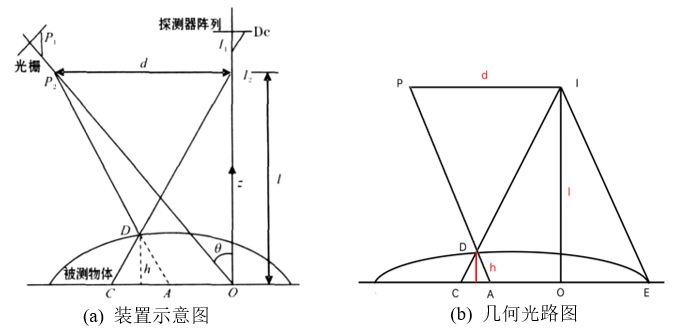
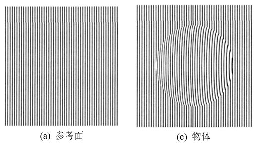
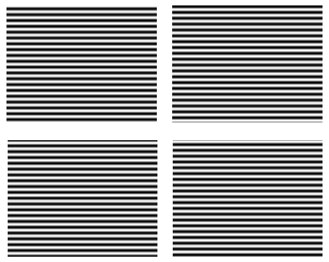
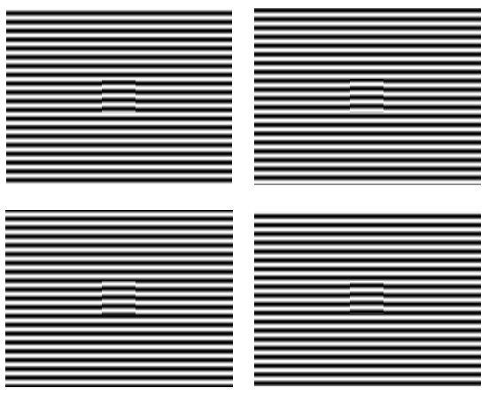
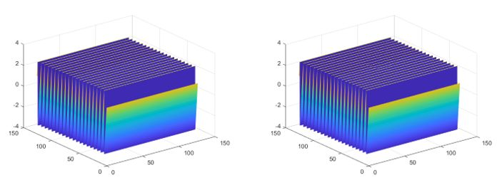
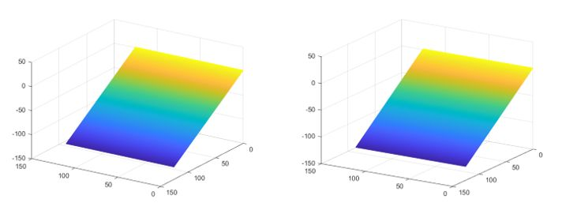
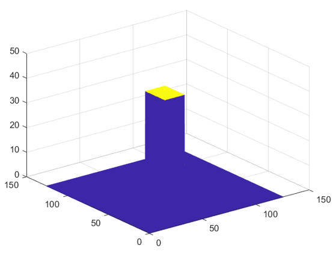

-----

| Title         | 3D Camera 结构光 相移法重建                                   |
| ------------- | ----------------------------------------------------- |
| Created @     | `2022-04-06T21:54:58Z`                                |
| Last Modify @ | `2022-12-24T16:24:41Z`                                |
| Labels        | \`\`                                                  |
| Edit @        | [here](https://github.com/junxnone/aiwiki/issues/309) |

-----

## Reference

  - [结构光三维重建——相移法基本原理](https://zhuanlan.zhihu.com/p/106226749)
  - [基于相移法的结构光三维测量技术](https://blog.csdn.net/qq_42676511/article/details/120605768)
  - [相位轮廓测量术的基本原理与Matlab仿真](https://zhuanlan.zhihu.com/p/432343200)
  - [补充知识——结构光之解相位求解的相关问题](https://blog.csdn.net/weixin_41605937/article/details/113773015)
  - [结构光简史](https://zhuanlan.zhihu.com/p/29971801)
  - [相位信息转化成高度信息](https://blog.csdn.net/qq_51057357/article/details/123995316)

## Brief

  - 相移法 - `Phase Shifting Method` - `光强 --> 相位 --> 高度 --> 3D`
  - 相位测量轮廓术 - **PMP** - `Phase Measurement Profilometry`
  - 通过投影一系列相移光栅图像编码获取物体表面的相对位置或绝对位置
  - **缺点**
      - 投影仪存在Gamma 非线性关系, 结正弦结构光投影成像后不具备良好正弦性，需要非线性矫正相位误差
      - 环境光\\噪声\\阴影等造成的相位展开错误(可以通过 `+格雷码` 方式解决)
      - 传统相移机械移动的精度导致的相位误差(现在不存在)

## 原理

  - 因为物体的加入，成像点 D 产生了相位差: $\\Delta\\theta\_{AC} = 2\\pi \\frac{AC}{T}$
      - T 为投射到参考平面的条纹周期
  - 相似三角形 $\\Delta ACD$ & $\\Delta CEI$ 推导: $\\frac{h}{l} =
    \\frac{AC}{CE} = \\frac{AC}{AC+d}$
  - 当 AC \<\< d : $h = AC\\frac{l}{d}$
  - $\\Delta \\theta\_{AC} = \\frac{2\\pi}{T}\\frac{hd}{l}$
  - \=\> $h = \\Delta \\theta\_{AC} \\frac{T}{2\\pi} \\frac{l}{d}$
      - d 为投影仪与camera 距离
      - l 为探测仪到参考平面距离
      - h 为高度
  - 求出 $\\Delta \\theta\_{AC}$ 结合 Camera 参数即可求出 h

## 相移计算

  - N 张条纹图像总相移为 $2\\pi$ , 每张图片相移量为 $\\frac{2\\pi}{N}$
  - $I^{'}$ 为环境光强
  - $I^{''}$ 为调制强度
  - $\\theta$ 为相位(**包裹相位/Wrapped Phase**)
      - 如果 $\\theta \\in \[-\\pi,\\pi\]$, 则换算到 $\[0, 2\\pi\]$ =\>
        $\\theta = \\theta + \\pi$

| 相移公式   | $I\_n = I^{'} + I^{''}cos(\\theta + \\frac{2n}{N}\\pi)$ |
| ------ | ------------------------------------------------------- |
| $I\_0$ | $I^{'} + I^{''}cos(\\theta)$                            |
| $I\_1$ | $I^{'} + I^{''}cos(\\theta + \\frac{2}{N}\\pi)$         |
| ...    |                                                         |

### 绝对相位

  - Absolute Phase
  - **相位解包裹**: `Wrapped Phase` =\> `Absolute Phase`
  - 使用格雷码获取相位周期($n\_k$)
  - $\\Theta = \\theta \\pm 2n\_k\\pi$ 为**绝对相位**
  - $n\_{k+1}=\\begin{cases} n\_k+1 & \\text{ if } \\left|
    \\theta\_{k+1} - \\theta\_{k}\\right|\\geq \\pi \\ n\_k & \\text{ if
    } \\left| \\theta\_{k+1} - \\theta\_{k}\\right| \< \\pi
    \\end{cases}$

### 解码

| 解码公式  | $\\theta = -tan^{-1}(\\frac{\\sum\_{0}^{N-1}I\_{n}sin(\\frac{2n}{N}\\pi)}{\\sum\_{0}^{N-1}I\_{n}cos(\\frac{2n}{N}\\pi)})$ |
| ----- | ------------------------------------------------------------------------------------------------------------------------- |
| N = 3 | $\\theta = -tan^{-1}(\\frac{\\sum\_{0}^{2}I\_{n}sin(\\frac{2n}{3}\\pi)}{\\sum\_{0}^{2}I\_{n}cos(\\frac{2n}{3}\\pi)})$     |

## Examples

| Steps | Figure                                                       |
| ----- | ------------------------------------------------------------ |
| 参考面   |  |
| 物体成像  |  |
| 相对相位  |  |
| 绝对相位  |  |
| 物体3D  |  |

## Camera Parameters??

  - **相位-高度** 映射
  - $h\_{x,y} = p^1\_{x,y} + p^2\_{x,y}\\theta\_{x,y} +
    p^3\_{x,y}\\theta\_{x,y}^2 + p^4\_{x,y}\\theta\_{x,y}^3 $
  - $h\_{x,y}$ 为整个物体的 $Pixel\_{x,y}$ 高度
  - $\\theta\_{x,y}$ 为计算的 $Pixel\_{x,y}$ 相位
  - $p^1\_{x,y} p^2\_{x,y} P^3\_{x,y} p^4\_{x,y}$ 为 $Pixel\_{x,y}$ 相机参数
