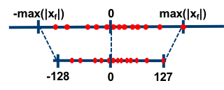

-----

| Title     | MO Quantization                                       |
| --------- | ----------------------------------------------------- |
| Created @ | `2018-10-16T02:57:36Z`                                |
| Updated @ | `2024-06-28T15:28:40Z`                                |
| Labels    | `ML`                                                  |
| Edit @    | [here](https://github.com/junxnone/aiwiki/issues/312) |

-----

# 量化

  - Quantization - 量化
      - 嵌入式设备/移动设备 - 低计算能力/低内存/低存储空间/低功耗/...
      - 压缩参数/提升速度/降低内存占用/低计算单元占用面积
      - 精度损失
  - 浮点运算 --\> 整型运算: `float32 --> int8`
  - 线性量化/非线性量化
  - 逐层/组/通道量化
  - 在线/离线量化
  - 比特量化
  - 权重/权重激活量化
  - [OpenVINO INT8 Model](/OpenVINO_INT8_Model)

## 线性量化

  - $r = Round(S(q-Z))$
      - $q$: 原始 float32 值
      - $Z$: float32 数值的偏移量 `Zero Point`
      - $S$: float32 缩放因子 `Scale`
      - $Round$: 四舍五入或向上向下取整
      - $r$: 量化后的整数值
  - 对称量化/非对称量化

### 对称量化

  - 输入数据的 `最大值/最小值` 映射到 \[-128, 127\]
  - 输入数据`零`，对应量化后的`零`

### 非对称量化

  - 输入数据的 `最大值/最小值` 映射到 \[0, 255\]

## 非线性量化

## Pipeline

  - 统计输入数据 Max/Min
  - 选择量化方法 int8/uint8 ...
  - 计算 `Zero Point`/`Scale`
  - 根据Data对模型进行量化
  - 验证量化模型性能, 若模型性能不好，则尝试不同的 `Z/S` 重复量化

## Reference

  - [模型量化详解](https://blog.csdn.net/WZZ18191171661/article/details/103332338)
