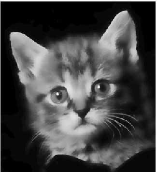
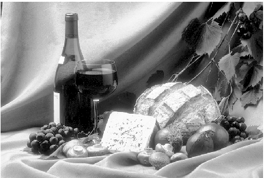
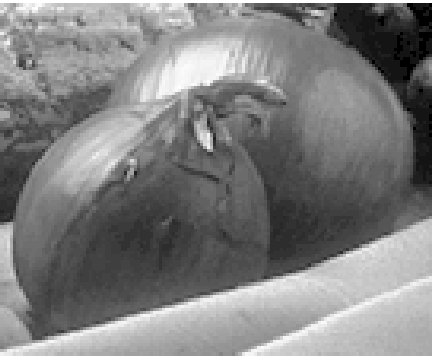
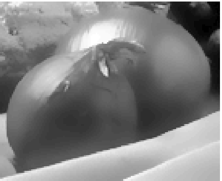
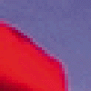
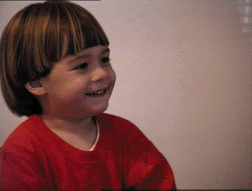
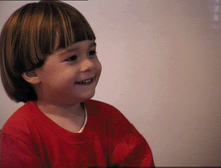
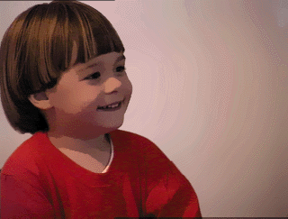

-----

| Title         | OpenCV IP Filter bilateralFilter BF                   |
| ------------- | ----------------------------------------------------- |
| Created @     | `2022-11-28T07:25:47Z`                                |
| Last Modify @ | `2022-12-27T09:06:30Z`                                |
| Labels        | \`\`                                                  |
| Edit @        | [here](https://github.com/junxnone/aiwiki/issues/318) |

-----

# Bilateral Filtering for Gray and Color Images

## Introduction

`Filtering` 可能是图像处理和计算机视觉中最基本的操作. `Filtering` 广义上是指在给定位置过滤图像的值,
是同一位置的小邻域中输入图像值的函数,
例如高斯低通滤波计算邻域内像素的加权均值(其中权重随着与邻域中心的距离而减小),
尽管可以给出这种权重减小的公式和量化解释，但是直觉上图像像素是缓慢变化的, 相邻的像素值是接近的，取平均值是合适的.
像素的噪声的相关性是小于信号的, 所以可以保留信号并消除噪声. 这种方法在边缘处失效,
线性低通滤波器会造成边缘模糊. 如何才能在平均平滑区域的情况下避免边缘处平均. [Many
efforts](https://homepages.inf.ed.ac.uk/rbf/CVonline/LOCAL_COPIES/MANDUCHI1/Bilateral_Filtering.html#References)
一直致力于减少这种不良影响. [Bilateral
filtering](https://homepages.inf.ed.ac.uk/rbf/CVonline/LOCAL_COPIES/MANDUCHI1/Bilateral_Filtering.html#[1])是一个简单的非迭代的保持边缘的滤波平滑.

## The Idea

The basic idea underlying bilateral filtering is to do in the range of
an image what traditional filters do in its domain. Two pixels can be
close to one another, that is, occupy nearby spatial location, or they
can be similar to one another, that is, have nearby values, possibly in
a perceptually meaningful fashion. Consider a shift-invariant low-pass
domain filter applied to an image:

## The Gaussian Case

## Experiments with Black-and-White Images

图 2a & 2b 显示了双边滤波去除纹理的能力, 图 2b 所示的图片简化可以用于数据压缩而不丢失整体形状,
可以在图片传输/图片编辑和操作/图片检索等应用中使用

| 2a                                                           | 2b                                                           |
| ------------------------------------------------------------ | ------------------------------------------------------------ |
|  |  |

Bilateral filtering with parameters sd =3 pixels and sr =50 intensity
values is applied to the image in figure 3 (a) to yield the image in
figure 3 (b). Notice that most of the fine texture has been filtered
away, and yet all contours are as crisp as in the original image. Figure
3 (c) shows a detail of figure 3 (a), and figure 3 (d) shows the
corresponding filtered version. The two onions have assumed a
graphics-like appearance, and the fine texture has gone. However, the
overall shading is preserved, because it is well within the band of the
domain filter and is almost unaffected by the range filter. Also, the
boundaries of the onions are preserved.

| 3a                                                           | 3b                                                           |
| ------------------------------------------------------------ | ------------------------------------------------------------ |
|  |  |

| 3c                                                           | 3d                                                           |
| ------------------------------------------------------------ | ------------------------------------------------------------ |
|  |  |

## Experiments with Color Images

For black-and-white images, intensities between any two gray levels are
still gray levels. As a consequence, when smoothing black-and-white
images with a standard low-pass filter, intermediate levels of gray are
produced across edges, thereby producing blurred images. With color
images, an additional complication arises from the fact that between any
two colors there are other, often rather different colors. For instance,
between blue and red there are various shades of pink and purple. Thus,
disturbing color bands may be produced when smoothing across color
edges. The smoothed image does not just look blurred, it also exhibits
odd-looking, colored auras around objects.

| 4a                                                           | 4b                                                           |
| ------------------------------------------------------------ | ------------------------------------------------------------ |
|  |  |

| 4c                                                           | 4d                                                           |
| ------------------------------------------------------------ | ------------------------------------------------------------ |
|  |  |

Figure 4 (a) shows a detail from a picture with a red jacket against a
blue sky. Even in this unblurred picture, a thin pink-purple line is
visible, and is caused by a combination of lens blurring and pixel
averaging. In fact, pixels along the boundary, when projected back into
the scene, intersect both red jacket and blue sky, and the resulting
color is the pink average of red and blue. When smoothing, this effect
is emphasized, as the broad, blurred pink-purple area in figure 4 (b)
shows. To address this difficulty, edge-preserving smoothing could be
applied to the red, green, and blue components of the image separately.
However, the intensity profiles across the edge in the three color bands
are in general different. Smoothing the three color bands separately
results in an even more pronounced pink and purple band than in the
original, as shown in figure 4 (c). The pink-purple band, however, is
not widened as in the standard-blurred version of figure 4 (b). A much
better result can be obtained with bilateral filtering. In fact, a
bilateral filter allows combining the three color bands appropriately,
and measuring photometric distances between pixels in the combined
space. Moreover, this combined distance can be made to correspond
closely to perceived dissimilarity by using Euclidean distance in the
[CIE-Lab color
space](https://homepages.inf.ed.ac.uk/rbf/CVonline/LOCAL_COPIES/MANDUCHI1/Bilateral_Filtering.html#[16]).
This color space is based on a large body of psychophysical data
concerning color-matching experiments performed by human observers. In
this space, small Euclidean distances are designed to correlate strongly
with the perception of color discrepancy as experienced by an "average"
color-normal human observer. Thus, in a sense, bilateral filtering
performed in the CIE-Lab color space is the most natural type of
filtering for color images: only perceptually similar colors are
averaged together, and only perceptually important edges are preserved.
Figure 4 (d) shows the image resulting from bilateral smoothing of the
image in figure 4 (a). The pink band has shrunk considerably, and no
extraneous colors appear.

| 5a                                                           | 5b                                                           | 5c                                                           |
| ------------------------------------------------------------ | ------------------------------------------------------------ | ------------------------------------------------------------ |
|  |  |  |

Figure 5 (c) shows the result of five iterations of bilateral filtering
of the image in figure 5 (a). While a single iteration produces a much
cleaner image (figure 5 (b)) than the original, and is probably
sufficient for most image processing needs, multiple iterations have the
effect of flattening the colors in an image considerably, but without
blurring edges. The resulting image has a much smaller color map, and
the effects of bilateral filtering are easier to see when displayed on a
printed page. Notice the cartoon-like appearance of figure 5 (c). All
shadows and edges are preserved, but most of the shading is gone, and no
"new" colors are introduced by filtering.

## References

\[1\] C. Tomasi and R. Manduchi, "Bilateral Filtering for Gray and Color
Images", Proceedings of the 1998 IEEE International Conference on
Computer Vision, Bombay, India. \[2\] T. Boult, R.A. Melter, F. Skorina,
and I. Stojmenovic,"G-neighbors", Proceedings of the SPIE Conference on
Vision Geometry II, pages 96-109, 1993. \[3\] R.T. Chin and C.L. Yeh,
"Quantitative evaluation of some edge-preserving noise-smoothing
techniques", Computer Vision, Graphics, and Image Processing, 23:67-91,
1983. \[4\] L.S. Davis and A. Rosenfeld, "Noise cleaning by iterated
local averaging", IEEE Transactions on Systems, Man, and Cybernetics,
8:705-710, 1978. \[5\] R.E. Graham, "Snow-removal - a noise-stripping
process for picture signals", IRE Transactions on Information Theory,
8:129-144, 1961. \[6\] N. Himayat and S.A. Kassam, "Approximate
performance analysis of edge preserving filters", IEEE Transactions on
Signal Processing, 41(9):2764-77, 1993. \[7\] T.S. Huang, G.J. Yang, and
G.Y. Tang, "A fast two-dimensional median filtering algorithm", IEEE
Transactions on Acoustics, Speech, and Signal Processing, 27(1):13-18,
1979. \[8\] J.S. Lee, "Digital image enhancement and noise filtering by
use of local statistics", IEEE Transactions on Pattern Analysis and
Machine Intelligence, 2(2):165-168, 1980. \[9\] M. Nagao and T.
Matsuyama, "Edge preserving smoothing", Computer Graphics and Image
Processing, 9:394-407, 1979. \[10\] P.M. Narendra, "A separable median
filter for image noise smoothing", IEEE Transactions on Pattern Analysis
and Machine Intelligence, 3(1):20-29, 1981. \[11\] K.J. Overton and T.E.
Weymouth, "A noise reducing preprocessing algorithm",Proceedings of the
IEEE Computer Science Conference on Pattern Recognition and Image
Processing, pages 498-507, Chicago, IL, 1979. \[12\] P. Perona and J.
Malik, "Scale-space and edge detection using anisotropic diffusion",
IEEE Transactions on Pattern Analysis and Machine Intelligence,
12(7):629-639, 1990. \[13\] G. Ramponi, "A rational edge-preserving
smoother", Proceedings of the International Conference on Image
Processing, volume 1, pages 151-154, Washington, DC, 1995. \[14\] G.
Sapiro and D.L. Ringach, "Anisotropic diffusion of color images",
Proceedings of the SPIE, volume 2657, pages 471-382, 1996. \[15\] D.C.C.
Wang, A.H. Vagnucci, and C.C. Li, "A gradient inverse weighted smoothing
scheme and the evaluation of its performance", Computer Vision,
Graphics, and Image Processing, 15:167-181, 1981. \[16\] G. Wyszecki and
W. S. Styles, Color Science: Concepts and Methods, Quantitative Data and
Formulae, John Wiley and Sons, New York, NY, 1982. \[17\] L. Yin, R.
Yang, M. Gabbouj, and Y. Neuvo, "Weighted median filters: a
tutorial",IEEE Transactions on Circuits and Systems II: Analog and
Digital Signal Processing, 43(3):155-192, 1996.
