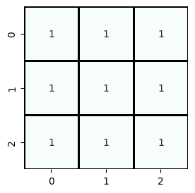
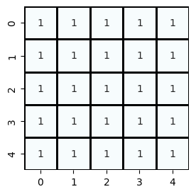
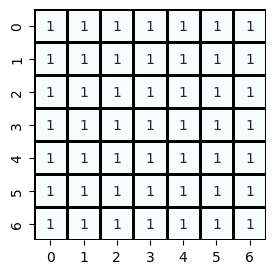
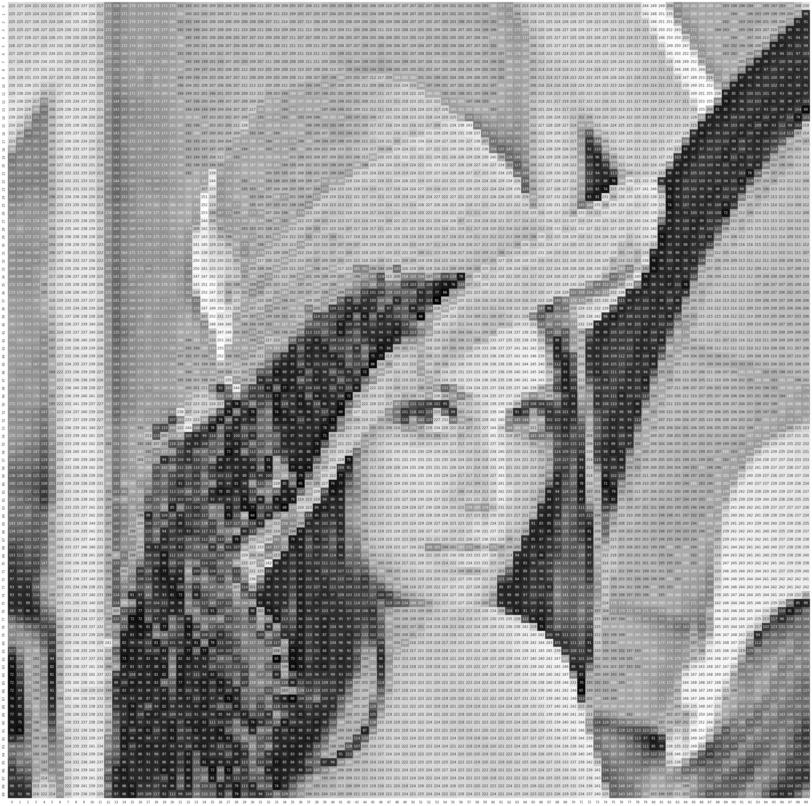

-----

| Title         | OpenCV IP Filter boxFilter                            |
| ------------- | ----------------------------------------------------- |
| Created @     | `2022-11-29T03:17:35Z`                                |
| Last Modify @ | `2022-12-27T09:05:49Z`                                |
| Labels        | \`\`                                                  |
| Edit @        | [here](https://github.com/junxnone/aiwiki/issues/319) |

-----

## 原理

  - 类似卷积过程


## Kernel

$\\texttt{K} = \\alpha \\begin{bmatrix} 1 & 1 & 1 & \\cdots & 1 & 1 \\ 1
& 1 & 1 & \\cdots & 1 & 1 \\ \\vdots \\ 1 & 1 & 1 & \\cdots & 1 & 1
\\end{bmatrix}$

$\\alpha = \\begin{cases} \\frac{1}{\\texttt{ksize.width\*ksize.height}}
& \\texttt{when } \\texttt{normalize=true} \\1 &
\\texttt{otherwise}\\end{cases}$

| 3x3 Kernel                                                   | 5x5 Kernel                                                   | 7x7 Kernel                                                   |
| ------------------------------------------------------------ | ------------------------------------------------------------ | ------------------------------------------------------------ |
|  |  |  |

| org image                                                       | 3x3 boxFilter                                                | 5x5 boxFilter                                                | 7x7 boxFilter                                                |
| --------------------------------------------------------------- | ------------------------------------------------------------ | ------------------------------------------------------------ | ------------------------------------------------------------ |
|  |  |  |  |

## OpenCV API

``` COOL
void cv::boxFilter(InputArray   src,
                OutputArray     dst,
                int     ddepth,
                Size    ksize,
                Point   anchor = Point(-1,-1),
                bool    normalize = true,
                int     borderType = BORDER_DEFAULT 
                )       
```

  - normalize: 是否归一化 - 把要处理的值缩放到某个尺度, 例如(0,1) - 均值滤波
