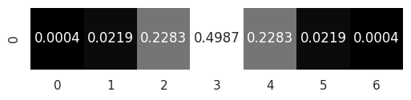
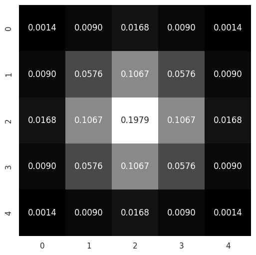

-----

| Title         | OpenCV IP Filter GaussianBlur                         |
| ------------- | ----------------------------------------------------- |
| Created @     | `2022-11-29T07:55:56Z`                                |
| Last Modify @ | `2022-12-27T09:05:25Z`                                |
| Labels        | \`\`                                                  |
| Edit @        | [here](https://github.com/junxnone/aiwiki/issues/320) |

-----

## 高斯核

  - 1D 高斯核: $G\_i= \\alpha *e^{-(i-( \\texttt{ksize} -1)/2)^2/(2*
    \\texttt{sigma}^2)}$
  - 2D 高斯核: $G\_{0}(x, y) = A e^{ \\dfrac{ -(x - \\mu\_{x})^{2} }{
    2\\sigma^{2}*{x} } + \\dfrac{ -(y - \\mu*{y})^{2} }{
    2\\sigma^{2}\_{y} } }$

| D      | 高斯核 OpenCV API                                                    | 高斯核                                                          |
| ------ | ----------------------------------------------------------------- | ------------------------------------------------------------ |
| 1D 7x1 | `cv2.getGaussianKernel(7, 0.8)`                                   |  |
| 2D 5x5 | `cv2.getGaussianKernel(5, 0.9) * cv2.getGaussianKernel(5, 0.9).T` |  |
