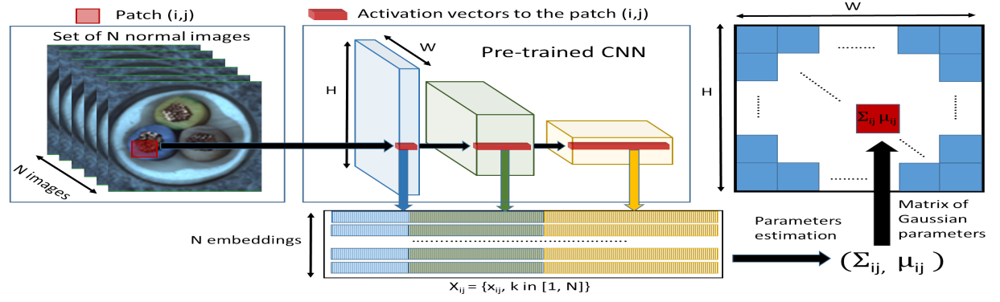

-----

| Title         | ML Tasks Image Anomaly PaDiM                          |
| ------------- | ----------------------------------------------------- |
| Created @     | `2022-12-05T01:58:43Z`                                |
| Last Modify @ | `2022-12-24T13:06:37Z`                                |
| Labels        | \`\`                                                  |
| Edit @        | [here](https://github.com/junxnone/aiwiki/issues/322) |

-----

## Reference

  - [PaDiM: a Patch Distribution Modeling Framework for Anomaly
    Detection and Localization](https://arxiv.org/pdf/2011.08785.pdf)

## Brief

  - 使用 CNN 提取向量来表示图片 patch
  - 使用 三个不同层的 feature map 拼接得到 embedding vector
  - 利用多元高斯分布计算正常类别的概率

## Arch

