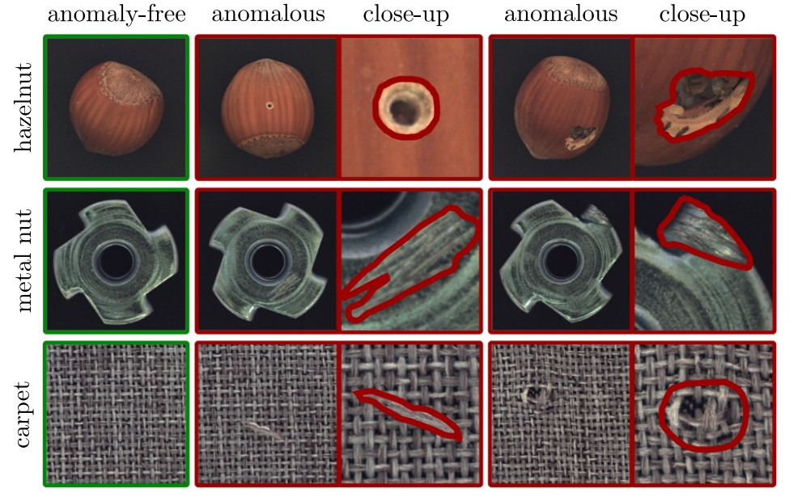
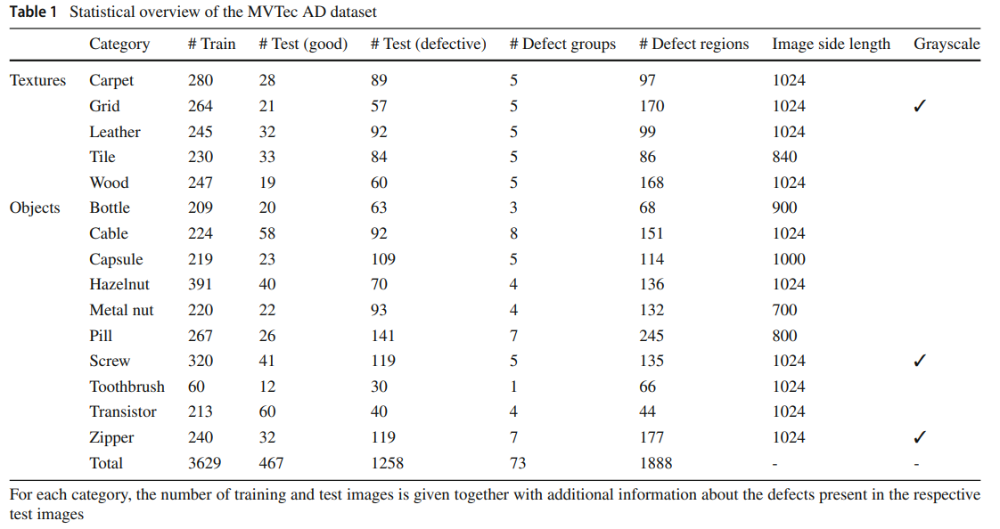
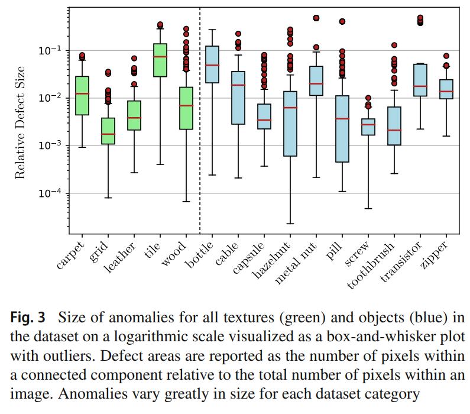

-----

| Title         | ML Tasks Image Anomaly MVTec                          |
| ------------- | ----------------------------------------------------- |
| Created @     | `2022-12-05T08:08:10Z`                                |
| Last Modify @ | `2022-12-24T13:06:54Z`                                |
| Labels        | \`\`                                                  |
| Edit @        | [here](https://github.com/junxnone/aiwiki/issues/323) |

-----

## Reference

  - [官网](https://www.mvtec.com/company/research/datasets/mvtec-ad/)
  - [paper - The MVTec Anomaly Detection Dataset: A Comprehensive
    Real-World Dataset for Unsupervised Anomaly
    Detection](https://link.springer.com/content/pdf/10.1007/s11263-020-01400-4.pdf)

## Brief

  - MVTec AD是MVtec公司提出的一个用于异常检测的数据集
  - 模仿了工业实际生产场景
  - 主要用于unsupervised anomaly detection
  - 为异常区域都提供了像素级标注
  - 包含不同领域中的五种纹理以及十种物体
  - 训练集中只包含正常样本，测试集中包含正常样本与缺陷样本

## Statistical overview

