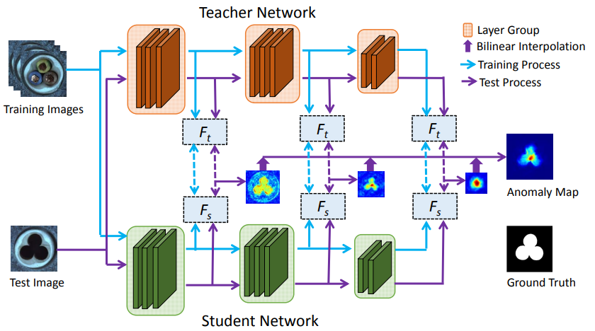

-----

| Title         | ML Tasks Image Anomaly STFPM                          |
| ------------- | ----------------------------------------------------- |
| Created @     | `2022-12-09T03:33:27Z`                                |
| Last Modify @ | `2022-12-24T13:06:43Z`                                |
| Labels        | \`\`                                                  |
| Edit @        | [here](https://github.com/junxnone/aiwiki/issues/324) |

-----

## Reference

  - [2021.3 **STFPM** Student-Teacher Feature Pyramid Matching for
    Anomaly Detection](https://arxiv.org/pdf/2103.04257.pdf)

## Brief

  - 通过比较教师网络和学生网络的特征金字塔。差异越大，异常发生的概率越高

## Arch

