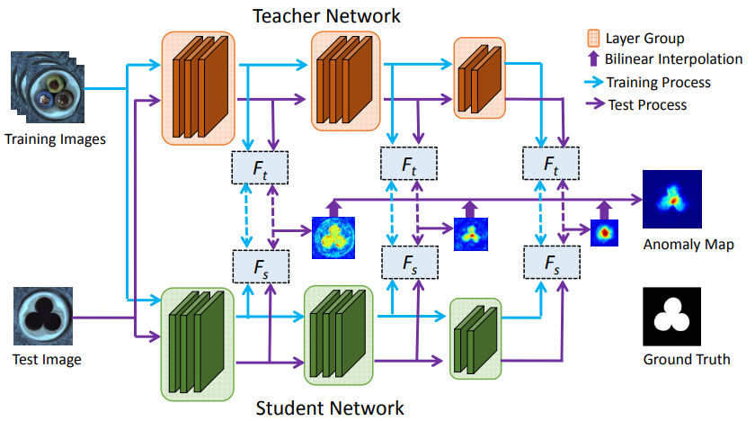

-----

| Title     | paper STFPM                                           |
| --------- | ----------------------------------------------------- |
| Created @ | `2022-12-09T03:33:27Z`                                |
| Updated @ | `2025-05-27T01:41:46Z`                                |
| Labels    | \`\`                                                  |
| Edit @    | [here](https://github.com/junxnone/aiwiki/issues/324) |

-----

# STFPM

  - 通过比较教师网络和学生网络的特征金字塔。差异越大，异常发生的概率越高
  - **师生网络架构**：用一个在图像分类任务上预训练好的强大模型（教师网络，如
    ResNet-18），去指导一个结构相同的学生网络学习正常图像的特征分布。学生网络通过匹配教师网络的特征来学习
    “正常” 的模式，两者特征差异越大，越可能是异常。
  - **多尺度特征匹配**：教师和学生网络都会提取不同层级的特征（形成特征金字塔），底层特征关注纹理、边缘等细节，高层特征关注整体结构。通过对比这些多尺度特征的差异，能检测出不同大小的异常区域。
    具体方法

## Arch

## Reference

  - [2021.3 **STFPM** Student-Teacher Feature Pyramid Matching for
    Anomaly Detection](https://arxiv.org/pdf/2103.04257.pdf)
  - [code](https://github.com/gdwang08/STFPM)
