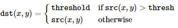

-----

| Title     | OpenCV IP misc BIN                                    |
| --------- | ----------------------------------------------------- |
| Created @ | `2019-05-24T08:05:26Z`                                |
| Updated @ | `2023-09-19T15:07:19Z`                                |
| Labels    | \`\`                                                  |
| Edit @    | [here](https://github.com/junxnone/aiwiki/issues/330) |

-----

# OpenCV 二值化

  - cv2.threshold
  - cv2.adaptiveThreshold

## 普通二值化

    ret, dst = cv2.threshold(src, thresh, maxval, type)

| Type                    | 公式                                                           | 图解                                                           |
| ----------------------- | ------------------------------------------------------------ | ------------------------------------------------------------ |
| cv2.THRESH\_BINARY      |  |  |
| cv2.THRESH\_BINARY\_INV |  |  |
| cv2.THRESH\_TRUNC       |  |  |
| cv2.THRESH\_TOZERO      |  |  |
| cv2.THRESH\_TOZERO\_INV |  |  |
| `source image`          |                                                              |  |

**Examples**

|  |
| ------------------------------------------------------------ |
|  |

## 自适应二值化

  - 根据图像局部像素值来取阈值

<!-- end list -->

``` 
void cv::adaptiveThreshold(InputArray   src,
                      OutputArray   dst,
                      double    maxValue,
                      int   adaptiveMethod,
                      int   thresholdType,
                      int   blockSize,
                      double    C 
)   
```

| 参数             | 描述                                                             |
| -------------- | -------------------------------------------------------------- |
| maxValue       | 符合条件的值赋予的值, 二值化中的大值, 小值为 0                                     |
| adaptiveMethod | 使用的自适应算法 `ADAPTIVE_THRESH_MEAN_C`/`ADAPTIVE_THRESH_GAUSSIAN_C` |
| thresholdType  | 二值化方法                                                          |
| blockSize      | 计算阈值的邻域                                                        |
| C              | 减去的常数                                                          |

### 自适应算法

#### ADAPTIVE\_THRESH\_MEAN\_C

  - 取相邻区域均值
  - `T(x,y)` 为点 `(x,y)` 相邻区域 `blockSize x blockSize` 的均值 减去 `C`
  - 相当于用 `boxfilter` 求阈值

<script src="https://junxnone.github.io/emgithub/embed-v2.js?target=https%3A%2F%2Fgithub.com%2Fopencv%2Fopencv%2Fblob%2F157b0e7760117a60de457a4ae874b0709edc4e53%2Fmodules%2Fimgproc%2Fsrc%2Fthresh.cpp%23L1695-L1697&style=default&type=code&showBorder=on&showLineNumbers=on&showFileMeta=on&showFullPath=on&showCopy=on"></script>

#### ADAPTIVE\_THRESH\_GAUSSIAN\_C

  - 取相邻区域高斯加权和
  - `T(x,y)` 为点 `(x,y)` 相邻区域 `blockSize x blockSize` 的 高斯加权和 减去 `C`
  - 相当于用 `GaussianBlur` 求阈值

<script src="https://junxnone.github.io/emgithub/embed-v2.js?target=https%3A%2F%2Fgithub.com%2Fopencv%2Fopencv%2Fblob%2F157b0e7760117a60de457a4ae874b0709edc4e53%2Fmodules%2Fimgproc%2Fsrc%2Fthresh.cpp%23L1698-L1705&style=default&type=code&showBorder=on&showLineNumbers=on&showFileMeta=on&showFullPath=on&showCopy=on"></script>

### 二值化方法

| Enum                | 描述                |
| ------------------- | ----------------- |
| THRESH\_BINARY      | 大于阈值取大值，否则为 0     |
| THRESH\_BINARY\_INV | 与上面相反             |
| THRESH\_TRUNC       | 大于阈值取阈值，其他不变      |
| THRESH\_TOZERO      | 小于阈值取 0 ，其他不变     |
| THRESH\_TOZERO\_INV | 与上面相反             |
| THRESH\_OTSU        | Otsu 算法 选择最佳阈值    |
| THRESH\_TRIANGLE    | Triangle 算法选择最佳阈值 |

> 详情见
> [ThresholdTypes](https://docs.opencv.org/4.x/d7/d1b/group__imgproc__misc.html#gaa9e58d2860d4afa658ef70a9b1115576)

    dst = cv2.adaptiveThreshold(src, maxval, thresh_type, type, Block Size, C)

  - `cv.ADAPTIVE_THRESH_MEAN_C` - 阈值为邻近区域平均值
  - `cv.ADAPTIVE_THRESH_GAUSSIAN_C` - 阈值是权重为高斯窗的邻域值的加权和


## Reference

  - [Python-OpenCV
    处理图像（七）：图像灰度化处理](https://blog.csdn.net/qq_26898461/article/details/50454371)
  - [opencv threshold
    tutorial](https://docs.opencv.org/master/db/d8e/tutorial_threshold.html)
  - [ADAPTIVE\_THRESH\_MEAN\_C
    Impl](https://github.com/opencv/opencv/blob/157b0e7760117a60de457a4ae874b0709edc4e53/modules/imgproc/src/thresh.cpp#L1695-L1697)
  - [ADAPTIVE\_THRESH\_GAUSSIAN\_C
    Impl](https://github.com/opencv/opencv/blob/157b0e7760117a60de457a4ae874b0709edc4e53/modules/imgproc/src/thresh.cpp#L1698C51-L1705)
  - [ThresholdTypes](https://docs.opencv.org/4.x/d7/d1b/group__imgproc__misc.html#gaa9e58d2860d4afa658ef70a9b1115576)
