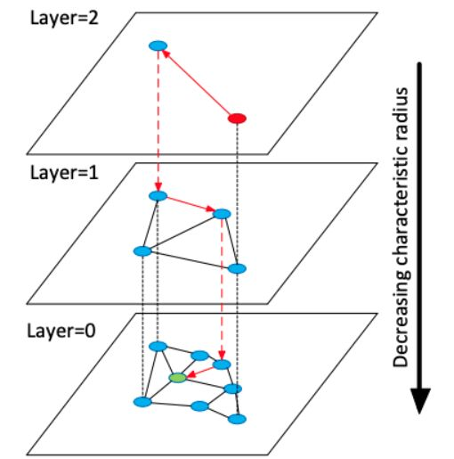

-----

| Title         | ML NNS ANN HNSW                                       |
| ------------- | ----------------------------------------------------- |
| Created @     | `2021-08-18T03:22:52Z`                                |
| Last Modify @ | `2022-12-23T15:14:32Z`                                |
| Labels        | \`\`                                                  |
| Edit @        | [here](https://github.com/junxnone/aiwiki/issues/334) |

-----

# Hierarchical Navigable Small World

## Reference

  - 2016.03 **\[HNSW\]** Efficient and robust approximate nearest
    neighbor search using Hierarchical Navigable Small World graphs
    \[[Paper](https://arxiv.org/abs/1603.09320)\]
    \[[Code](https://github.com/nmslib/hnswlib)\]
  - [一文看懂HNSW算法理论的来龙去脉](https://blog.csdn.net/u011233351/article/details/85116719)

## Brief

  - 基于图存储
  - Delaunay graph
  - 粗/细 搜索

## Pipeline

  - D-dim Vector 构建图
  - 基于图搜索 K 近邻

## UseCase
