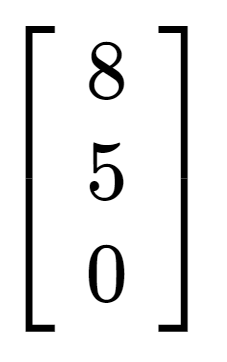
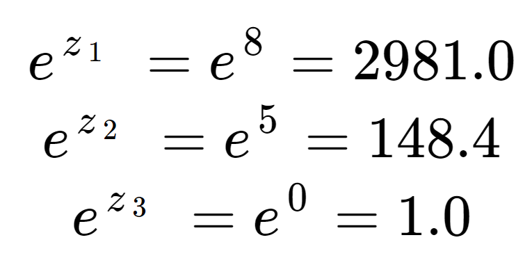
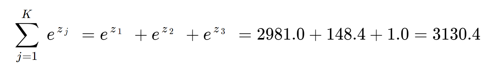
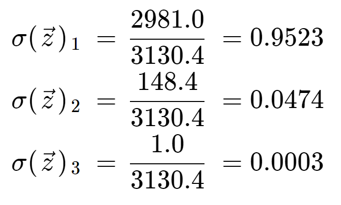

-----

| Title     | ML Op AF Softmax                                      |
| --------- | ----------------------------------------------------- |
| Created @ | `2022-12-24T12:25:20Z`                                |
| Updated @ | `2023-01-31T07:26:16Z`                                |
| Labels    | \`\`                                                  |
| Edit @    | [here](https://github.com/junxnone/aiwiki/issues/335) |

-----

## Reference

  - <http://neuralnetworksanddeeplearning.com/chap3.html#softmax>
  - [logistic函数和softmax函数](http://www.cnblogs.com/maybe2030/p/5678387.html)
  - [详解sigmoid与softmax，
    多分类及多标签分类](https://blog.csdn.net/uncle_ll/article/details/82778750)
  - [Keras - Softmax 与 Sigmoid
    二分类问题分析](https://www.aiuai.cn/aifarm679.html)
  - [Keras深度学习笔记(三)：神经网络入门](https://xiaosheng.me/2018/11/24/article154/)
  - [sigmoid\_and\_softmax.ipynb](https://gist.github.com/ypwhs/6905ebbda99d04621f9fc00417657ae2)
  - [一文详解Softmax函数](https://zhuanlan.zhihu.com/p/105722023)
  - [Softmax Function -
    deepai.org](https://deepai.org/machine-learning-glossary-and-terms/softmax-layer)

## Brief

  - `Sigmoid Function` == `Logistic Function`
  - **二分类时** `sigmoid` 和 `softmax` 等价

| Name    | 应用                            | 输出                           |
| ------- | ----------------------------- | ---------------------------- |
| sigmoid | \- 二分类 - 多标签分类/Multi-Label | 一个或多个 0∼1 范围内的概率值            |
| softmax | \- 多分类                        | 在 classes\_num 个不同输出类别上的概率分布 |

## Softmax

  - `Softmax` = `Soft` + `max`
  - hardmax 相对就是求最大值
  - $softmax(\\vec{z})*{i}=\\frac{e^{z*{i}}}{\\sum\_{j=1}^{K}e^{z\_{i}}}$
      - $\\vec{z}$ : Input Vector
      - $z\_{i}$: Vector Value
      - $e^{z\_{i}}$: Vector Value 指数函数值
      - $\\sum\_{j=1}^{K}e^{z\_{i}}$: 确保所有值加起来等于 1
      - $K$: 类别数量
  - 添加指数函数使输出的概率距离更大
  - 将 `Vector` 映射到 `概率 Vector`

### Examples

|  |  |  |  |
| ------------------------------------------------------------ | ------------------------------------------------------------ | ------------------------------------------------------------ | ------------------------------------------------------------ |

## 二分类时 `sigmoid` 和 `softmax` 等价

| Name    | Formula                                                               |
| ------- | --------------------------------------------------------------------- |
| sigmoid | $sigmoid(x)= \\frac{1}{1 + e^{-x}}$                                   |
| softmax | $softmax(\\vec{z})*{i}=\\frac{e^{z*{i}}}{\\sum\_{j=1}^{K}e^{z\_{i}}}$ |

  - 当 二分类时 Vector = \[x, 0\]

$softmax(\\vec{z})*{1}=\\frac{e^{z*{1}}}{e^{z\_{1}} +
e^{z\_{2}}}=\\frac{e^{x}}{e^{x} + e^{0}}=\\frac{e^{x}}{e^{x} +
1}=\\frac{1}{1+e^{-x} }$

## 对比

  - Sigmoid 与 Softmax 完全等价
  - Sigmoid 与 Softmax 分类器的权值可以相互转换
  - Softmax 会比 Sigmoid 浪费 2 倍的权值空间
