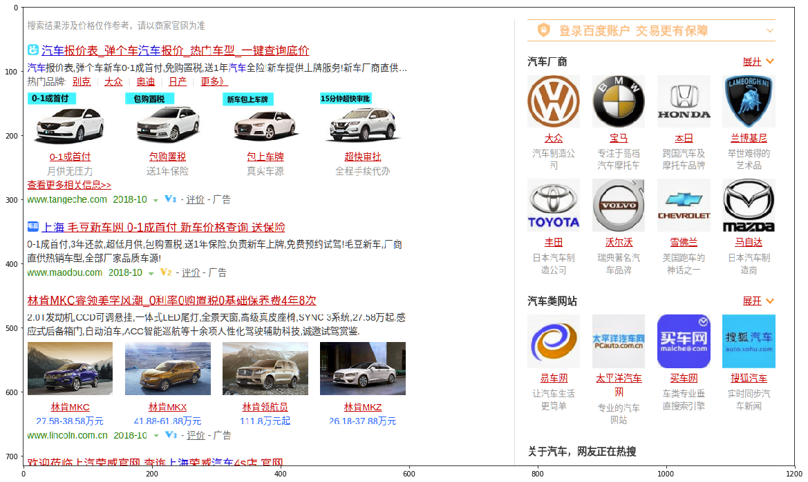

-----

| Title         | OpenCV CLAHE                                          |
| ------------- | ----------------------------------------------------- |
| Created @     | `2018-09-25T06:43:35Z`                                |
| Last Modify @ | `2022-12-27T09:17:35Z`                                |
| Labels        | \`\`                                                  |
| Edit @        | [here](https://github.com/junxnone/aiwiki/issues/341) |

-----

## Reference

  - [图像直方图及均衡方法总结（二）自适应直方图均衡AHE,CLAHE](https://blog.csdn.net/piaoxuezhong/article/details/78271785)
  - [cv2.createCLAHE](https://www.programcreek.com/python/example/89353/cv2.createCLAHE)
  - [Histogram Equalization -
    HE/AHE/CLAHE](https://github.com/junxnone/tech-io/issues/887)

## Brief

直方图均衡化是图像处理领域中利用图像直方图对对比度进行调整的方法。通过这种方法，亮度可以更好地在直方图上分布。这样就可以用于增强局部的对比度而不影响整体的对比度，直方图均衡化通过有效地扩展常用的亮度来实现这种功能。

直方图均衡经典算法对整幅图像的像素使用相同的变换，对于像素值分布比较均衡的图像来说，经典算法的效果不错。但是如果图像中包括明显亮的或者暗的区域，在这些部分的对比度并不能得到增强。

  - AHE - 自适应直方图均衡化(Adaptive histgram equalization)
  - CLAHE - 限制对比度自适应直方图均衡（Contrast Limited Adaptive histgram
    equalization)

## AHE

AHE算法与经典算法的不同点在于它通过计算图像多个局部区域的直方图，并重新分布亮度，以此改变图像对比度。所以，该算法更适合于提高图像的局部对比度和细节部分。不过呢，AHE存在过度放大图像中相对均匀区域的噪音的问题。

## CLAHE

CLAHE在AHE的基础上，对每个子块直方图做了限制，很好的控制了AHE带来的噪声。
CLAHE与AHE的不同主要在于其对于对比度的限幅，在CLAHE中，对于每个小区域都必须使用对比度限幅，用来克服AHE的过度放大噪音的问题。
在计算CDF前，CLAHE通过用预先定义的阈值来裁剪直方图以达到限制放大倍数的目的。该算法的优势在于它不是选择直接忽略掉那些超出限幅的部分，而是将这些裁剪掉的部分均匀分布到直方图的其他部分。

## UseCase

    import numpy as np
    import cv2
    import matplotlib.pyplot as plt
    from six import BytesIO
    from PIL import Image
    
    img = cv2.imread('t.png',3)
    fig = plt.figure(figsize=(20, 15))
    plt.grid(False)
    plt.imshow(img)
    lab = cv2.cvtColor(img, cv2.COLOR_BGR2LAB)
    l, a, b = cv2.split(lab)
    clahe = cv2.createCLAHE(clipLimit=3.0, tileGridSize=(8, 8))
    cl = clahe.apply(l)
    limg = cv2.merge((cl, a, b))
    fig = plt.figure(figsize=(20, 15))
    plt.grid(False)
    plt.imshow(limg)

  - 原图 
  - 处理后的图像 
