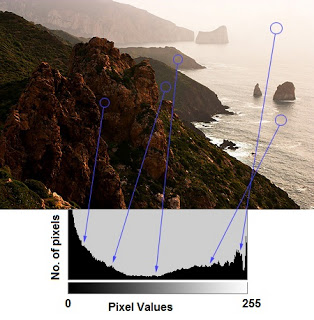
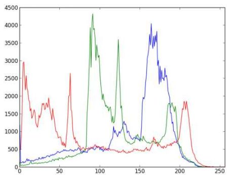
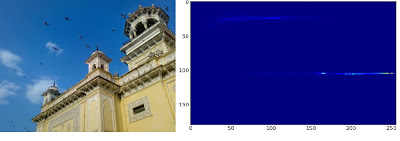
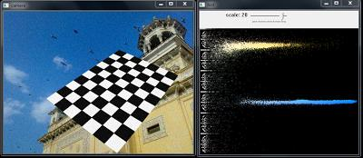
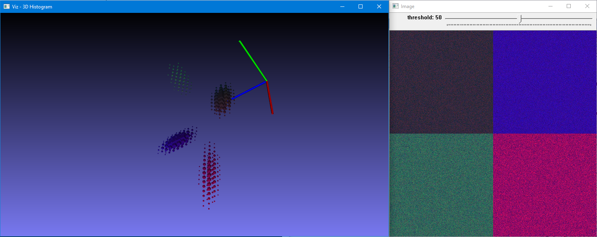
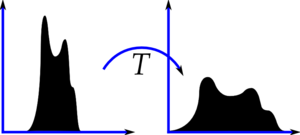
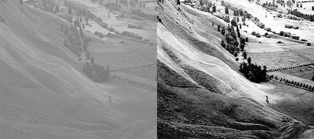
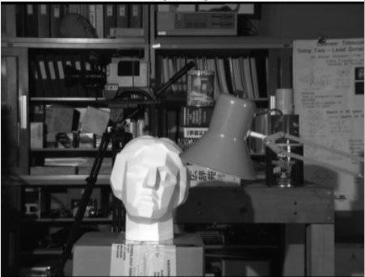
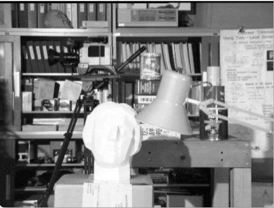
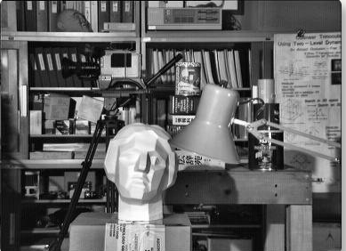

-----

| Title     | Media Image Histogram                                 |
| --------- | ----------------------------------------------------- |
| Created @ | `2018-10-09T08:20:07Z`                                |
| Updated @ | `2024-01-15T06:42:18Z`                                |
| Labels    | \`\`                                                  |
| Edit @    | [here](https://github.com/junxnone/aiwiki/issues/342) |

-----

# Histogram 图像直方图

## 1D Histogram

  - X - 像素值
  - Y - 相应的像素数量

| Gray                                                         | RGB                                                          |
| ------------------------------------------------------------ | ------------------------------------------------------------ |
|  |  |

**计算 & 绘制函数**

  - cv.calcHist()
  - np.histogram()
  - np.bincount()
  - matplotlib.pyplot.hist()

## 2D Histogram

  - RGB -\> HSV
      - H - \[0, 180\]
      - S - \[0, 256\]

**计算方法**

  - cv.calcHist(\[hsv\], \[0, 1\], None, \[180, 256\], \[0, 180, 0,
    256\])
  - np.histogram2d(h.ravel(),s.ravel(),\[180,256\],\[\[0,180\],\[0,256\]\])

|  |  |
| ------------------------------------------------------------ | ------------------------------------------------------------ |

## 3D Histogram

## 直方图均衡

  - 将像素值范围均衡化到更大范围
  - 改善图像的对比度

|  |  |
| ------------------------------------------------------------ | ------------------------------------------------------------ |

| 原图                                                           | cv.equalizeHist() - 全局直方图均衡                                  | cv.createCLAHE() - 自适应直方图均衡                                  |
| ------------------------------------------------------------ | ------------------------------------------------------------ | ------------------------------------------------------------ |
|  |  |  |

## 直方图反投影

  - 应用 - 分割部分同色物体

## Reference

  - [OpenCV
    中的直方图](https://opencv.apachecn.org/#/docs/4.0.0/4.10-tutorial_py_histograms)
  - [2D
    Histogram](https://docs.opencv.org/4.x/dd/d0d/tutorial_py_2d_histogram.html)
  - [3D
    histogram](https://docs.opencv.org/4.x/d1/d1d/tutorial_histo3D.html)
