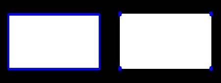
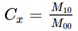
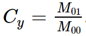
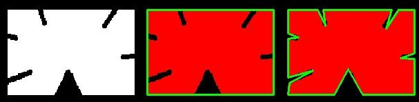
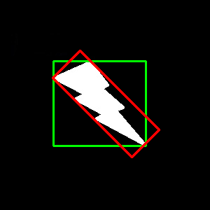
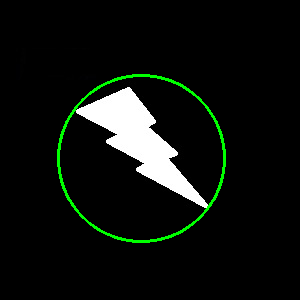
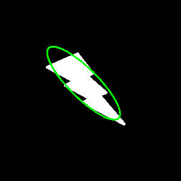
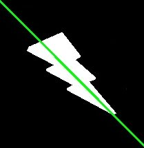

-----

| Title         | OpenCV IP shape Contours                              |
| ------------- | ----------------------------------------------------- |
| Created @     | `2020-02-27T06:33:42Z`                                |
| Last Modify @ | `2022-12-27T09:12:40Z`                                |
| Labels        | \`\`                                                  |
| Edit @        | [here](https://github.com/junxnone/aiwiki/issues/343) |

-----

# Contours 轮廓

## Reference

  - [cv.findContours()](https://docs.opencv.org/4.2.0/d3/dc0/group__imgproc__shape.html#gadf1ad6a0b82947fa1fe3c3d497f260e0)
  - [mode -
    RetrievalModes](https://docs.opencv.org/4.2.0/d3/dc0/group__imgproc__shape.html#ga819779b9857cc2f8601e6526a3a5bc71)
  - [method -
    ContourApproximationModes](https://docs.opencv.org/4.2.0/d3/dc0/group__imgproc__shape.html#ga4303f45752694956374734a03c54d5ff)
  - [查找轮廓（cv2.findCountours函数）](https://www.cnblogs.com/wmy-ncut/p/9889294.html)
  - [jupyter
    notebook](https://github.com/junxnone/examples/blob/master/opencv/OpenCV_findContours_drawContours.ipynb)
  - [Contours - Opencv tutorial -
    apachecn](https://opencv.apachecn.org/#/docs/4.0.0/4.9-tutorial_py_contours)

## Brief

| Function                | Description    | Comments                                                                                                                     |
| ----------------------- | -------------- | ---------------------------------------------------------------------------------------------------------------------------- |
| cv.findContours()       | 查找 Contours    |                                                                  |
| cv.drawContours()       | 绘制 Contours    |                                                                                                                              |
| cv.moments()            | 计算矩值 (重心)      |   |
| cv.contourArea()        | 计算轮廓面积         |                                                                                                                              |
| cv.arcLength()          | 计算轮廓周长         |                                                                                                                              |
| cv.approxPolyDP()       | 轮廓近似为指定顶点数量的形状 |                                                                  |
| cv.convexHull()         | 检查凸包           |                                                                  |
| cv.boundingRect()       | 获取外接矩形         |                                                                  |
| cv.rectangle()          | 绘制矩形           |                                                                                                                              |
| cv.minAreaRect()        | 最小面积矩形         |                                                                                                                              |
| cv.boxPoints()          | 获取矩形点          |                                                                                                                              |
| cv.minEnclosingCircle() | 最小外接圆          |                                                                  |
| cv.circle()             | 绘制圆            |                                                                                                                              |
| cv.fitEllipse()         | 获取拟合椭圆         |                                                                  |
| cv.ellipse()            | 绘制椭圆           |                                                                                                                              |
| cv.fitLine()            | 获取拟合线          |                                                                  |
| cv.line()               | 绘制线            |                                                                                                                              |
| cv.minMaxLoc()          | mask 中最大最小值    |                                                                                                                              |

## findContours()

    contours, hierarchy = cv.findContours(image, mode, method[,contours[,hierarchy[,offset]]])

| mode                | Description                     |
| ------------------- | ------------------------------- |
| cv2.RETR\_EXTERNAL  | 只检测外轮廓                          |
| cv2.RETR\_LIST      | 检测的轮廓不建立等级关系                    |
| cv2.RETR\_CCOMP     | 建立两个等级的轮廓，上面一层为外边界，里面一层为内孔的边界信息 |
| cv2.RETR\_TREE      | 建立一个等级树结构的轮廓                    |
| cv2.RETR\_FLOODFILL |                                 |

| mothod                        | Description        |
| ----------------------------- | ------------------ |
| cv2.CHAIN\_APPROX\_NONE       | 存储所有边界点            |
| cv2.CHAIN\_APPROX\_SIMPLE     | 压缩垂直、水平、对角方向，只保留端点 |
| cv2.CHAIN\_APPROX\_TX89\_L1   | 使用teh-Chini近似算法    |
| cv2.CHAIN\_APPROX\_TC89\_KCOS | 使用teh-Chini近似算法    |

## drawContours()

    image = cv.drawContours(image, contours, contourIdx,  \
        color[, thickness[, lineType[, hierarchy[, maxLevel[, offset]]]]])

| Parameters | Description                                                                                                                                                                                                                                                                                                                                                    |
| ---------- | -------------------------------------------------------------------------------------------------------------------------------------------------------------------------------------------------------------------------------------------------------------------------------------------------------------------------------------------------------------- |
| image      | 目标图片                                                                                                                                                                                                                                                                                                                                                           |
| contours   | 边缘 - Each contour is stored as a point vector.                                                                                                                                                                                                                                                                                                                 |
| contourIdx | 轮廓 ID. `-1` 时绘制所有轮廓                                                                                                                                                                                                                                                                                                                                            |
| color      | 轮廓绘制颜色                                                                                                                                                                                                                                                                                                                                                         |
| thickness  | 轮廓绘制粗细. `-1` 时填充 .                                                                                                                                                                                                                                                                                                                                             |
| lineType   | Line connectivity. See LineTypes                                                                                                                                                                                                                                                                                                                               |
| hierarchy  | Optional information about hierarchy. It is only needed if you want to draw only some of the contours (see maxLevel ).                                                                                                                                                                                                                                         |
| maxLevel   | Maximal level for drawn contours. If it is 0, only the specified contour is drawn. If it is 1, the function draws the contour(s) and all the nested contours. If it is 2, the function draws the contours, all the nested contours, all the nested-to-nested contours, and so on. This parameter is only taken into account when there is hierarchy available. |
| offset     | Optional contour shift parameter. Shift all the drawn contours by the specified offset=(dx,dy) .                                                                                                                                                                                                                                                               |

## contourArea()

    retval = cv.contourArea(contour[, oriented])

  - 使用格林公式计算面积, 不是 计数 pixels 所以返回值不同于 non-zero pixels

> 当面积极小时会被计算为 `0`

  - 建议计算面积时还是使用 `cv2.countNonZero(your_image)`

<!-- end list -->

    def get_area(image, contours):
        area_list = []
        for i in range(len(contours)):
            pimg  = np.zeros(image.shape, dtype=np.uint8)
            cv2.drawContours(pimg, [contours[i]], -1, 255, -1)
            nzero = cv2.countNonZero(pimg)
            area_list.append(nzero)
    
        return area_list
