-----

| Title         | OpenCV IP Filter morphology                           |
| ------------- | ----------------------------------------------------- |
| Created @     | `2018-12-20T08:46:04Z`                                |
| Last Modify @ | `2022-12-27T09:16:18Z`                                |
| Labels        | \`\`                                                  |
| Edit @        | [here](https://github.com/junxnone/aiwiki/issues/344) |

-----

# 膨胀腐蚀

## Reference

  - [Morphology -
    HIPR2](http://homepages.inf.ed.ac.uk/rbf/HIPR2/morops.htm)
  - [Morphological -
    OpenCV](https://opencv.apachecn.org/#/docs/4.0.0/4.5-tutorial_py_morphological_ops)

## Brief

| Name | Description                     | Examples                                                                                                                      |
| ---- | ------------------------------- | ----------------------------------------------------------------------------------------------------------------------------- |
| 腐蚀   | 侵蚀前景对象的边界<br>`白色/高值` =\> `黑色/0` | 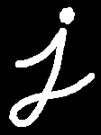 =\> 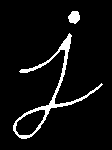 |
| 膨胀   | 增加前景对象的边界<br>`黑色/0` =\> `白色/高值` |  =\>  |
| 开运算  | 腐蚀后膨胀                           | 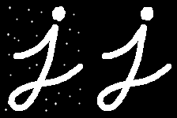                                                                  |
| 闭运算  | 膨胀后腐蚀                           | 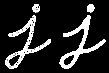                                                                  |
| 形态梯度 | 膨胀腐蚀差值                          | 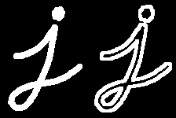                                                                  |
| 顶帽   | 原图像和开运算的差值                      | 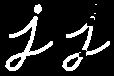                                                                  |
| 黑帽   | 原图像和闭运算的差值                      |                                                                   |

## 腐蚀

    #coding=utf-8
    import cv2
    import numpy as np
    import matplotlib.pyplot as plt
    
    img = cv2.imread('t.png', 0)
    #img = cv2.cvtColor(oimg, cv2.COLOR_BGR2RGB)
    
    m1 = plt.imshow(img)
    m1.set_cmap('gray')
    plt.show()
    
    kernel = np.ones((5, 5), np.uint8)
    erosion = cv2.erode(img, kernel)  # 腐蚀
    fig = plt.figure()
    m1 = plt.imshow(erosion)
    m1.set_cmap('gray')
    plt.show()
    
    kernel = np.ones((10, 10), np.uint8)
    erosion = cv2.erode(img, kernel)  # 腐蚀
    fig = plt.figure()
    m1 = plt.imshow(erosion)
    m1.set_cmap('gray')
    plt.show()

| 原图                                                           | 5x5 腐蚀                                                       | 10x10 腐蚀                                                     |
| ------------------------------------------------------------ | ------------------------------------------------------------ | ------------------------------------------------------------ |
| 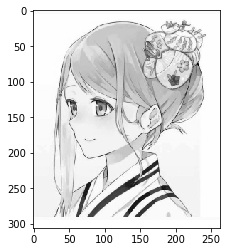 |  | 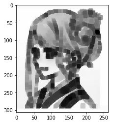 |

    kernel = cv2.getStructuringElement(cv2.MORPH_RECT, (10, 10))  # 矩形结构
    erosion = cv2.erode(img, kernel)  # 腐蚀
    fig = plt.figure()
    m1 = plt.imshow(erosion)
    m1.set_cmap('gray')
    plt.show()
    
    kernel = cv2.getStructuringElement(cv2.MORPH_ELLIPSE, (10, 10))  # 椭圆结构
    erosion = cv2.erode(img, kernel)  # 腐蚀
    fig = plt.figure()
    m1 = plt.imshow(erosion)
    m1.set_cmap('gray')
    plt.show()
    
    kernel = cv2.getStructuringElement(cv2.MORPH_CROSS, (10, 10))  # 十字形结构
    erosion = cv2.erode(img, kernel)  # 腐蚀
    fig = plt.figure()
    m1 = plt.imshow(erosion)
    m1.set_cmap('gray')
    plt.show()

| 矩形结构腐蚀                                                       | 椭圆结构腐蚀                                                       | 十字结构腐蚀                                                       |
| ------------------------------------------------------------ | ------------------------------------------------------------ | ------------------------------------------------------------ |
|  |  | 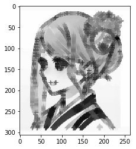 |

## 膨胀

    kernel = np.ones((5, 5), np.uint8)
    dilation = cv2.dilate(img, kernel)  # 膨胀
    fig = plt.figure()
    m1 = plt.imshow(dilation)
    m1.set_cmap('gray')
    plt.show()
    
    kernel = np.ones((10, 10), np.uint8)
    dilation = cv2.dilate(img, kernel)  # 膨胀
    fig = plt.figure()
    m1 = plt.imshow(dilation)
    m1.set_cmap('gray')
    plt.show()

| 原图                                                           | 5x5 膨胀                                                       | 10x10 膨胀                                                     |
| ------------------------------------------------------------ | ------------------------------------------------------------ | ------------------------------------------------------------ |
|  | 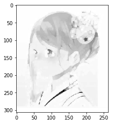 | 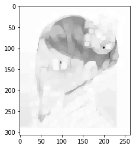 |

## 开运算 & 闭运算

开运算 - 先腐蚀后膨胀（因为先腐蚀会分开物体，这样容易记住），其作用是：分离物体，消除小区域。 闭运算 -
先膨胀后腐蚀（先膨胀会使白色的部分扩张，以至于消除/"闭合"物体里面的小黑洞，所以叫闭运算）
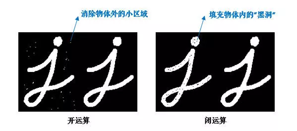

``` 
kernel = cv2.getStructuringElement(cv2.MORPH_RECT, (5, 5))  # 定义结构元素

img = cv2.imread('t.png', 0)
plt.imshow(img, cmap='gray')
plt.show()

opening = cv2.morphologyEx(img, cv2.MORPH_OPEN, kernel)  # 开运算
fig = plt.figure()
plt.imshow(opening, cmap='gray')
plt.show()


closing = cv2.morphologyEx(img, cv2.MORPH_CLOSE, kernel)  # 闭运算
fig = plt.figure()
plt.imshow(closing, cmap='gray')
plt.show()

```

| 原图                                                           | 开运算                                                          | 闭运算                                                          |
| ------------------------------------------------------------ | ------------------------------------------------------------ | ------------------------------------------------------------ |
|  | 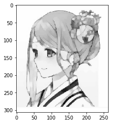 | 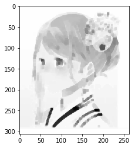 |

## 形态学梯度/顶帽/黑帽

    img = cv2.imread('t.png', 0)
    plt.imshow(img, cmap='gray')
    plt.show()
    
    gradient = cv2.morphologyEx(img, cv2.MORPH_GRADIENT, kernel)
    plt.imshow(gradient, cmap='gray')
    plt.show()
    
    tophat = cv2.morphologyEx(img, cv2.MORPH_TOPHAT, kernel)
    plt.imshow(tophat, cmap='gray')
    plt.show()
    
    blackhat = cv2.morphologyEx(img, cv2.MORPH_BLACKHAT, kernel)
    plt.imshow(blackhat, cmap='gray')
    plt.show()

| 原图                                                           | 形态学梯度                                                        | 顶帽                                                           | 黑帽                                                           |
| ------------------------------------------------------------ | ------------------------------------------------------------ | ------------------------------------------------------------ | ------------------------------------------------------------ |
|  | 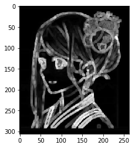 | 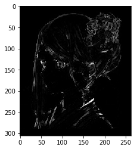 | 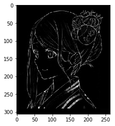 |
