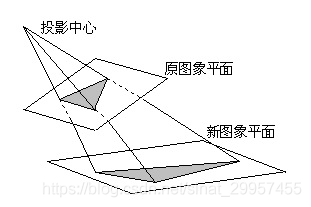
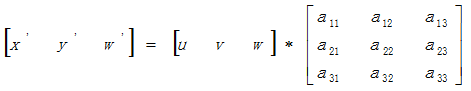
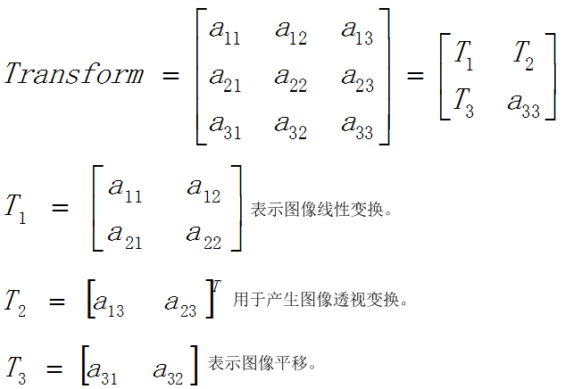
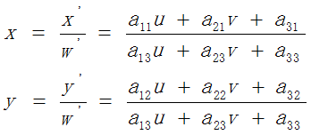
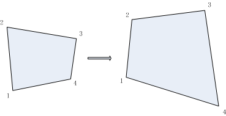

-----

| Title         | Media Image PT                                        |
| ------------- | ----------------------------------------------------- |
| Created @     | `2020-11-05T03:01:31Z`                                |
| Last Modify @ | `2022-12-27T02:49:15Z`                                |
| Labels        | \`\`                                                  |
| Edit @        | [here](https://github.com/junxnone/aiwiki/issues/345) |

-----

# Perspective Transformation - 透视变换

## Reference

  - [图像几何变换之透视变换](https://www.cnblogs.com/liekkas0626/p/5262942.html)
  - [OpenCV
    几何变换](https://www.docs.opencv.org/4.0.0/da/d6e/tutorial_py_geometric_transformations.html)
  - [透视变换原理实例代码详解](https://xiulian.blog.csdn.net/article/details/104281693)

## Brief

| 将图片投影到一个新的视平面 |  |
| ------------- | ------------------------------------------------------------ |
| 透视变换          |  |
| 分解            |  |
| 计算公式          |  |
| 示例            |  |

## 透视变换 vs 仿射变换

| Name | 透视变换 | 仿射变换 |
| ---- | ---- | ---- |
| 维度   | 3    | 2    |
