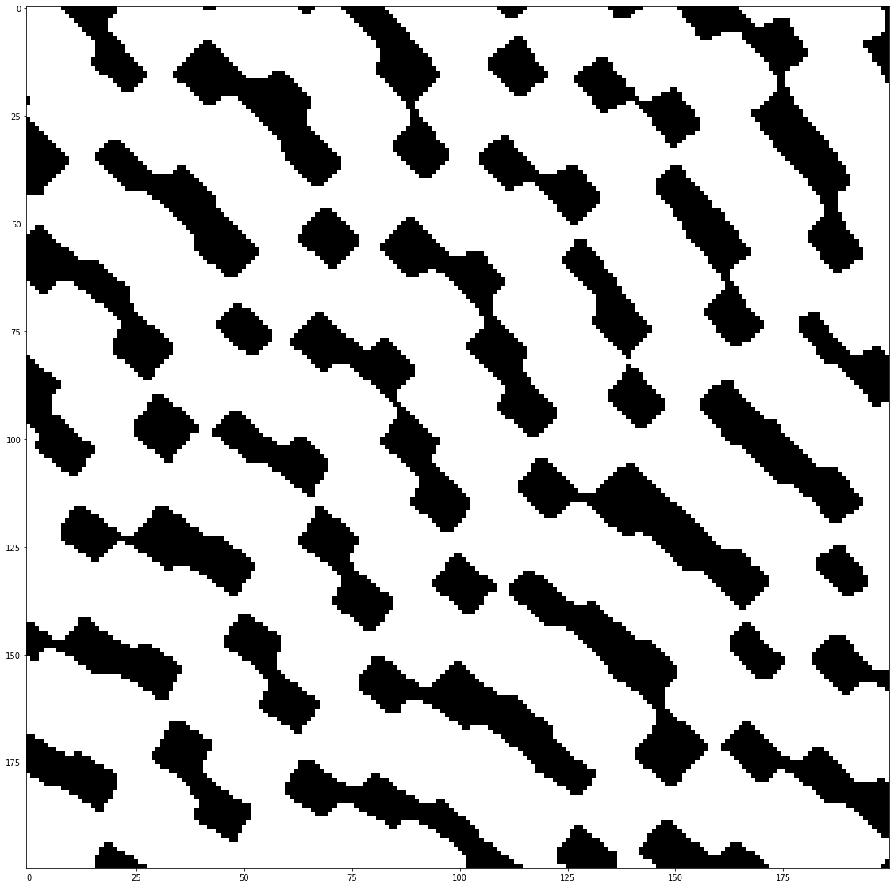
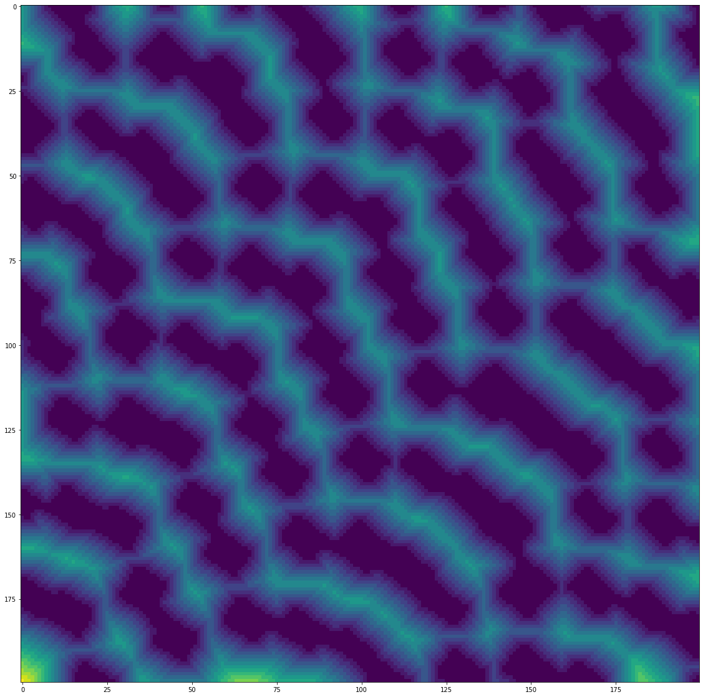
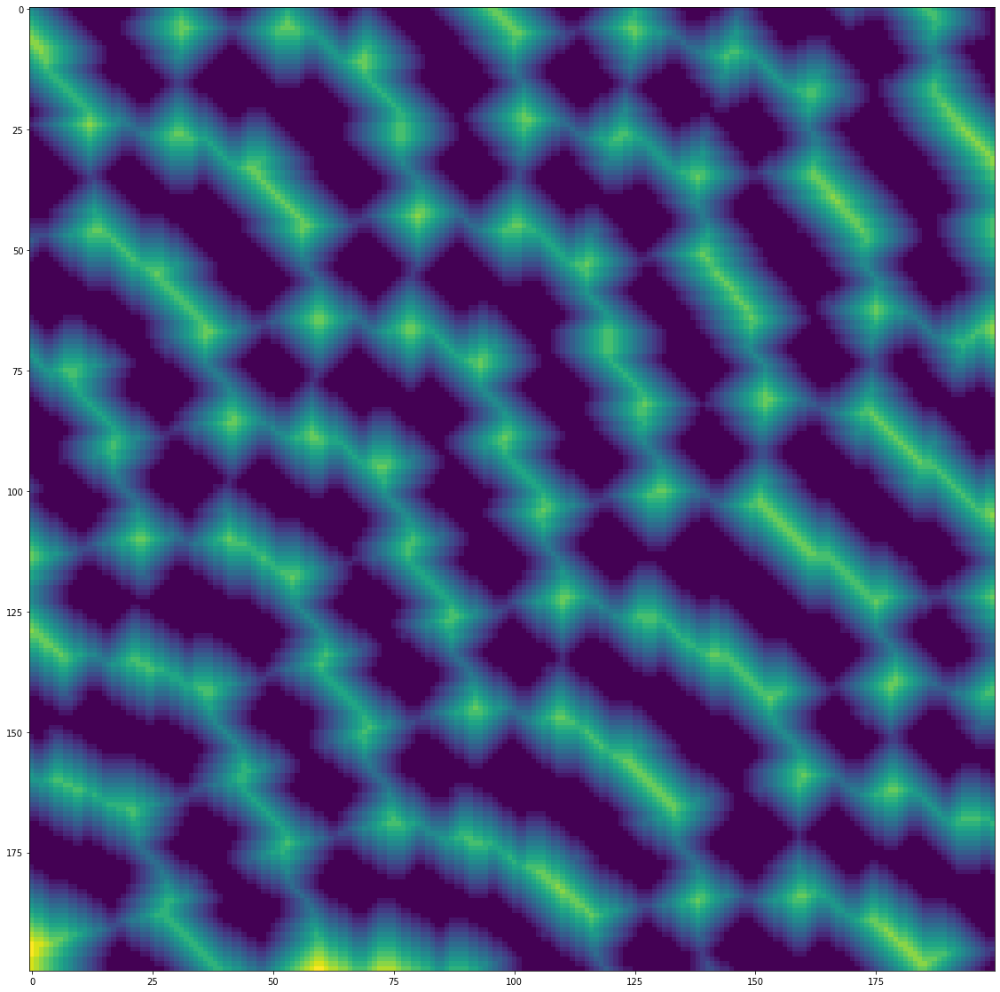
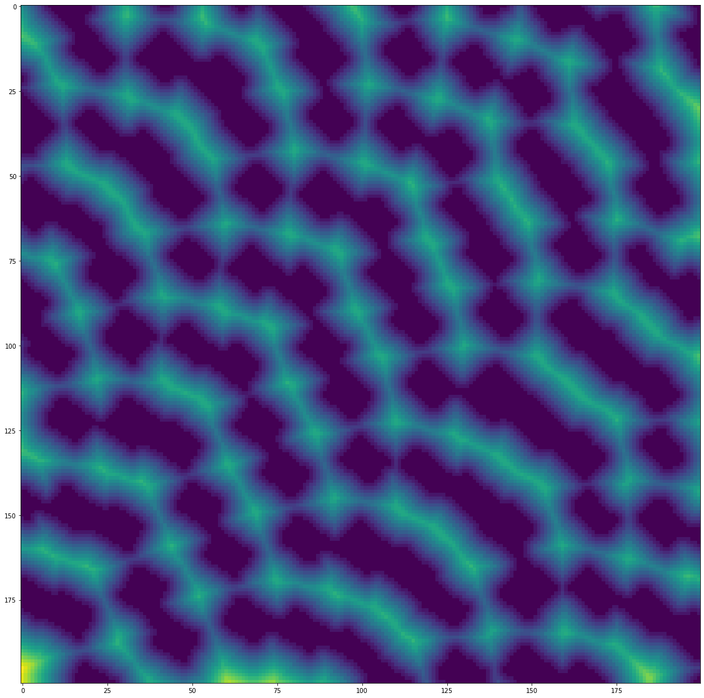

-----

| Title         | OpenCV IP misc distanceTransform                      |
| ------------- | ----------------------------------------------------- |
| Created @     | `2020-09-24T06:12:08Z`                                |
| Last Modify @ | `2022-12-27T09:11:44Z`                                |
| Labels        | \`\`                                                  |
| Edit @        | [here](https://github.com/junxnone/aiwiki/issues/346) |

-----

# distanceTransform 处理区域粘连

    dst_img = cv2.distanceTransform(img, cv2.DIST_C, cv2.DIST_MASK_3)

| origin image                                                 | cv2.DIST\_C                                                  | cv2.DIST\_L1                                                 | cv2.DIST\_L2                                                 |
| ------------------------------------------------------------ | ------------------------------------------------------------ | ------------------------------------------------------------ | ------------------------------------------------------------ |
|  |  |  |  |
