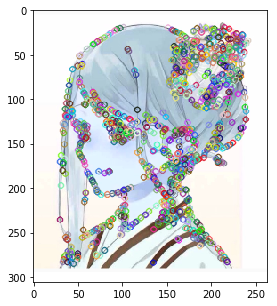
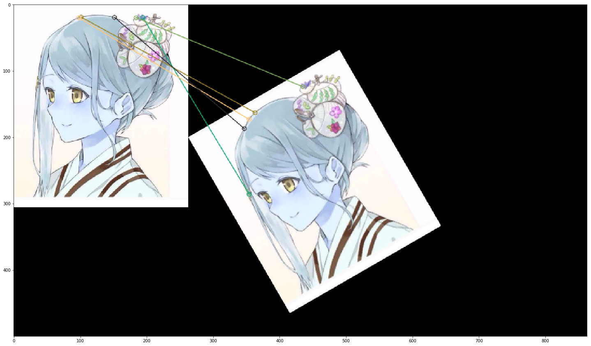
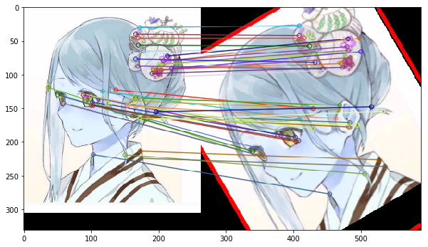
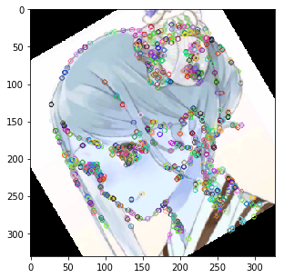
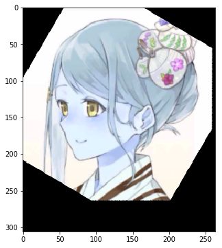

-----

| Title         | OpenCV Brisk                                          |
| ------------- | ----------------------------------------------------- |
| Created @     | `2018-10-21T17:11:34Z`                                |
| Last Modify @ | `2022-12-27T09:17:06Z`                                |
| Labels        | \`\`                                                  |
| Edit @        | [here](https://github.com/junxnone/aiwiki/issues/348) |

-----

# Brisk 特征点匹配

    brisk = cv2.BRISK_create()
    kp = brisk.detect(img, None)
    kp, des = brisk.compute(img, kp)
    out_img = img.copy()
    out_img = cv2.drawKeypoints(img, kp, out_img)
    fig = plt.figure(figsize=(5, 5))
    plt.imshow(out_img)



# BF Match

    matcher = cv2.BFMatcher()
    matches = matcher.match(des, des_30)
    out_img = cv2.drawMatches(img, kp, bk30_img, kp_30, matches[0:5], out_img,flags=cv2.DrawMatchesFlags_NOT_DRAW_SINGLE_POINTS)
    plt.figure(figsize=(25, 15))
    plt.imshow(out_img)



# Knn match

``` 

FLANN_INDEX_LSH = 6
index_params = dict(algorithm=FLANN_INDEX_LSH,
                                 table_number=6,
                                 key_size=12,
                                 multi_probe_level=1)
search_params = dict(checks=100)
flann = cv2.FlannBasedMatcher(index_params, search_params)
knn_matches = flann.knnMatch(des, des_30, k=2)

good_matches = []
lowe_ratio_test = 0.3
min_match_count = 10

for m, n in knn_matches:
    if m.distance < n.distance * lowe_ratio_test:
        good_matches.append(m)

    if len(good_matches) > min_match_count:
        src_pts = np.float32([kp[m.queryIdx].pt for m in good_matches]).reshape(-1, 1, 2)
        dst_pts = np.float32([kp_30[m.trainIdx].pt for m in good_matches]).reshape(-1, 1, 2)
    else:
        src_pts = None
        dst_pts = None
M, mask = cv2.findHomography(src_pts, dst_pts, method=cv2.RANSAC, ransacReprojThreshold=4.0)
matches_mask = mask.ravel().tolist()

        # Apply homography matrix.
h, w, c = img.shape
# ref image
pts = np.float32([[0, 0], [0, h - 1], [w - 1, h - 1], [w - 1, 0]]).reshape(-1, 1, 2)
# test image
dst = cv2.perspectiveTransform(pts, M)

test_img = cv2.polylines(img=img_30, pts=[np.int32(dst)], isClosed=True,
                                 color=255, thickness=3, lineType=cv2.LINE_AA)

img_matches = np.empty(
            shape=(max(img.shape[0], img_30.shape[0]),
                   img.shape[1] + img_30.shape[1],
                   3),
            dtype=np.uint8)
out_img = cv2.drawMatches(img, kp,
                        test_img, kp_30,
                        matches1to2=good_matches,
                        outImg=img_matches,
                        matchesMask=matches_mask,
                        flags=cv2.DrawMatchesFlags_NOT_DRAW_SINGLE_POINTS)

plt.figure(figsize=(10, 10))
plt.imshow(out_img)
```



# Rotate

    im30 =  cv2.imread('t30.png',3)
    (kp_i30, des_i30) = brisk.detectAndCompute(im30, None)
    bk30_img = im30.copy()
    o30_img = im30.copy()
    o30_img = cv2.drawKeypoints(bk30_img, kp_i30, o30_img)
    plt.figure(figsize=(15, 10))
    plt.imshow(o30_img)
    
    
    # test image
    points = np.int32(dst).reshape(4, 2)
    rect = np.zeros((4, 2), dtype="float32")
    rect[0], rect[1], rect[2], rect[3] = points[0], points[3], points[2], points[1]
    # ref image
    destination = np.array([[0, 0], [w - 1, 0], [w - 1, h - 1], [0, h - 1]], dtype="float32")
    # homography matrix
    h_mat = cv2.getPerspectiveTransform(rect, destination)
    frame_wrap = cv2.warpPerspective(src=im30, M=h_mat, dsize=(w, h))
    # test image overlay
    frame_overlay = frame_wrap.copy()
    
    plt.figure(figsize=(15, 10))
    plt.imshow(frame_overlay)



