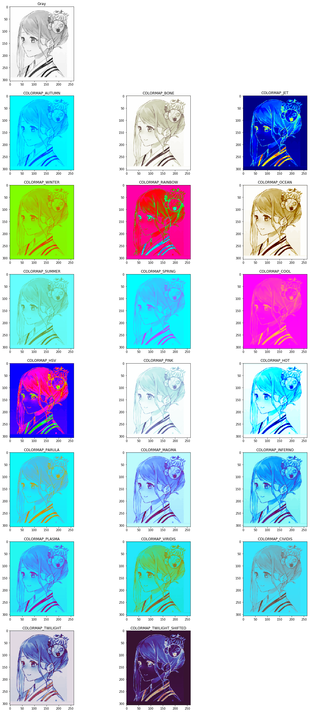

-----

| Title     | OpenCV IP Colormaps                                   |
| --------- | ----------------------------------------------------- |
| Created @ | `2019-08-07T05:19:00Z`                                |
| Updated @ | `2023-06-17T16:20:00Z`                                |
| Labels    | \`\`                                                  |
| Edit @    | [here](https://github.com/junxnone/aiwiki/issues/349) |

-----

# ColorMaps

## Convert to JET

    import cv2 
     
    im_gray = cv2.imread("yourimage.jpg", cv2.IMREAD_GRAYSCALE)
    im_color = cv2.applyColorMap(im_gray, cv2.COLORMAP_JET)

## Reference

  - [applyColorMap for pseudocoloring in OpenCV ( C++ / Python
    )](learnopencv.com/applycolormap-for-pseudocoloring-in-opencv-c-python/)
  - [API
    Doc](https://docs.opencv.org/4.1.1/d3/d50/group__imgproc__colormap.html)
