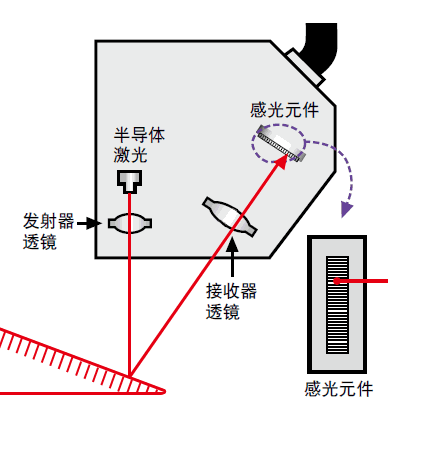

-----

| Title         | 3D Camera 激光测量                                        |
| ------------- | ----------------------------------------------------- |
| Created @     | `2021-09-14T07:53:53Z`                                |
| Last Modify @ | `2022-12-27T05:52:59Z`                                |
| Labels        | \`\`                                                  |
| Edit @        | [here](https://github.com/junxnone/aiwiki/issues/354) |

-----

# Reference

  - [一文了解激光测距](https://www.36kr.com/p/1724280602625)

# Brief

  - 测光测量用途
      - 测距 - `激光测距仪`
      - 3D 重建 - `激光扫描仪`

## 激光测距

  - ToF
      - 脉冲测量
      - 相位测量
  - 空间几何
      - 三角测量
      - 干涉测量

| 方法   | 适合距离     | 精度 | 应用场景            |
| ---- | -------- | -- | --------------- |
| 脉冲测量 | 长距离      | m  | 遥测/地质勘探/飞行器/... |
| 回波测量 |          |    |                 |
| 相位测量 |          | mm |                 |
| 三角测量 | \<2000mm | um |                 |

### 三角测量

  - 随着被测物体距离的改变，光线聚焦到感光元件的位置不同

| 原理 | **D = c x △t/2** |
| -- | ---------------- |
| D  | 被测距离             |
| c  | 光速               |
| △t | 测试时间             |

### 相位测量

| 原理 | D = c x △t = c x △φ/ 4πf = λ/2 x △φ/2π |
| -- | -------------------------------------- |
| D  | 被测距离                                   |
| c  | 光速                                     |
| △t | 测试时间 `△t=△φ/2πf`                       |
| △φ | 相移                                     |
| f  | 调制频率                                   |
| λ  | 调制波长 `λ=c/f`                           |
