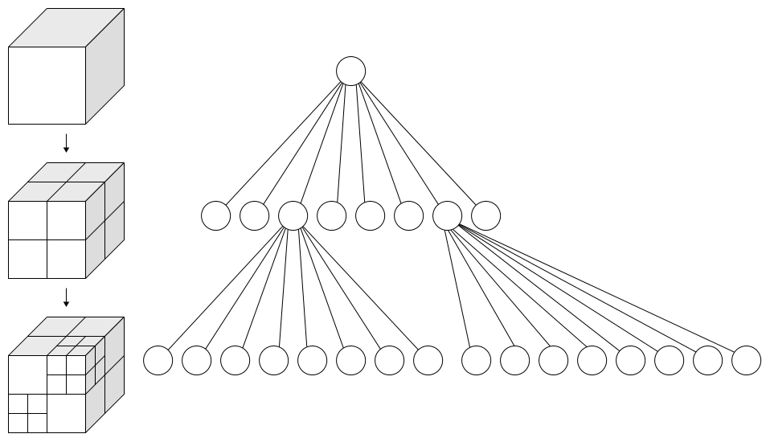

-----

| Title         | Math QuadTree                                         |
| ------------- | ----------------------------------------------------- |
| Created @     | `2021-08-19T06:15:39Z`                                |
| Last Modify @ | `2022-12-27T05:55:27Z`                                |
| Labels        | \`\`                                                  |
| Edit @        | [here](https://github.com/junxnone/aiwiki/issues/356) |

-----

# QuadTree/OCTree - 四叉树/八叉树

## Reference

  - [Octree](https://en.wikipedia.org/wiki/Octree)
  - [Quadtree](https://en.wikipedia.org/wiki/Quadtree)
  - [空间数据结构(四叉树/八叉树/BVH树/BSP树/k-d树)](https://www.cnblogs.com/KillerAery/p/10878367.html)
  - [KdTree && Octree
    原理学习对比以及可视化分析--"索引树"](https://www.cnblogs.com/ZuDame/p/11193179.html)

## Brief

  - QuadTree -
  - OcTree - `oct + tree`

| Name     | Dimensional |
| -------- | ----------- |
| QuadTree | 2D          |
| OcTree   | 3D          |

| QuadTree                                                     | OcTree                                                       |
| ------------------------------------------------------------ | ------------------------------------------------------------ |
|  |  |

## UseCase
