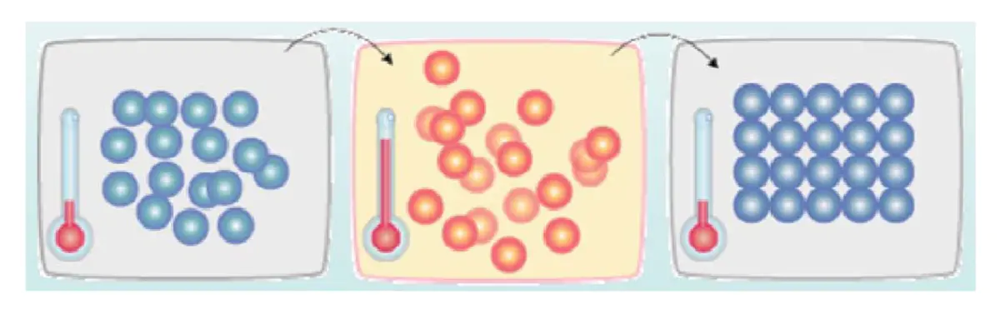

-----

| Title     | Math SA                                               |
| --------- | ----------------------------------------------------- |
| Created @ | `2021-03-30T08:34:59Z`                                |
| Updated @ | `2023-02-03T02:51:32Z`                                |
| Labels    | \`\`                                                  |
| Edit @    | [here](https://github.com/junxnone/aiwiki/issues/357) |

-----

# Simulated annealing 模拟退火

## Reference

  - [模拟退火算法](https://ustccoder.github.io/2019/05/20/optimization_SA/)
  - [模拟退火算法 Simulated Annealing](https://www.jianshu.com/p/57678cfe8553)
  - [SA - 数独-
    Visualizer](https://jeremypflipsen.github.io/Sudoku-Visualizer/#0)
  - [SA -
    demo](http://aimacode.github.io/aima-javascript/4-Beyond-Classical-Search/)
  - [SA - 路径规划
    demo](https://harmonc.github.io/sketches/simulated_annealing/index.html)

## Hill climbing

  - 爬山算法是一种简单的贪心搜索算法，该算法每次从当前解的临近解空间中选择一个最优解作为当前解,直到达到一个局部最优解
  - 如图， 有局部最优解 B/E, 如果初始点在 A - G之前的谷底，则只可能达到局部最优点 B/E

## Simulated Annealing

  - SA - Simulated annealing - 来源于固体退火原理
  - `Hill Climbing` + `Random Walk`
  - 搜索过程中以一定概率接受比当前解较差的解，以跳出局部最优
      - 概率随着时间推移逐渐降低

| 自然界退火 |  |
| ----- | ------------------------------------------------------------ |

> 将固体加温至充分高，再让其徐徐冷却（退火），加温时，固体内部粒子随温升变为无序状，内能增大，而徐徐冷却时粒子渐趋有序，在每个温度都达到平衡态，最后在常温时达到基态，内能减为最小

## UseCase
