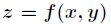
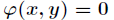
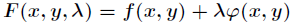
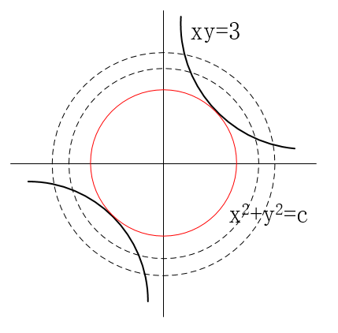
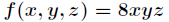
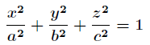
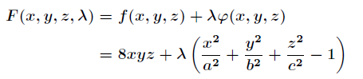
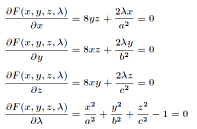
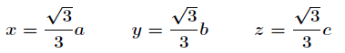
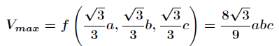

-----

| Title         | Math LMM                                              |
| ------------- | ----------------------------------------------------- |
| Created @     | `2021-03-26T06:06:14Z`                                |
| Last Modify @ | `2022-12-27T06:02:31Z`                                |
| Labels        | \`\`                                                  |
| Edit @        | [here](https://github.com/junxnone/aiwiki/issues/358) |

-----

# Lagrange Multiplier Method 拉格朗日乘数法

## Reference

  - [拉格朗日乘数法 ——
    通俗理解](https://blog.csdn.net/THmen/article/details/87366904)
  - [拉格朗日乘数法](https://blog.csdn.net/acdreamers/article/details/41413445)

## Brief

  - 通过引入`拉格朗日乘子`来将含有n个变量和k个约束条件的约束优化问题转化为含有（n+k）个变量的无约束优化问题
      - `n 个变量` + `k 个约束条件` ==\> `n + k 个变量`

| 函数                                                           | 条件                                                           | 转化函数                                                         |
| ------------------------------------------------------------ | ------------------------------------------------------------ | ------------------------------------------------------------ |
|  |  |  |

## Examples

### Example 1

| Name       | Details                                                      |
| ---------- | ------------------------------------------------------------ |
| 问题描述       | 求双曲线xy=3上离原点最近的点                                             |
| 函数 f(x, y) | `xy = 3`                                                     |
| 约束 g(x, y) | `x^2 + y^2 = C`                                              |
| 曲线         |  |
| 转化问题       | 求当f(x,y)和g(x,y)相切时，x,y的值是多少？                                 |
| 推理         | 两个曲线相切 ==\> 切线相同/法向量是相互平行                                    |
| 引入拉格朗日乘子 λ | ▽f//▽g ==\> ▽f=λ\*▽g ==\> `fx=λ*gx`/`fy=λ*gy`/`xy=3`         |

### Example 2

| Name          | Details                                                                                                                   |
| ------------- | ------------------------------------------------------------------------------------------------------------------------- |
| 问题描述          | 椭球的内接长方体的最大体积                                                                                                             |
| 函数 f(x, y, z) |                                                               |
| 条件            |                                                               |
| 转化问题          |                                                               |
| 求偏导           |                                                               |
| 求解            |   |
