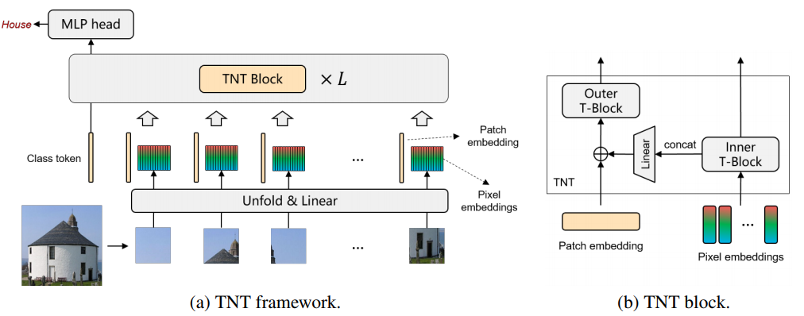
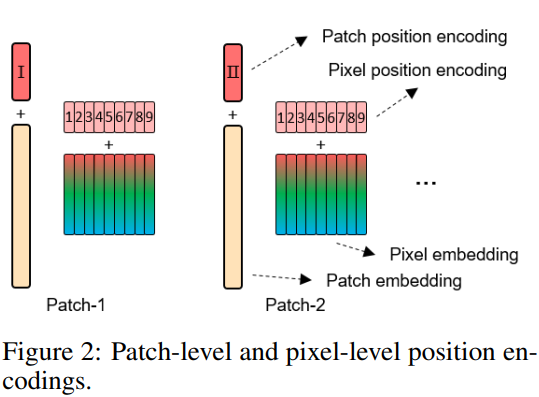
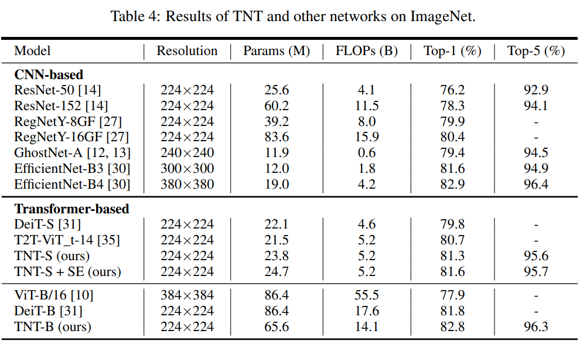
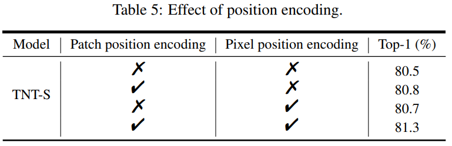
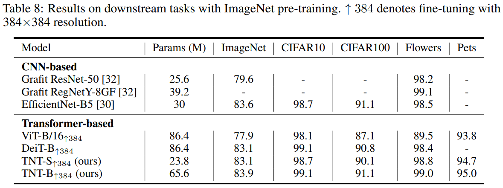

-----

| Title         | ML Transformer TiT                                    |
| ------------- | ----------------------------------------------------- |
| Created @     | `2021-03-04T01:58:58Z`                                |
| Last Modify @ | `2022-12-27T06:49:39Z`                                |
| Labels        | \`\`                                                  |
| Edit @        | [here](https://github.com/junxnone/aiwiki/issues/360) |

-----

# Transformer in Transformer

## Reference

  - 2021-02 **\[TNT\]** Transformer in
    Transformer\[[Paper](https://arxiv.org/abs/2103.00112)\]
    \[[Code](https://github.com/huawei-noah/noah-research/tree/master/TNT)\]
  - [pytorch code -
    lucidrains](https://github.com/lucidrains/transformer-in-transformer)

## Brief

  - patch-level and pixel-level representation
  - Inner T-Block ==\> Patch level
  - Outer T-Block ==\> Pixel level

## Motivation

  - 背景/存在的问题
  - 做了什么尝试/分别有什么效果
  - 应用领域

## Arch

### Position encoding(patch & pixel)

## Evaluation

## Tricks
