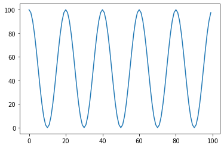
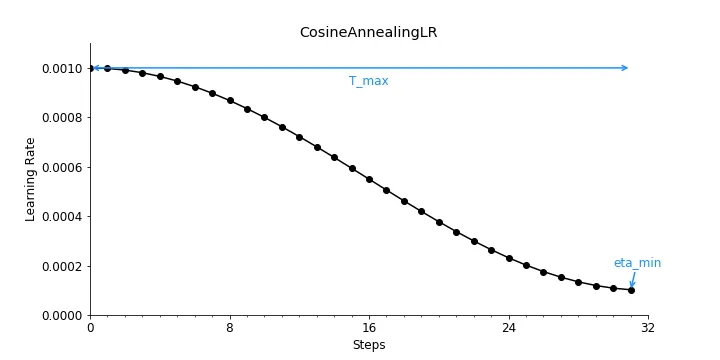
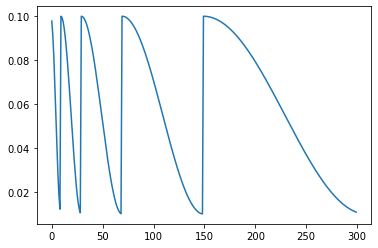
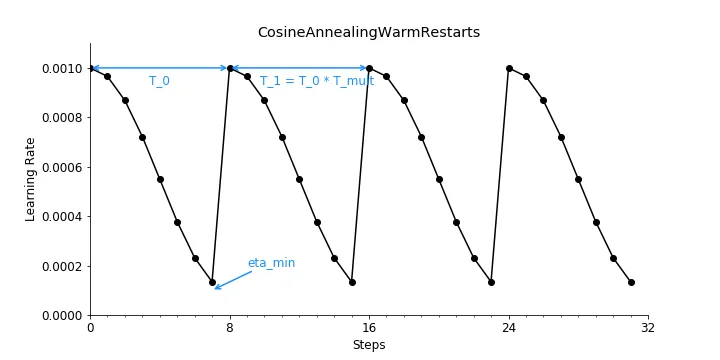

-----

| Title     | ML Arch LR AnnealingLR                                |
| --------- | ----------------------------------------------------- |
| Created @ | `2023-02-03T03:08:43Z`                                |
| Updated @ | `2023-02-03T03:10:33Z`                                |
| Labels    | \`\`                                                  |
| Edit @    | [here](https://github.com/junxnone/aiwiki/issues/372) |

-----

# AnnealingLR 退火学习率

## Reference

  - [CosineAnnealingLR -
    Pytorch](https://pytorch.org/docs/stable/generated/torch.optim.lr_scheduler.CosineAnnealingLR.html#cosineannealinglr)
  - [CosineAnnealingWarmRestarts -
    Pytorch](https://pytorch.org/docs/stable/generated/torch.optim.lr_scheduler.CosineAnnealingWarmRestarts.html#torch.optim.lr_scheduler.CosineAnnealingWarmRestarts)

## CosineAnnealingLR

## CosineAnnealingWarmRestarts

