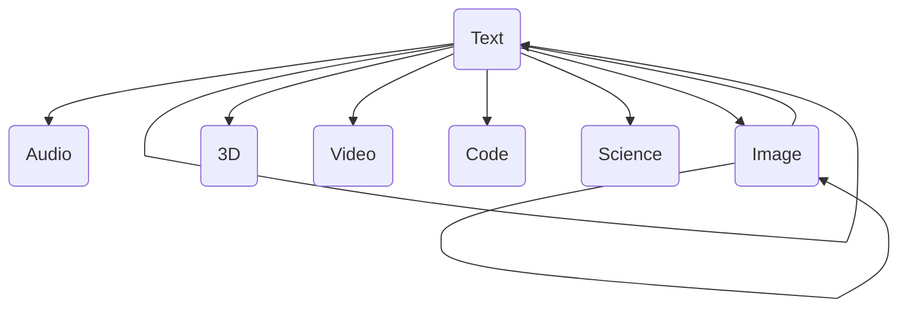
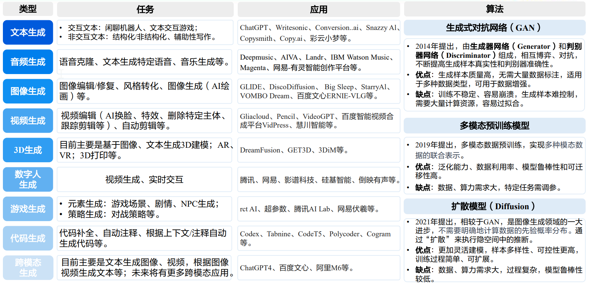
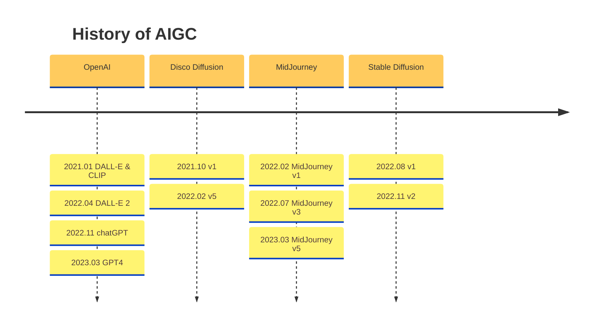

-----

| Title     | Hot AIGC                                              |
| --------- | ----------------------------------------------------- |
| Created @ | `2023-02-03T07:46:02Z`                                |
| Updated @ | `2023-10-18T06:35:04Z`                                |
| Labels    | \`\`                                                  |
| Edit @    | [here](https://github.com/junxnone/aiwiki/issues/374) |

-----

# AIGC

  - AIGC: `AI Generated Content` 利用 AI 生成内容 - 绘画/写作/...
      - PGC: `Professional Generated Content` 专业平台或组织生成的内容，
        电视/电影/海报/网剧/...
      - UGC: `User Generated Content` 用户个体生成的内容，个人vlog/blog/...

<!-- end list -->

## 相关工具

  - DALL-E (V1/V2)
  - Disco Diffusion
  - MidJourney
  - Stable Diffusion (V1/V2)

<!-- end list -->

## Reference

  - [人工智能系列深度报告：AIGC行业综述篇](https://github.com/junxnone/aiwiki/files/11518064/AIGC.pdf)
  - [Disco Diffusion](https://github.com/alembics/disco-diffusion)
  - [CLIP](https://github.com/openai/CLIP)
  - [Stable Diffusion](https://github.com/Stability-AI/stablediffusion)
  - [Midjourney](https://www.midjourney.com/home/)
  - [ChatGPT is not all you need. A State of the Art Review of large
    Generative AI models](https://arxiv.org/pdf/2301.04655.pdf)
  - [AI内容生成](https://www.zhangzhenhu.com/aigc/index.html)
