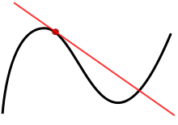

-----

| Title     | Math Derivative                                       |
| --------- | ----------------------------------------------------- |
| Created @ | `2023-02-04T14:11:22Z`                                |
| Updated @ | `2023-02-05T06:11:16Z`                                |
| Labels    | \`\`                                                  |
| Edit @    | [here](https://github.com/junxnone/aiwiki/issues/377) |

-----

# Derivative 导数

  - 函数在某一点的导数是指这个函数在这一点附近的变化率
  - $\\displaystyle \\lim\_{ x \\to a}\\frac{f(x) - f(a)}{x-a}$
  - $\\displaystyle \\lim\_{ \\Delta x \\to 0}\\frac{f(x\_{0} + \\Delta
    x) - f(x\_{0})}{\\Delta x}$
  - $\\frac{df}{dx} |*{x=x*{0}}$
  - ${f}'(x\_{0})$

## 一元函数 - 导数

  - f(x) 在 x 轴正方向的变化率

## 多元函数 - 偏导数

  - 函数 $f(x\_{1},x\_{2},x\_{3}, ...)$ 在某一坐标轴 $(x\_{1},x\_{2},x\_{3},
    ...)$ 上的变化率

## 方向导数

  - 某一点在某个方向上的导数值

## 梯度

  - 一个向量
  - 方向与最大方向导数方向一致
  - 模为方向导数的最大值
