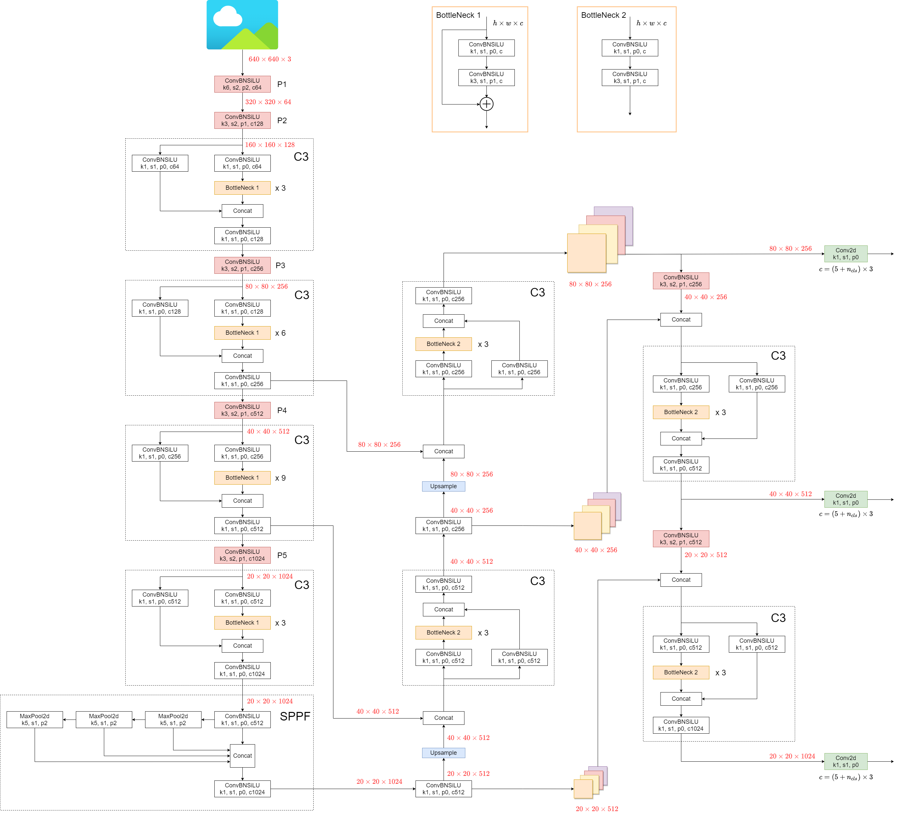

-----

| Title     | ML Tasks Image Detection YOLO V5                      |
| --------- | ----------------------------------------------------- |
| Created @ | `2023-02-14T13:27:32Z`                                |
| Updated @ | `2023-02-16T14:34:38Z`                                |
| Labels    | \`\`                                                  |
| Edit @    | [here](https://github.com/junxnone/aiwiki/issues/379) |

-----

# YOLO V5

## Reference

  - [YOLOv5 (6.0/6.1) brief
    summary](https://github.com/ultralytics/yolov5/issues/6998)
  - [Github Code](https://github.com/ultralytics/yolov5)
  - [Docs Wiki](https://github.com/ultralytics/yolov5/wiki)
  - **Ultralytics 提供了个 [ 数据集管理模型管理的工具 -
    hub](https://hub.ultralytics.com/)** \[[Trained Model
    Preview](https://hub.ultralytics.com/models/7lyorIyBxUuJ6xjOSSlt)\]

## Arch

  - **Backbone**: New CSP-Darknet53
  - **Neck**: SPPF, New CSP-PAN
  - **Head**: YOLOv3 Head

## Preprocess

### Augmentation

  - Mosaic
  - Copy-Paste
  - Mixup
  - Random horizontal flip
  - ...

## Training

  - Multi-scale training(0.5\~1.5x)
  - AutoAnchor(For training custom data)
  - Warmup and Cosine LR scheduler
  - EMA(Exponential Moving Average)
  - Mixed precision
  - Evolve hyper-parameters
