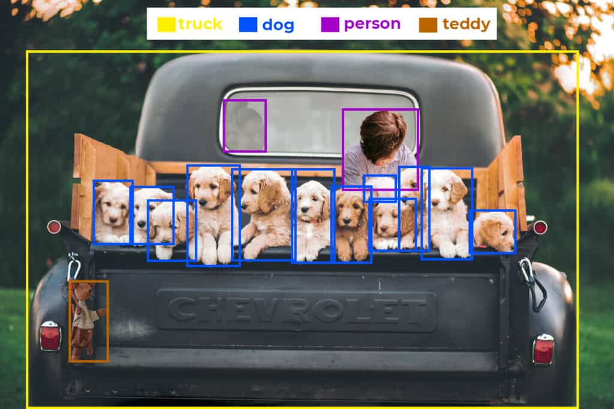
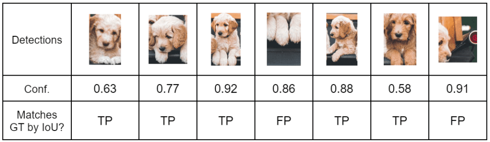
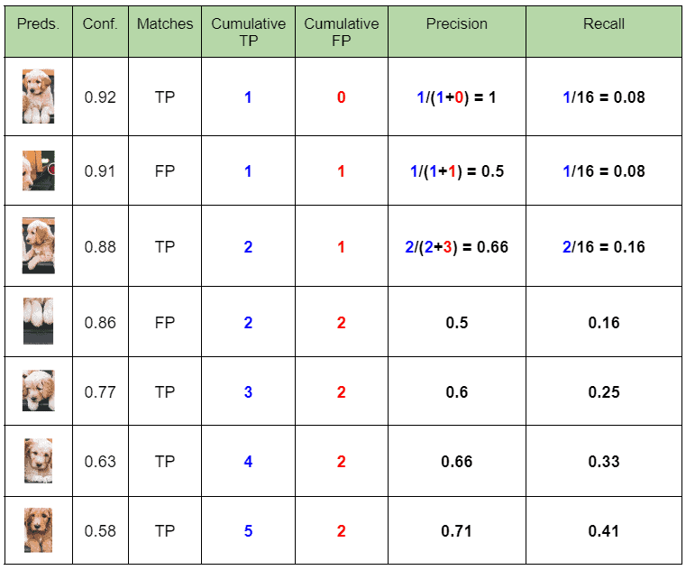
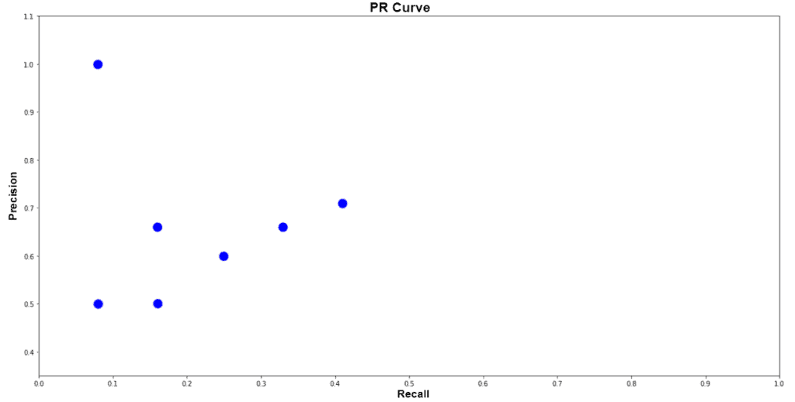
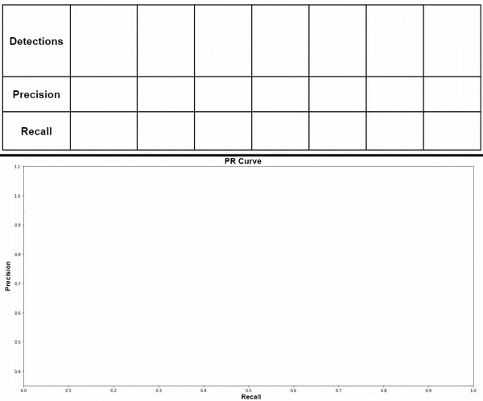
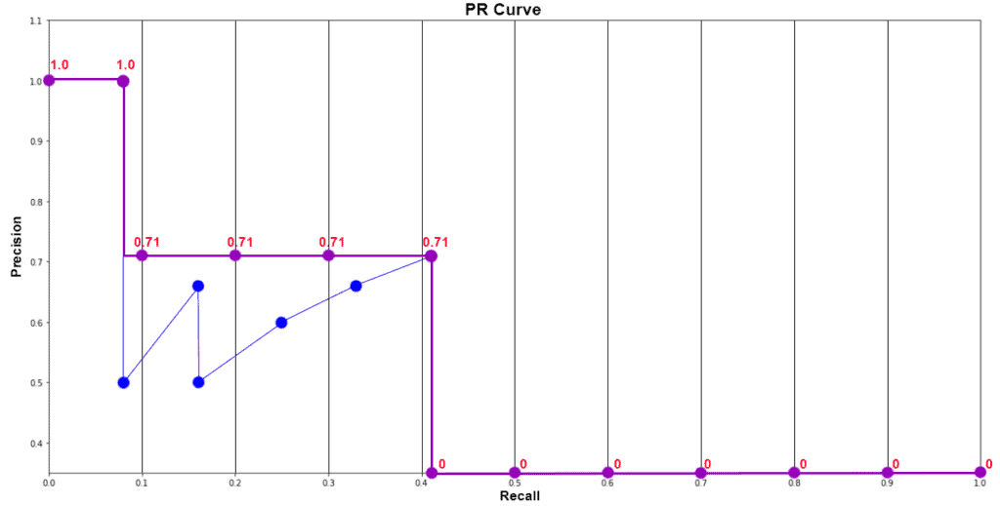

-----

| Title     | ML Metrics Detection APmAPAR                          |
| --------- | ----------------------------------------------------- |
| Created @ | `2023-02-16T15:19:37Z`                                |
| Updated @ | `2023-02-20T08:20:15Z`                                |
| Labels    | \`\`                                                  |
| Edit @    | [here](https://github.com/junxnone/aiwiki/issues/382) |

-----

# AP & mAP & AR

  - `mAP@[0.5:.05:.95]` - 当前比较流行的衡量标准

## AP

  - PR 曲线下的面积
  - AP 一般指单个类别

### 计算步骤

| GT          |  |
| ----------- | ------------------------------------------------------------ |
| Predict Dog |  |

#### 计算 Precision & Recall

  - 根据 `confidence` 排序
  - 

#### Plot PRCurve

  - 每个 `Recall Level` 的 `Precision` 值 使用右侧最大值 使其单调?

##### 11 Point Interpolation Method

  - **11 Recall Point: N=11** \[0, 0.1, 0.2, ..., 0,9, 1.0\]

  - $\\huge AP = \\frac{1}{11}\\times \\int\_{1}^{11}Precisions$
  - $\\huge =\\frac{1}{11}\\times (1+4\\times 0.71+6\\times 0)$
  - $\\huge =0.349$

> The intention in interpolating the precision/recall curve in this way
> is to reduce the impact of the “wiggles” in the precision/recall
> curve, caused by small variations in the ranking of examples.

##### Interpolating all points

  - AUC(Area Under Curve) on PR Curve

$\\huge \\sum\_{0}^{n}(r\_{n+1} - r\_n)p\_{interp}(r\_{n+1})\\newline
p\_{interp}(r\_{n+1})=\\underset{\\bar{r}:\\bar(r)\\geq
r\_{n+1}}{max}p(\\tilde{r})$

##### 101 Point Interpolation AP

  - **N=101**: MSCOCO AP `[0:.01:1]`

## mAP

  - mAP - mAP 一般指所有类别的平均
  - $mAP = \\frac{\\int\_{1}^{n} AP}{n}$

-----

  - `mAP@.50IOU` - 当 IoU 大于 0.50 时认为正确识别的 mAP
  - `mAP@.75IOU` - 当 IoU 大于 0.75 时认为正确识别时的 mAP
  - `mAP@[.5:.95]` - IoU \[0.5, 0.95\] 范围内以步长 0.05 间隔计算 mAP

> COCO 中称 mAP 为 AP We make no distinction between AP and mAP (and
> likewise AR and mAR) and assume the difference is clear from context.

## AR

  - AR - 在每个图像中检测到固定数量的最大召回（recall），在类别和IoU上平均
