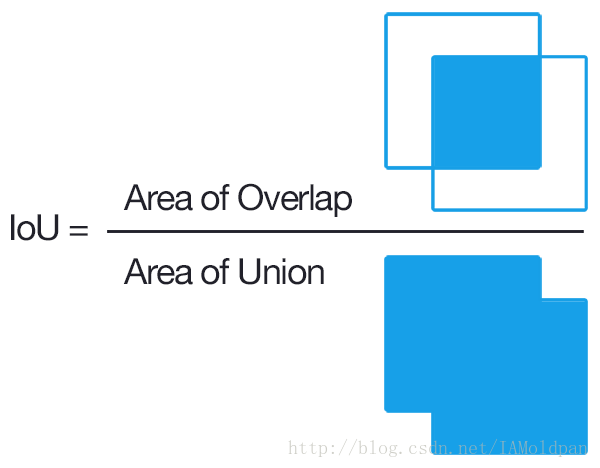

-----

| Title     | ML Metrics Detection IoU                              |
| --------- | ----------------------------------------------------- |
| Created @ | `2023-02-16T15:22:05Z`                                |
| Updated @ | `2023-02-16T15:22:05Z`                                |
| Labels    | \`\`                                                  |
| Edit @    | [here](https://github.com/junxnone/aiwiki/issues/383) |

-----

# IoU - Intersection Over Union

  - `GT BBox` 与 `Predict BBox` 的交叠率，即它们交集与并集的比值。
  - 最理想情况是完全重叠，即比值为1.
  - 一般来说，这个 IoU＞ 0.5 就可以被认为一个不错的结果

