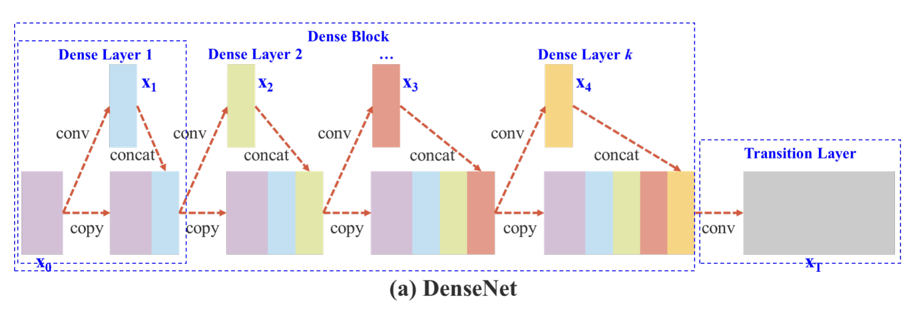
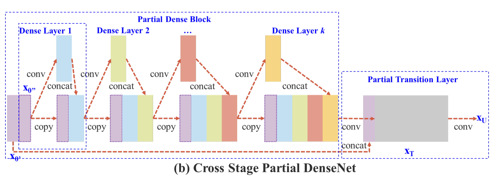
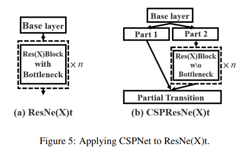
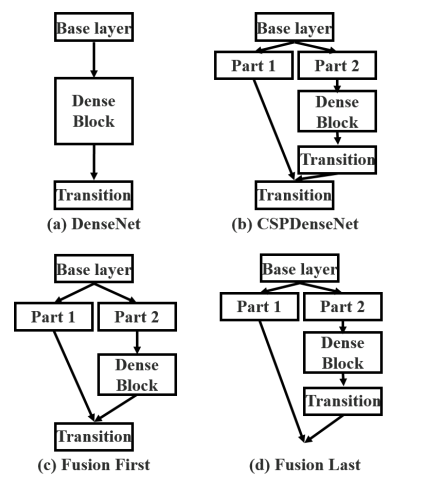
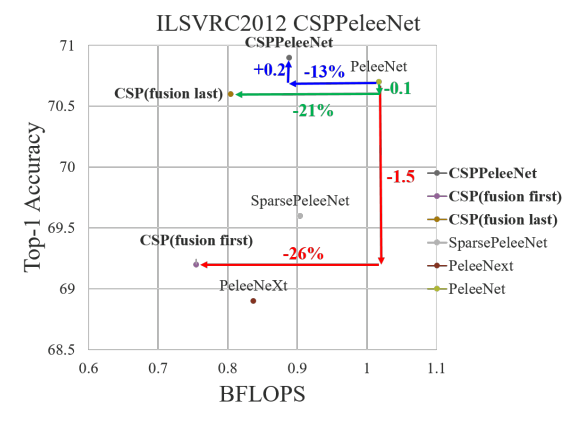

-----

| Title     | paper CSPNet                                          |
| --------- | ----------------------------------------------------- |
| Created @ | `2023-02-21T23:02:39Z`                                |
| Updated @ | `2023-02-21T23:28:48Z`                                |
| Labels    | \`\`                                                  |
| Edit @    | [here](https://github.com/junxnone/aiwiki/issues/385) |

-----

## Reference

  - 2019 **CSPNet** CSPNet: A New Backbone that can Enhance Learning
    Capability of CNN \[[paper](https://arxiv.org/pdf/1911.11929.pdf)\]

## Brief

  - 增加了 CNN 学习能力
  - 消除了部分计算瓶颈
  - 减少了内存消耗

## Cross Stage Partial Network

### DenseNet vs CSPDenseNet

### ResNet vs CSPResNet

### 对比设计

#### 对比结果

