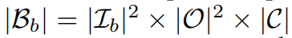
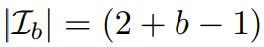
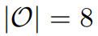
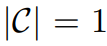
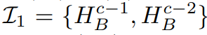
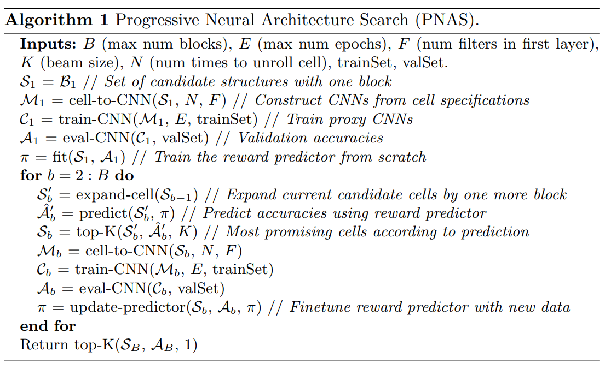
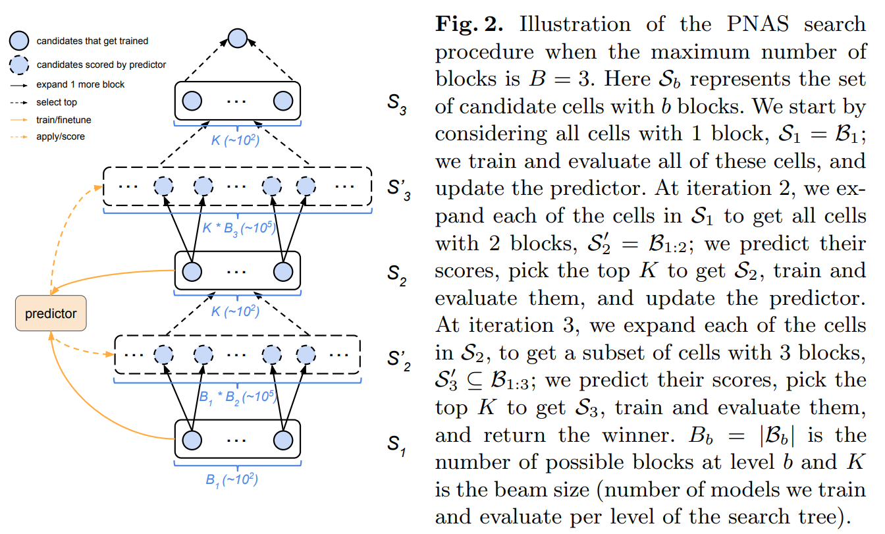
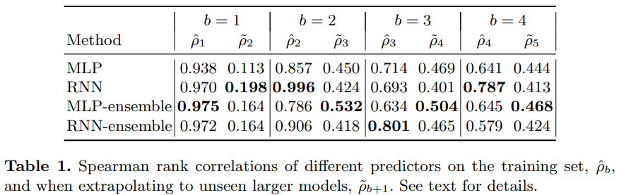
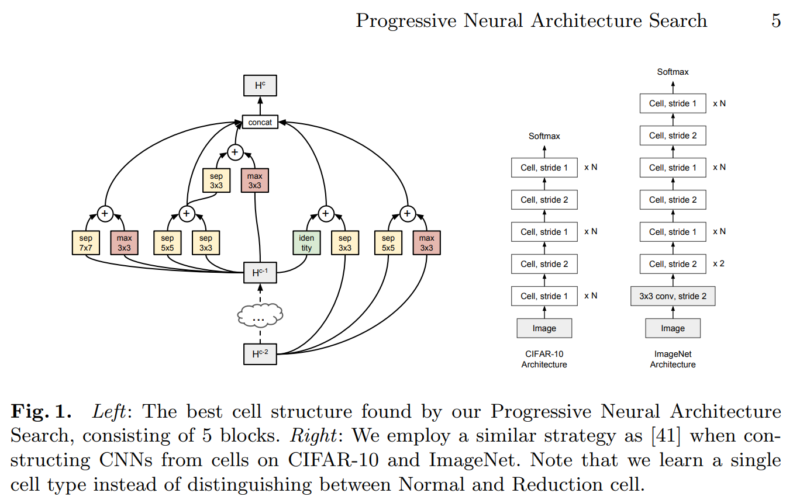

-----

| Title     | ML AutoML NAS PNAS                                    |
| --------- | ----------------------------------------------------- |
| Created @ | `2020-07-23T01:52:54Z`                                |
| Updated @ | `2023-03-25T14:39:46Z`                                |
| Labels    | \`\`                                                  |
| Edit @    | [here](https://github.com/junxnone/aiwiki/issues/388) |

-----

# PNAS

  - Progressive Neural Architecture Search
  - 将大的搜索空间分解为小的搜索空间的乘积
  - Operator -\> Block -\> Cell -\> CNN
  - 不区分 `Normal Cell` & `Reduction Cell`
      - `Normal Cell` 功能实现 - stride=1
      - `Reduction Cell` 功能实现 - stride=2

## Arch

  - CNN = Cell x M
  - Cell = Block x B
  - Block = Input x 2 + Operator x 2 + Combination x 1
      - Combination - only `Addition`

| Operator                            |
| ----------------------------------- |
| 3x3 depthwise-separable convolution |
| 5x5 depthwise-separable convolution |
| 7x7 depthwise-separable convolution |
| 1x7 followed by 7x1 convolution     |
| identity                            |
| 3x3 average pooling                 |
| 3x3 max pooling                     |
| 3x3 dilated convolution             |

## Search Space

| Name                      | Formula                                                                                    |
| ------------------------- | ------------------------------------------------------------------------------------------ |
| Possible Block            |                                |
| Block b Input             |                                |
| Operation                 |                                |
| Combination               |                                |
| For b = 1                 |    `B1` = 2x2x8x8x1 = 256   |
| B = 5 Cell = Block x 5 | `B1:5` = `4x64` x `9x64` x `16x64` x `25x64` x `36x64` = 5.6 x10e14  去掉对称 Cells \~10e12 |

## Algos

  - 渐进式搜素 - `B=1` -\> `B=2` -\> `B=3` ...
  - 使用 Bn-1 的模型作为 predictor 评估 Bn Cell 性能, 选出最佳 k Bn-Cell
  - Bn-Cell 训练 Bn-Model 作为 Bn+1 Cell 的评估 predictor

## Surrogate Model

  - 可以处理可变输入 - trained with `b` Block , predict with `b+1` Block
  - 与实际 performance 相关 - 不需要真实的 `mean squared error`, 但是要给出真实的
    performance 排序
  - Sample Efficiency - 需要尽可能少的training & evaluate, training data 稀疏

| LSTM & MLP                                                   |
| ------------------------------------------------------------ |
|  |

## Search Result

## Reference

  - [paper - 2017 - Progressive Neural Architecture
    Search](https://arxiv.org/pdf/1712.00559.pdf)
  - [AutoDL论文解读（六）：基于代理模型的NAS](https://blog.csdn.net/u014157632/article/details/102568194)
  - [【PNAS】2018-ECCV-Progressive Neural Architecture
    Search-论文阅读](https://www.cnblogs.com/chenbong/p/12939380.html)
