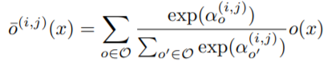
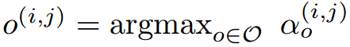
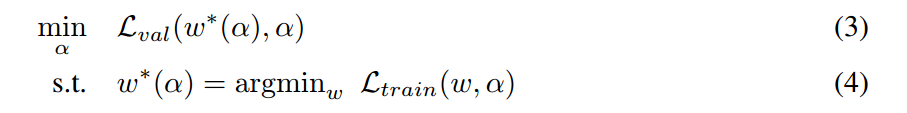
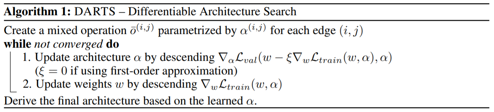
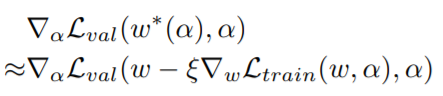
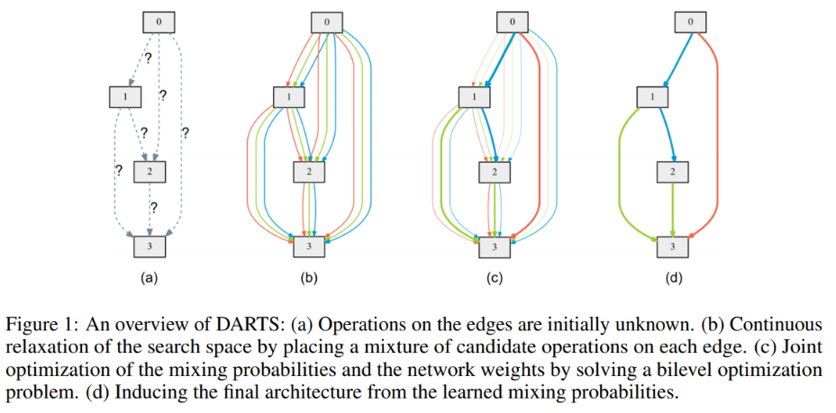

-----

| Title     | ML AutoML NAS DARTS                                   |
| --------- | ----------------------------------------------------- |
| Created @ | `2020-07-21T08:03:47Z`                                |
| Updated @ | `2023-03-25T14:42:58Z`                                |
| Labels    | \`\`                                                  |
| Edit @    | [here](https://github.com/junxnone/aiwiki/issues/389) |

-----

# DARTS

  - `RL & EA` --\> `DARTS`
  - 离散领域的黑盒优化问题 --\> 通过`可微的方式`进行结构搜索
  - DARTS - Differentiable Architecture Search - 松弛（Relaxation）搜索空间使之连续
    - 梯度下降 - AO
  - CNN
  - RNN

## Continuous Relaxation

| `categorical choice` --\> `softmax` |  |
| ----------------------------------- | ------------------------------------------------------------ |
| α(i,j)                              | 待学习连续变量                                                      |
| o(i,j) 近似替换                         |  |
| Bilevel Optimization problem        |  |
| α                                   | upper-level variable                                         |
| w                                   | lower-level variable                                         |
| Ltrain/Lval                         | train/val Loss                                               |
| Algos                               |  |
| 难以优化                                | α 维度比较高                                                      |
| 近似优化简化问题                            |  |

## Overview

## Test Dataset

  - CIFAR-10
  - ImageNet
  - PT - Penn Treebank
  - WT2 - WikiText-2

## 基于 DARTS 的后续优化

| Name     | Description                                                                                                        |
| -------- | ------------------------------------------------------------------------------------------------------------------ |
| GDAS     |                                                                                                                    |
| DenseNAS |                                                                                                                    |
| P-DARTS  |                                                                                                                    |
| PC-DARTS | [PC-DARTS: Partial Channel Connections for Memory-Efficient Architecture Search](https://arxiv.org/abs/1907.05737) |

## Reference

  - [paper - 2018 - DARTS: Differentiable Architecture
    Search](https://arxiv.org/pdf/1806.09055.pdf)
  - [paper - 2007 - An overview of bilevel
    optimization](http://www.iro.umontreal.ca/~marcotte/ARTIPS/AOR2007.pdf)
  - [Github](https://github.com/quark0/darts)
  - [论文笔记：DARTS: Differentiable Architecture
    Search](https://www.cnblogs.com/wangxiaocvpr/p/10556789.html)
  - [网络搜索之DARTS, GDAS, DenseNAS, P-DARTS,
    PC-DARTS](http://www.tensorinfinity.com/paper_195.html)
  - [AutoDL论文解读（五）：可微分方法的NAS](https://blog.csdn.net/u014157632/article/details/102556298)
