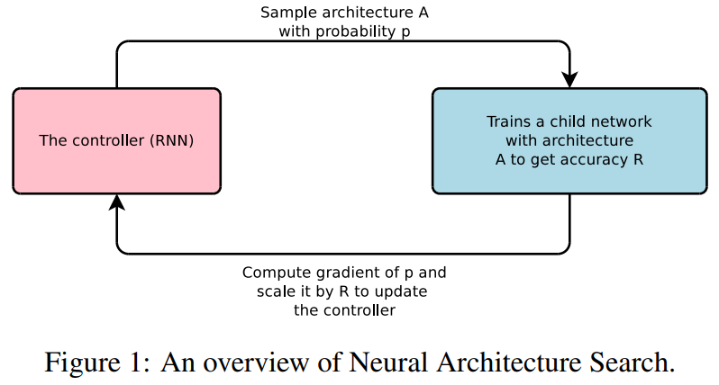

-----

| Title     | ML AutoML NAS NASwRL                                  |
| --------- | ----------------------------------------------------- |
| Created @ | `2020-07-20T06:36:15Z`                                |
| Updated @ | `2023-03-25T14:45:11Z`                                |
| Labels    | \`\`                                                  |
| Edit @    | [here](https://github.com/junxnone/aiwiki/issues/390) |

-----

## Neural Architecture Search with Reinforcement Learning

  - 第一篇比较正式的 RL-Based NAS paper
  - RL
      - Agent - RNN - Controller - `A variable-length String`
      - Reward - Accuracy
      - Policy Gradient
  - REINFORCE rule - Williams - 1992
  - Attention - `set-selection`

## Pipeline

| without skip-connections                                     | \+ skip-connections                                          |
| ------------------------------------------------------------ | ------------------------------------------------------------ |
|  |  |

## Training

  - Reward - Accuracy - 不可微 --\> Policy Gradient --\> REINFORCE --\>
    Update `θc`

| Name                    | Formula                                                      |
| ----------------------- | ------------------------------------------------------------ |
| Reward                  |  |
| REINFORCE               |  |
| empirical approximation |  |
| with Baseline Function  |  |

  - m - 子网络数量/batch
  - T - 超参数数量/子网络
  - Rk - 第 `k` 个子网络 Accuracy
  - b - 之前子网络准确率的指数移动平均值

| Parallelism and Asynchronous Updates                         |
| ------------------------------------------------------------ |
|  |

### Skip-Connections

  - 第 N Layer `+Anchor Point` = `N-1 sigmoids` - 指定之前 `N-1 Layer` 的连接关系
  - `Compilation Failures` - 当 Layer 与其他 Layer 不兼容, 或者 Layer 没有输入或者输出时
      - 如果没有输入, 则使用 `Input Layer`
      - 最后一个 Layer 和所有没被连接的 Layer concat 送入分类器
      - concat 不同大小的输入, `0-padding` 比较小的 Layer

| 当前RNN 状态和前 `N-1` Anchor Point 函数 |  |
| -------------------------------- | ------------------------------------------------------------ |
| hj                               | RNN 第 `j` 层 Anchor Point 隐藏状态                                |
| j                                | `0 ~ N-1`                                                    |

### RNN Cell

| RNN Cell 1 - Base Cell |  |
| ---------------------- | ------------------------------------------------------------ |
| RNN Cell 2 - LSTM      |  |
| Input                  | Base Cell - xt/ht-1  LSTM - xt/ht-1/ct-1                  |
| Output                 | Base Cell - ht  LSTM - ht/ct                              |
| Combination method     | Addition/Elementwise/Multiplication                          |
| Activation Function    | tanh/sigmoid                                                 |

## Reference

  - [paper - 2016 - Neural Architecture Search with Reinforcement
    Learning](https://arxiv.org/pdf/1611.01578.pdf)
  - [AutoDL论文解读（一）：基于强化学习的开创性工作](https://blog.csdn.net/u014157632/article/details/101721343)
  - [论文笔记《Neural Architecture Search With Reinforcement
    Learning》](https://blog.csdn.net/Sugar_girl/article/details/89516578)
  - [NAS详解](https://zhuanlan.zhihu.com/p/52471966)
