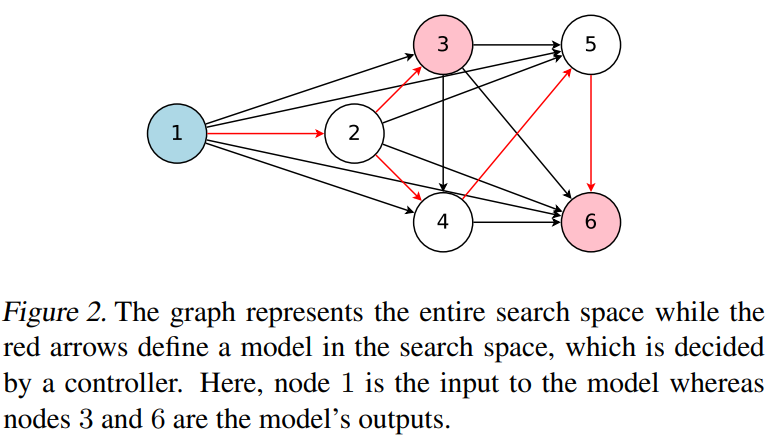
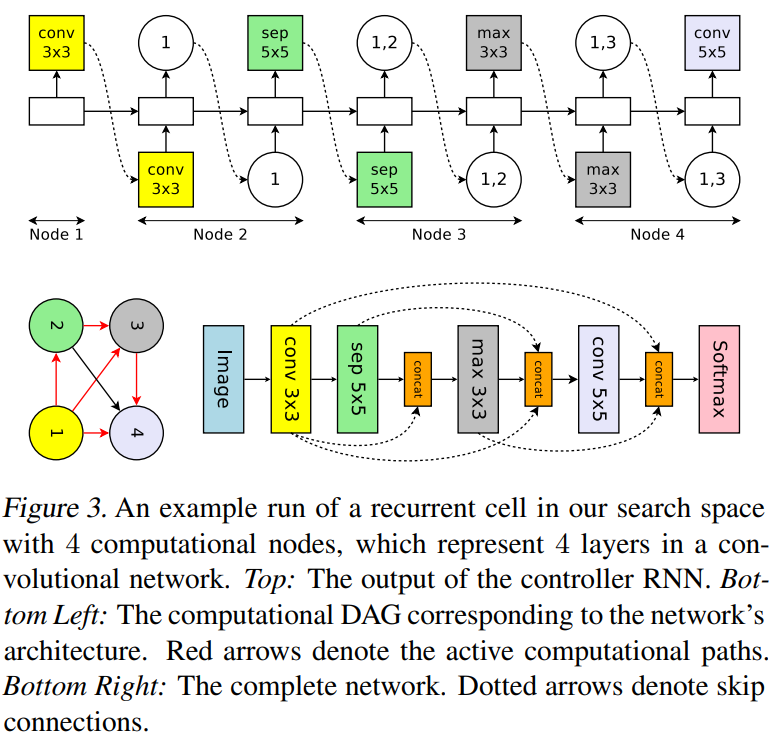
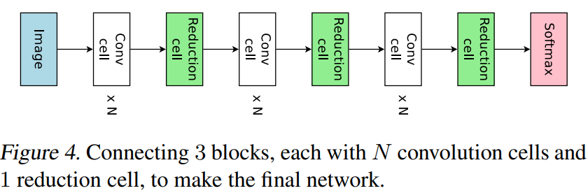
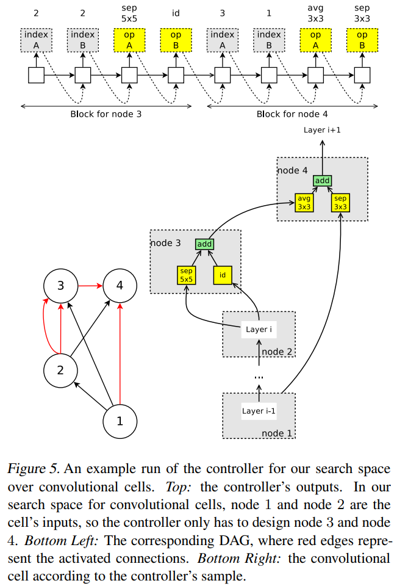
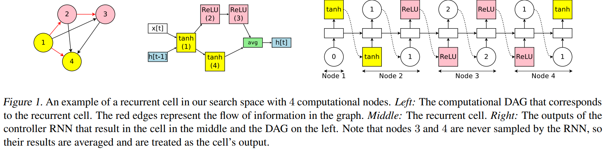
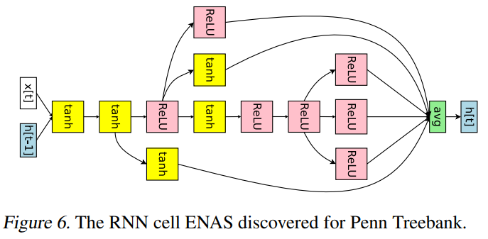
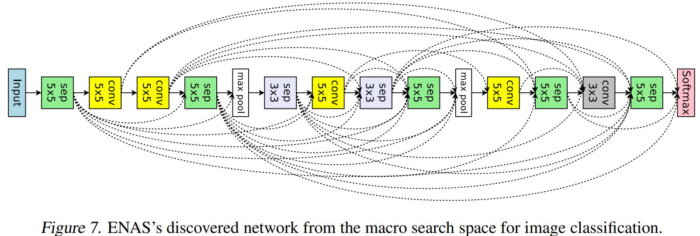
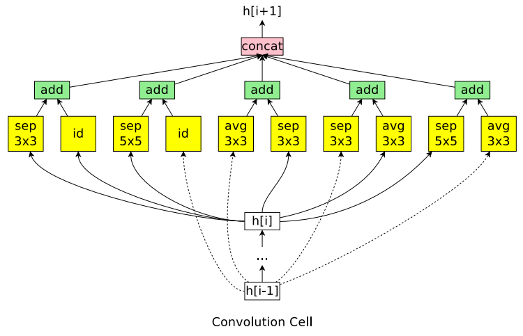
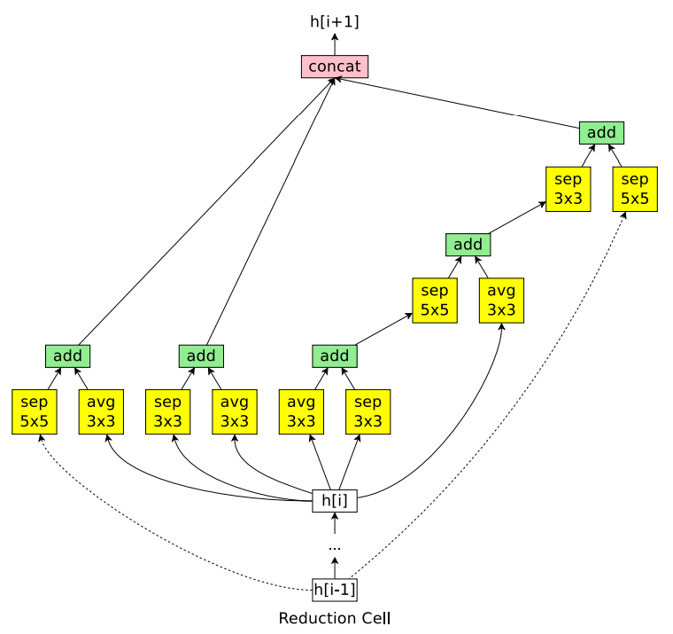

-----

| Title     | ML AutoML NAS ENAS                                    |
| --------- | ----------------------------------------------------- |
| Created @ | `2020-07-20T02:42:57Z`                                |
| Updated @ | `2023-03-25T14:46:14Z`                                |
| Labels    | \`\`                                                  |
| Edit @    | [here](https://github.com/junxnone/aiwiki/issues/391) |

-----

# ENAS

  - 子模型共享参数, 提高效率，减少所需计算资源
  - macro search space over entire convolutional models
  - micro search space over sonvolutional cells
  - Decision Block
  - Conv Cell
  - Reduction Cell

## Search Space

  - Model = Blocks x N
  - Blocks = Conv Cell x N + Reduction x M
  - Cell = Node x B (B=4)

| Entire Search Space                                          |
| ------------------------------------------------------------ |
|  |

| macro Search Space                                           | Micro Search Space                                                                                                           |
| ------------------------------------------------------------ | ---------------------------------------------------------------------------------------------------------------------------- |
|  |   |

| Macro Search Space - Node Avaliable Operations         | Micro Search Space - Node Available Operations |
| ------------------------------------------------------ | ---------------------------------------------- |
| `   `                                                  | identity                                       |
| convolutions with filter sizes 3 × 3                   |                                                |
| convolutions with filter sizes 5 × 5                   |                                                |
| depthwise-separable convolutions with filter sizes 3×3 | separable convolution with kernel size 3 × 3   |
| depthwise-separable convolutions with filter sizes 5×5 | separable convolution with kernel size 5 × 5   |
| max pooling of kernel size 3 × 3                       | max pooling with kernel size 3×3               |
| average pooling of kernel size 3 × 3                   | average pooling with kernel size 3×3           |

| Recurrent Cell                                               |
| ------------------------------------------------------------ |
|  |

## Discovered

| Name             | Discovered                                                   |
| ---------------- | ------------------------------------------------------------ |
| RNN Cell         |  |
| CNN Network      |  |
| Convolution Cell |  |
| Reduction Cell   |  |

## Reference

  - [paper - 2018 - Efficient Neural Architecture Search via Parameter
    Sharing](https://arxiv.org/pdf/1802.03268.pdf)
  - [论文笔记系列-Efficient Neural Architecture Search via Parameter
    Sharing](https://www.cnblogs.com/marsggbo/p/9435954.html)
  - [Github - Authors - Tensorflow](https://github.com/melodyguan/enas)
  - [ENAS-pytorch](https://github.com/carpedm20/ENAS-pytorch)
  - [AutoDL论文解读（四）：权值共享的搜索](https://blog.csdn.net/u014157632/article/details/102501816)
  - [【ENAS】2018-ICML-Efficient Neural Architecture Search via Parameter
    Sharing-论文阅读](https://www.cnblogs.com/chenbong/p/13137561.html)
